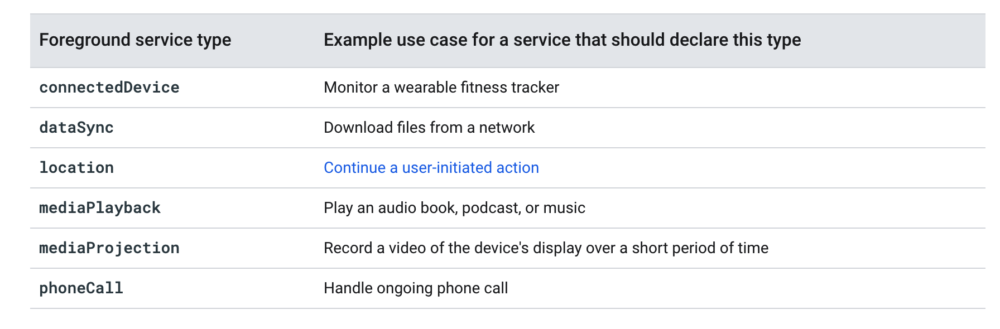

8.0 服务受限：  

限制场景下启动startService 会报异常  

限制场景下startForegroundService 五秒之内必须 startForeground  

JobIntentService  

[`FOREGROUND_SERVICE`](https://developer.android.google.cn/reference/android/Manifest.permission#FOREGROUND_SERVICE)  9.0 前台需要申请，是个普通权限。  

前台服务类型：  

