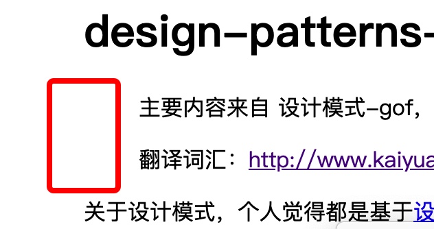
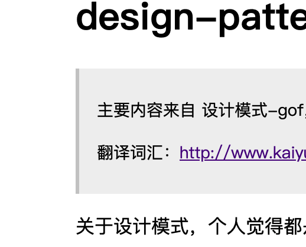

github 主页有基本的使用方式  

主要讲一下坑：

```markdown
``
>
```

目前发现上面另种语法不会被渲染成功, 而高亮会：

对应效果如：



经过检查发现marked 只是没有把对应的语法翻译成h5 某一种标签  
上述两个对应 `code` 和`blockquote`  
那么就很好解决了，添加对应的css 样式即可   
而高亮是因为添加了高亮单独的css  

实现效果如下：
