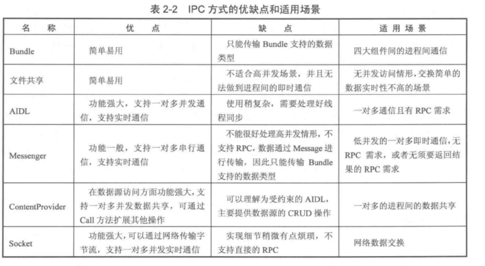

IPC(Inner-Process Communication)

多进程的创建：在xml 中指定process，或者jni fork。前者中`:` 和`.` 的方式不同，一个表示私有进程，而全局进程才允许其他应用通过ShareUID 跑在一样的进程。

每个进程都有一个独立的虚拟机，即有不同的内存地址。

`adb shell ps`

跨进程通信：

Intent 传递数据

共享文件

Binder：Messenger(可以方便互相通信，handler串行)，AIDL，RemoteCallbackList/binderDied/serviceDisconnected ， 多个AIDL 时使用BinderPool

ContentProvider：基本没用到了。就不看了

Socket：就套接字的编写

