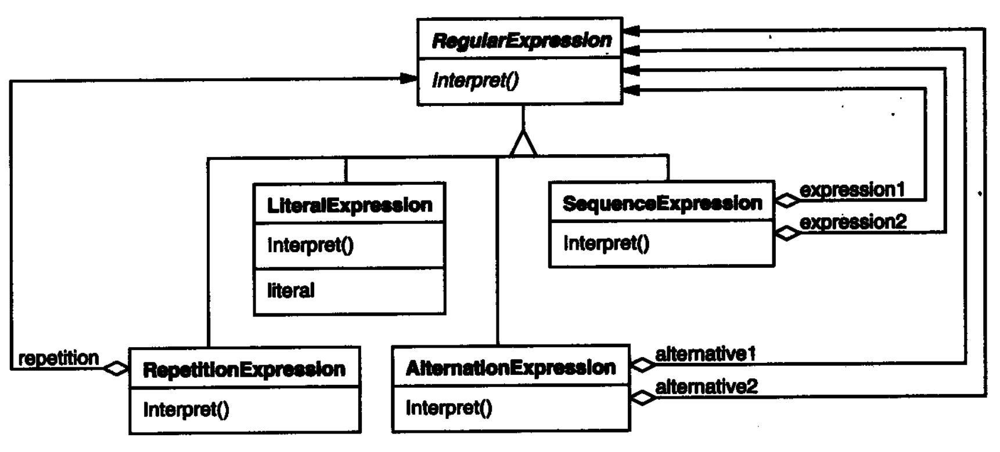
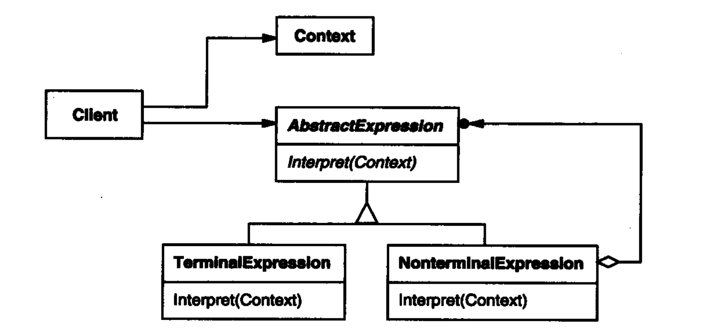

对一个实现使用一种自定义的文法，并定义一个解释器来解释这种文法


这里文章的说明比较抽象也有额外的功能，用简化代码看起来会比较直观：

```c++
    //(true and x) or (y and (not x))
    BooleanExp * exp;
    Context context;
    //创建对象
    VariableExp* x = new VariableExp("x");
    VariableExp* y = new VariableExp("y");
    //构建结构
    exp = new OrExp(
            new AndExp(new Constant(true), x),
            new AndExp(y, new NotExp(x))
            );
    //赋值对象
    context.Assign(x, false); 
    context.Assign(y, true);
    //计算结果
    bool result = exp -> Evaluate(context);
```


一般而言解释器中的具体文法是用一个个类进行一一解释

（解释器不进行语法分析）





