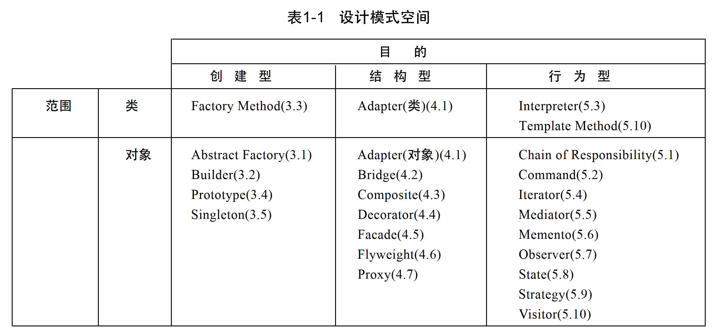

实际上程序是对“类和对象”的组织。所以如果对设计模式分类，首先是对“类和对象”创建(Create)的处理 -- [创建型模式](./创建型.md)；然后是对创建后的组合结构(Struct)的处理 -- [结构型模式](./结构型.md)；以及“类和对象”行为、交互(Behavior)的处理 -- [行为模式](./行为型.md)。

而类和对象又有一些差别：

类模式处理类和子类之间的关系，这些关系通过继承建立，是静态的，在**编译时刻** 便确定下来了。

对象模式处理对象之间的关系，这些关系在**运行时刻** 是可以变化的，更具有动态性

> 从某种意义上说，几乎所有模式都使用继承模式，所以”类模式“只指那些集中于处理类间关系的模式，而大部分模式都属于对象模式的范畴。

故而有了下面这个分类图

创建型类模式将对象的部分创建工作延迟到子类，而创建型对象模式则将它延迟到另一个对象中。

结构型类模式使用继承机制来组合类，而结构型对象模式则描述了对象的组装方式。

行为型类模式使用继承描述算法和控制流，而行为型对象模式则描述一组对象怎样完成单个对象无法完成的任务。
