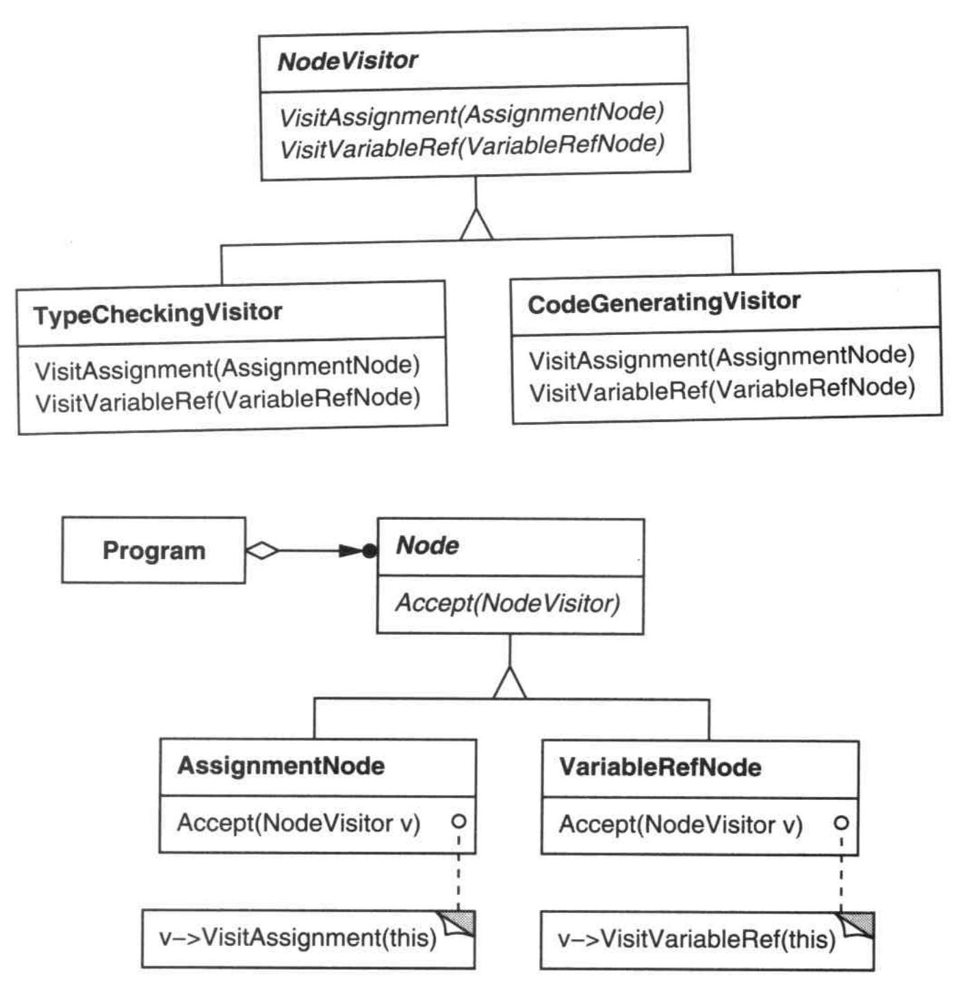
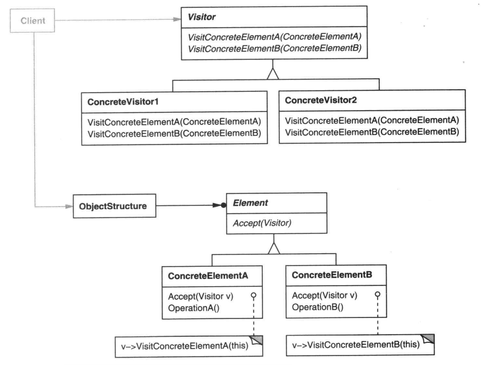

**作用描述**

表示一个作用于某对象结构中的各元素的操作。它使你可以在不改变各元素的类的前提下定义作用于这些元素的新操作。

**具象描述**

编译器读取了源程序，转化成一个语法树。

程序依序解析这个树上的节点。而每个节点都需要进行一些列相同的操作，比如类型检查，流程分析等等

我们当然首先想到把相同的操作抽象到父类，然后每个节点继承，并根据自己的语法类型进行实现。

但是这种形式将所有这些操作分散到各种结点子类中会导致整个系统难以理解、难以维护和修改。

主要是因为抽象导致新增方法时所有子类都需要“开闭”。

就是要以功能代码为主进行抽取。将类型检查、流程分析实现为一个功能类，通过传递节点，进行功能操作。

而节点的方法则只需要接受一下这个功能类即可，然后只调用自己需要的操作。

此时如果有新的功能需求，只需要功能类添加方法，而不需要处理之前的实现。

这个功能类就是一个访问者。

