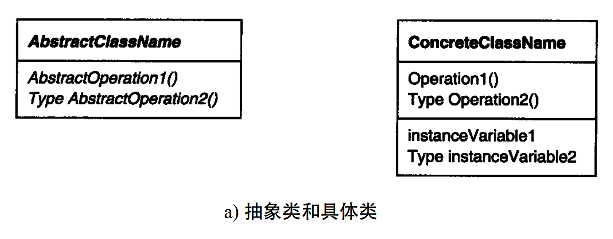
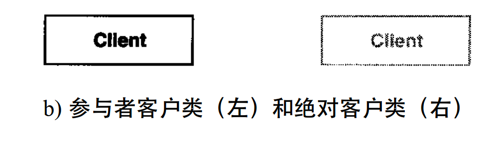
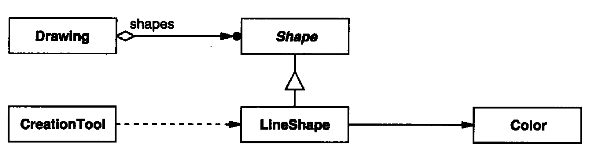
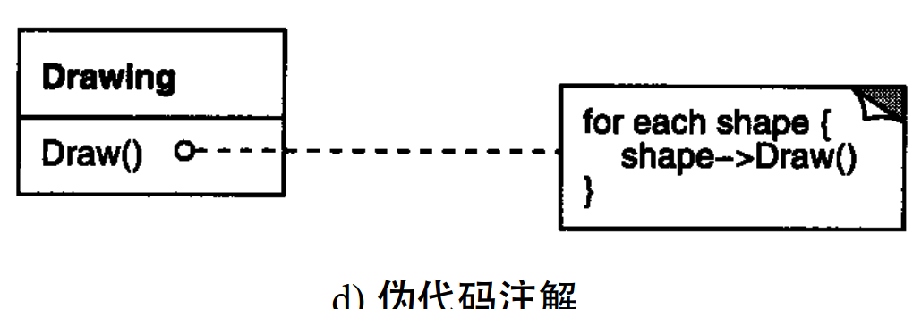
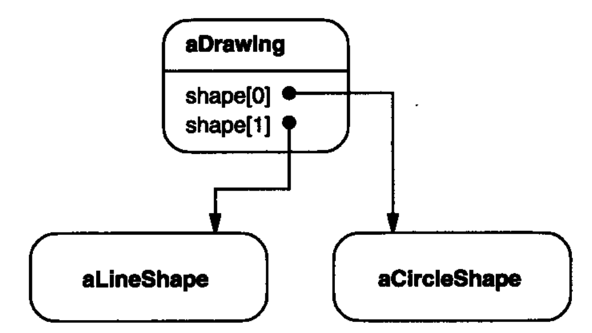
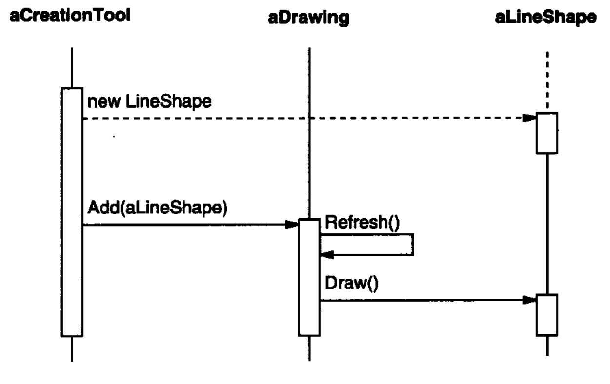

OMT(Object Modelling Techenique), [RBP+91, Rum94]

Objectory [JCJO92]和B o o c h方法

1) 类图描述各个类、它们的结构以及它们之间的静态关系。
2) 对象图描述运行时刻特定的对象结构。
3) 交互图展示对象间请求的流程

>OMT 术语“对象图”指类图。我们使用“类图”仅指对象结构图。
>OMT 还定义了类间的关联（association）关系，以类间的一条线来表示。关联关系是双向的。不太合适这里

### 类图

一个类表示为一个线框：顶部以粗体写着类名，其下是主要的操作，再下是实例变量。类型信息是可选的。我们使用 C + +的书写习惯，将类型名置于操作名（强调返回类型） 、变量名或参数之前。斜体表示该类或操作是抽象的。

在类图中，当某个客户类是某模式的参与者（即该客户类在这个模式中承担一定的责任）时，我们以正常的方式表
示它；而当该客户不是该模式的参与者（即客户类在模式中不承担责任） ，而仅仅是为了说明其与模式的参与者之间的交互关系时，我们以灰色来表示它。

三角形连线，表示类继承，指向父类；

根部菱形箭头，表示聚集关系（有对象引用），指向被聚集的类；

实心圆点，表示“多于一个” 。

根部没有菱形的箭头，表示相识关系（无对象引用）。在箭头根部附近可以注明名称，以区别于其他引用 。

虚线箭头，表示创建关系，指向的是被实例化的对象。（非OMT）

最后加上一些伪代码，以简要说明操作的实现。

### 对象图

对象的名字通常表示为“aSomething” 

圆角矩形，表示一个对象；用一条直线将对象名与对象引用分开。

箭头，表示对象引用。

### 交互图

交互图中从上到下表示时间流向

如果某对象在所示的时间区间开始时还未被创建，则用垂直虚线表示

垂直的矩形，表示对象正在处理某个请求。

水平箭头表示，发出请求，指向接收对象；请求的名称标注在箭头上方

虚线箭头表示，创建对象的请求

一个发给自身的请求也指向发送者自身。

