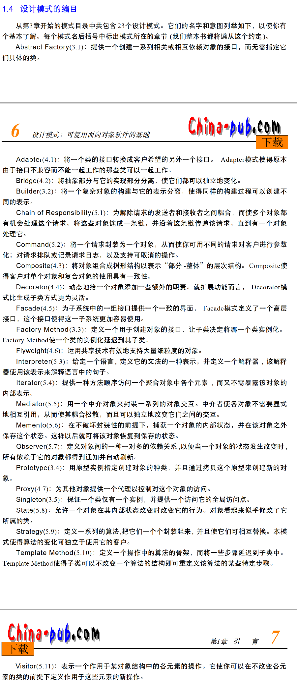
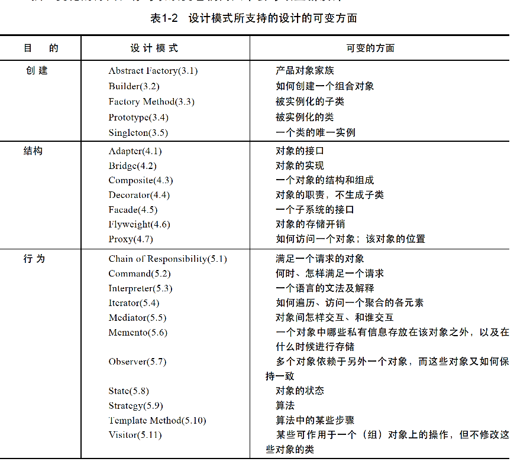

- 对对象类的依赖

在创建对象需要指定类名时，你将受特定实现的约束而不是特定接口的约束。应该间接的创建对象。

**相关模式**：创建型模式

- 对特殊操作的依赖

当你为请求指定一个特殊的操作时，完成请求的方式就固定了。应该在编译时刻或运行时刻很方便的改变相应请求的方法。

**相关模式**：响应链、命令

- 对硬件或软件平台的依赖

当你调用外部的接口时，会产生依赖性。应该要加一层来减少对外部接口的依赖性

**相关模式**：抽象工厂、桥接

- 对对象表示或实现的依赖

对对象怎么表示、保存、定位或实现的客户在对象发生变化时可能也需要变化。应该对外部隐藏这些信息

**相关模式**：抽象工厂、桥接、备忘录、代理

- 对算法的依赖

算法在开发和复用时经常被拓展、优化和替代。应该对算法部分单独抽取

**相关模式**：构建者、迭代器、策略、模板方法、访问者

- 紧耦合

很好理解。应该使用抽象耦合和分层技术来耦合度

**相关模式**：抽象工厂、命令、外观、中介器、观察者、响应链

- 通过生成子类来扩充功能

生成子类需要了解父类，并会增加类的数量。而不用子类，单独使用组合会让场景变得难以理解。应该定义一个子类，然后将它的实例和已存在实例进行组合来引入定制的功能

**相关模式**：桥接、响应链、复合、装饰者、观察者、策略

- 对外部类的依赖

无法修改外部类或修改起来非常麻烦。应该使用过渡方式

**相关模式**：适配器、装饰者、观察者

