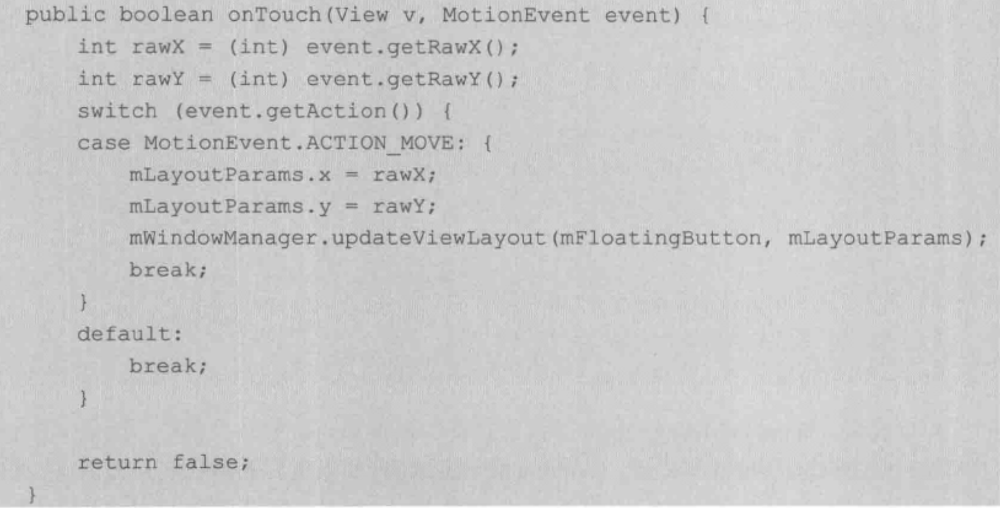

WindowManager, 添加window 的过程

window 设置属性，

flag_not_touch_modal(区域外部的事件传递给底层的window，内部的自己处理)

flag_not_focusable(不获取焦点，会同时打开touch_modal 标记位)

Flag_show_when_locked(显示在锁屏的界面上)

window 有z-ordered 概念。

应用window（zorder , 1~99），对应一个activity

子window（1000~1999），需要附属一个特定的父window

系统window（2000~2999），需要权限，比如toast和状态栏

addView

updateViewLayout

removeView

WindowManagerImpl -> WindowManagerGlobal ->

#### Window 创建过程

**activity**

在其创建过程的，attach 方法中，系统会通过PolicyManager.makeNewWindow 创建window，同时持有activity 的一个callback，在收到信息时回调给activity 

> PolicyManager 的实现类是 Policy，源码调用看不出两者具体关联，怀疑是编译处理

然后activity 的onCreate 方法中setContentView。window 的具体实例PhoneWindow，会处理其关联过程：

创建decorView，然后添加contentView 为子view，此时会回调onContentChanged

只是此时windowManager还没有"关联“decorView，需要activity 的onResume 中调用makeVisible() 时才关联

**dialog**

和activity 的整体流程基本没差，只是需要使用activityContext。

**toast**

基于window 实现，但是有定时取消功能，所以采用handler

toast 访问NotificationManagerService

NotificationManagerService 回调Toast 里的TN 接口

