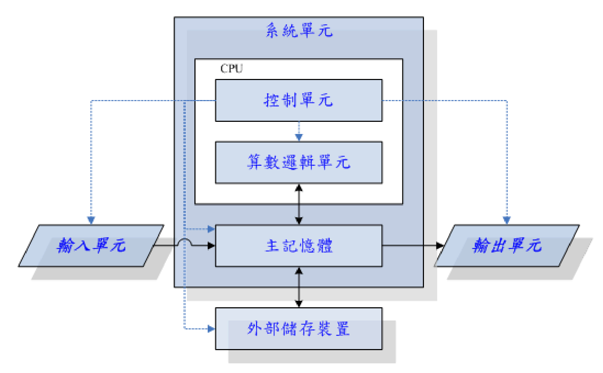

查看命令：

```shell
cat /proc/cpuinfo
lspci  #查看各项组件的型号
```




精简指令集（RISC）

- SPARC series、Power Architecture(PowerPC)、ARM series

复杂指令集（CISC）

- AMD，Intel，VIA 等x86


对于频率同步，按目前的理解，一次处理周期只要比一次输入输出周期快即可。所以倍频在保证处理器自身的完善情况下，不会影响其他组件。而减速应该会影响（或者通过标志位来标识是否完成处理？）。


现在cpu 至少都是两个核心，叫做多核心cpu。而且intel cpu 还有个超线程（Hyper-Threading）功能

就是在大部分需求情况下，cpu 都是过剩的，所以为了充分利用过剩的性能。cpu 内部将缓存器(register)分成两群（群？），然后可以有两个程序 同时竞争到CPU的运算单元。让人感觉一个cpu 可以有双倍核心的感觉。 -- 但是测试发现性能提升度还是很看使用场景的


cpu本身有一个高速缓存区