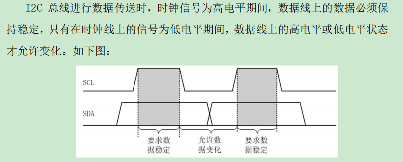
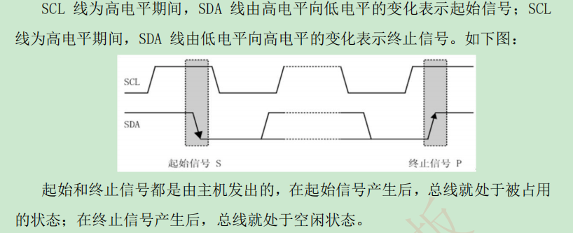
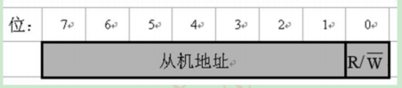

总线交互，最大电容400pF     

传输方式：  

- 标准传输 100kbit/s  
- 快速模式 400kbit/s  
- 高速模式 3.4mbit/s  

多主机   

主机，从机（发送器，接收器）  

主模式、从模式   

仲裁方式   

同步时钟   

数据有效性：  

主机发送一个字节，从机应答信号，主机继续发送  

主机发送一个字节，从机无法应答（忙或存储不下），主机发送结束信号  

主机发送数组可以控制方向，此时主机为接收方（伪从机，结束还是主机发送）      

数据传送时，先传送最高位  

起始信号后，是地址信号，

寻址协议：

[at24c02](at24c02.md)