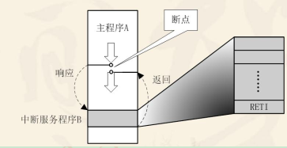
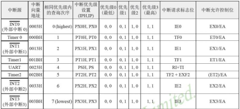
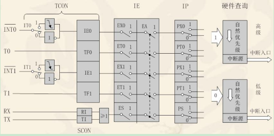
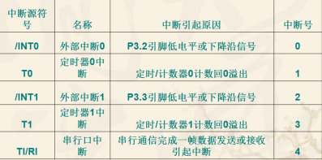
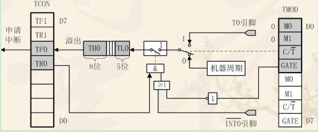

中断的简略逻辑如下，程序编译时就分在不同的区域，如有中断响应，  

会停止当前代码块的执行（理解成一个开关？

然后跳转到对应的中断代码块，执行完毕之后，重新开启上一层的代码块执行开关  

而51 单片机的设计上，中断可以手动开启关闭  

主要有几个中断口 

- 外部中断
- 定时器中断
- 串口中断

中断口有一些设置项，主要分为

- TCON

  可以设置外部中断的触发模式  

  已经中断发生时，内部会设置的中断位    

  中断计时/计数 的启动与否  

- IE 

  中断口开关（单独和所有

- IP

  优先级类别设置

串联图如下：

所以常规的中断，需要设置`IT0`, 开启`EX0`, `EA`, 设置`PX0`  

中断号如下：

计时器/计数器的更细致逻辑如下：

> 具体的线路是根据一些设置不同略有差别，这里是方式0    

所以计时器/计数器的中断，还需要设置`GATE`，`C/T`，`TR0`  

gate 是指对应的INT 位是否会影响  

因为希望时间可以变化，则还可以在未启动之前，设置TH0 / TL0 的初始值，这样做到溢出时间的控制。  

