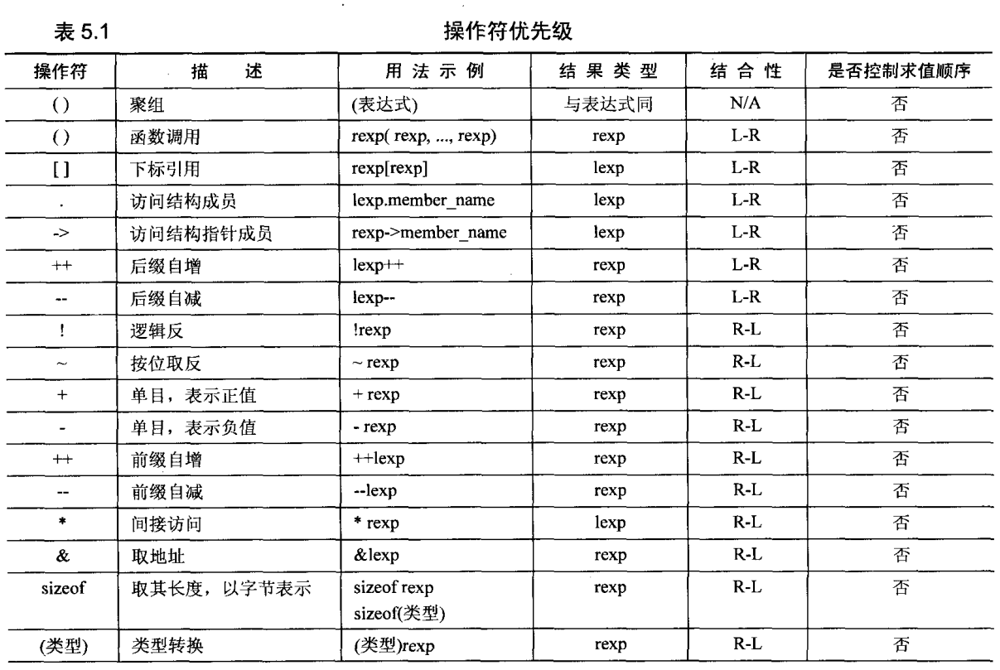
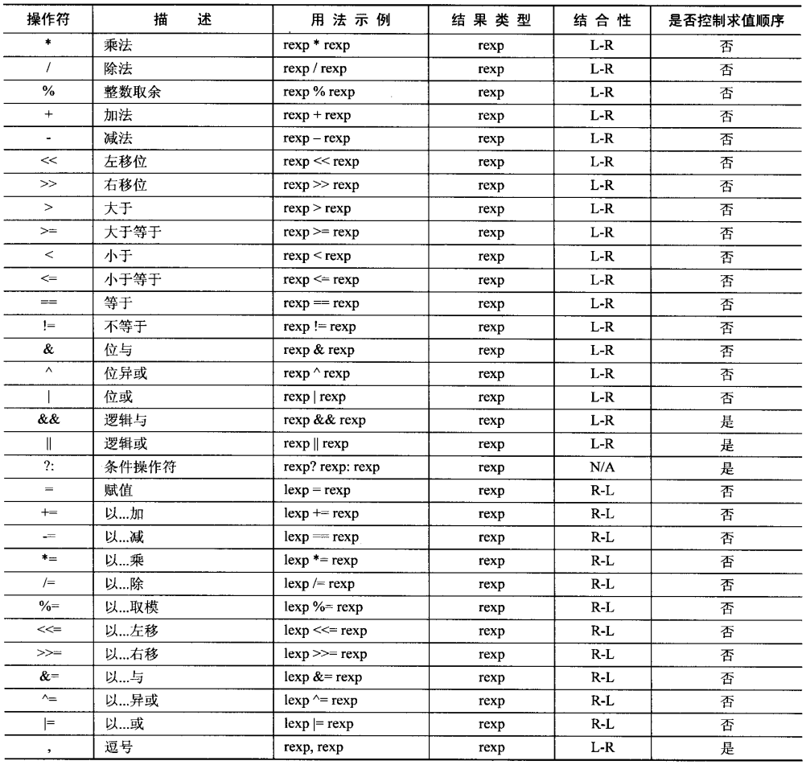
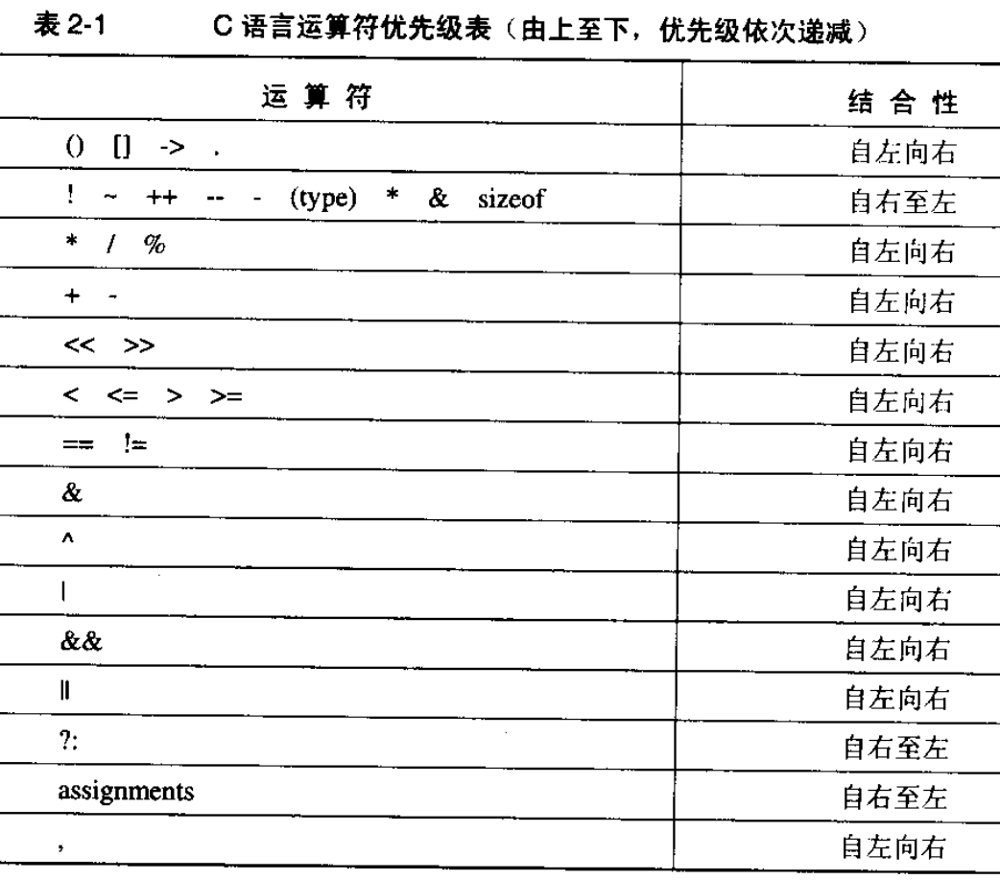

### 说明

```c
//左移操作符，补0
<<
//右移操作符
//如果是负数，则可能补0(逻辑方式)，也可能是补符号位（算术方式）-- 取决于编译器
>>
//移位操作不要传入 负数
```

`*`在 定义的时候表示指针类型，在使用的时候是间接访问

& 操作符表达的地址，无法作为左值的原因很粗暴，仅仅因为开发者无法获悉存储 右侧表达式结果的地址（其他不能作为左值的原因都是如此）。  
如`&temp = 2; &temp = address`

```text
cp -> f 等同于 (*cp).f
```

### 优先级







