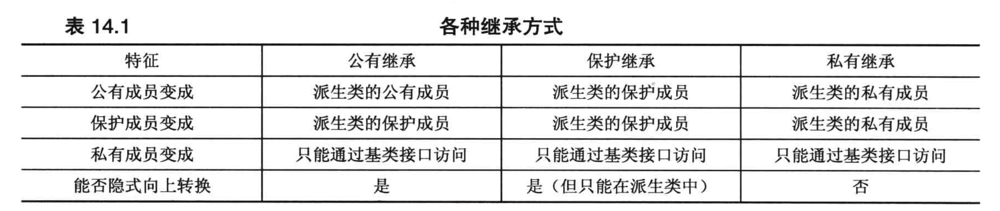

valarray ，在valarray 头文件中




私有继承，属于has- a 的实现，和包含对象的区别在于是否有显式的名称。

```c++
//初始化需要使用类名，因为没有对象变量名，调用方法时类似
Lsj(int age) : BaseLsj(age){};
```

继承时默认是私有继承。

#### 多继承，

```c++
//需要指出每个非私有基类
BaseSjl : public Human(name);
BaseLsj : public Human(name);
Lsj(name, age) :public BaseSjl(name, age), public BaseLsj(name, age){}; 
//BaseSjl 和 BaseLsj 中，有两个Human
```

```c++
//包含同名方法的问题
//显式域解析就行了
lsj.BaseLsj::showName()
//最好当然是Lsj 中实现方法
Lsj::showName(){BaseLsj::showName();}
//为了更全面
Lsj::showName(){BaseLsj::showName(); BaseSjl::showName();}
//但是会重复打印，所以要专门为了展示，细分方法，具体实操就行了
```

如果不显式调用，则派生类的方法会优先于基类的方法被调用；其他时候会产生二义性，即使冲突的方法并没有权限访问。

**虚基类**

```c++
//c++ 中使用虚基类 来使基类的实例 合并
class BaseLsj : public virtual Human(name); 
class BaseSjl : virtual public Human(name);
//如此 Lsj 中，BaseLsj 和Human 共享一个副本
//但是究竟是用谁的副本呢
Lsj : Human(name), BaseSjl(name, age), BaseLsj(name, age)
//需要主动声明，否则调用Human 的默认构造，而后两者的name 并不能传递构造Human
```

如果虚基类和非虚基类多继承，则虚基类合并，非虚基类保持多个副本。

#### 透传

当你只是单纯的使用基类的方法，而没有添加多余操作

特别是保护/私有派生的时候:

```c++
class Lsj{
  public:
  //showName 没有圆括号、函数特征和返回，相关的方法都会被透传
      using BaseLsj::showName; 
  //古老的语法中，不需要using 关键字，但是已经废弃
  
  using BaseLsj::BaseLsj; //会透传所有的构造函数
}
```
