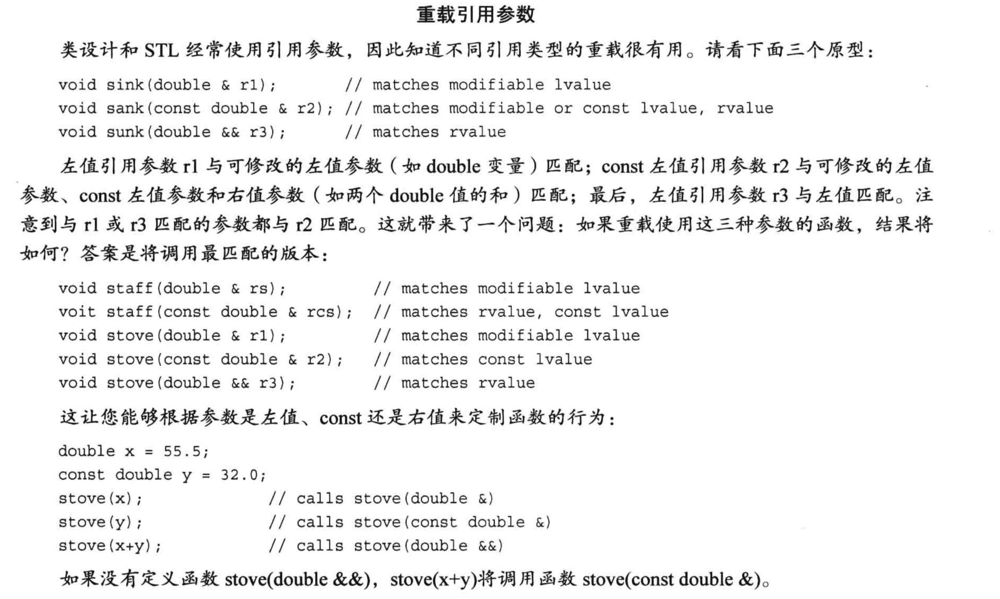

c中，左值指可以出现在赋值语句左边的实体

c++中，则包括常规变量和const 变量

#### 引用

```c++
int rats;
int & rodents = rats; //复制一份引用，作为别名，但是两者指向相同的值和内存，互相影响修改
//数组引用
int a[] = {};
int (&b)[0] = a;
```

引用初始化时必须赋值，此时包括值和地址，而之后不能改变地址。只能赋值

```c++
int rats = 101;
int * pt = &rats;
int & rodents = *pt; //注意此时rodents，自动会赋值 rats 的地址和值
int bunnies = 50;
pt = &bunnies; //并不影响rodents，不会变化。
```

早期的编译器允许 表达式传递给 函数作为引用参数，会产生一个**临时变量**。

这个临时变量显然不会修改原数据。不修改原数据和 引用的初衷不同。

所以现代c++ 标准严格要求临时变量的创建：

只有在参数是 const引用（即不修改），且实参不匹配的时候（不匹配 包括类型正确但不是左值、类型不正确但可以转化），才允许 生成临时变量。


不要把方法里的变量，传递给引用结果。（会变成空）


#### 右值引用

c++11

这种引用可以指向右值（包括非c风格的字面常量，表达式，有非引用返回值的函数），使用&& 声明（如此之前的就叫做左值引用）

但是不能对其应用地址运算符的值。

```c++
double && r_ref = std::sqrt(36.00);
double j = 1;
double && jref = 2*j + 1;
//此时jref 关联的是计算结果 3，如此 3 不在是临时结果，而会被存储到特定的位置并且可以获取该地址
//看起来好像只是简化了左值引用的中间变量，主要在移动语义中展现作用
```

#### 类引用

基类引用可以指向派生类





#### 移动语义

具体解释在p803，章18.2.1

关键在于右值引用语法，让计算机知道此时不需要复制产生临时变量。

