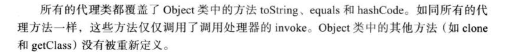
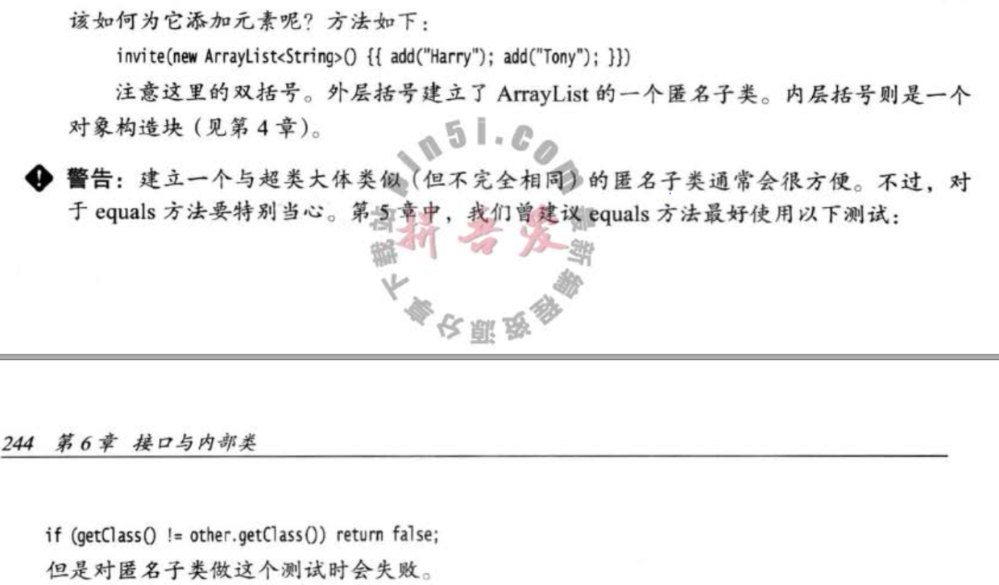

```java
String lineSeparator = System.getProperty("line.separator");//行分隔符  

private static final String TAG = new Object() {}.getClass().getEnclosingClass().getSimpleName();

```
**格式化**

章节3.7.2内容比较多


**代理** 

Proxy, InvocationHandler。 

**双括号初始化** 

**代码中开启断言**

 assert 条件 或者 assert 条件 : msg

启用断言：

```shell
#可以缩写成-ea
java -enableassertions MyJava
#包或者类
java -ea:MyClass -ea:com.company... MyJava
#禁用, -da
-disableassetions 
#"系统类"不支持，用-esa
-enablesystemassertions
```

ClassLoader中有对应的开关API

Arrays

思考一下为什么Arrays.copy方法，没有直接接受comparable\[\]的方法 

对于任意的x,y，sgn\(x.compareTo\(y\)\) = -sgn\(y.compareTo\(x\)\)，如果是异常也应当是一样的，继承的时候尤其注意

Q1：对于上述的x,y compareTo的设计标准，应该找一下原文

Arrays.parallelSort\(\) JDK8新加的API 


Character

Calendar

Comparable、Comparator

Comparable接口， 强烈建议（尽管不要求） compareTo 应该与 equals 保持一致。 也就是说， 对于两个对象 ol 和 o2, 应该确保当且仅当 ol.equals\(o2\)为 true 时 ol.compareTo\(o2\) = 0 成立。

Cloneable

Objects、Vector-HashTable（遗留类，修改操作同步）， Thread类

InetAddress、Socket

 Math类，Date类，Random类，Point2D类、 Number类，Rational 类，Biglnteger 和 BigDecimal 类 Collections类，File类 URL类，Calendar类，GregorianCalendar类，Color类，Font类 RandomAccessFile类