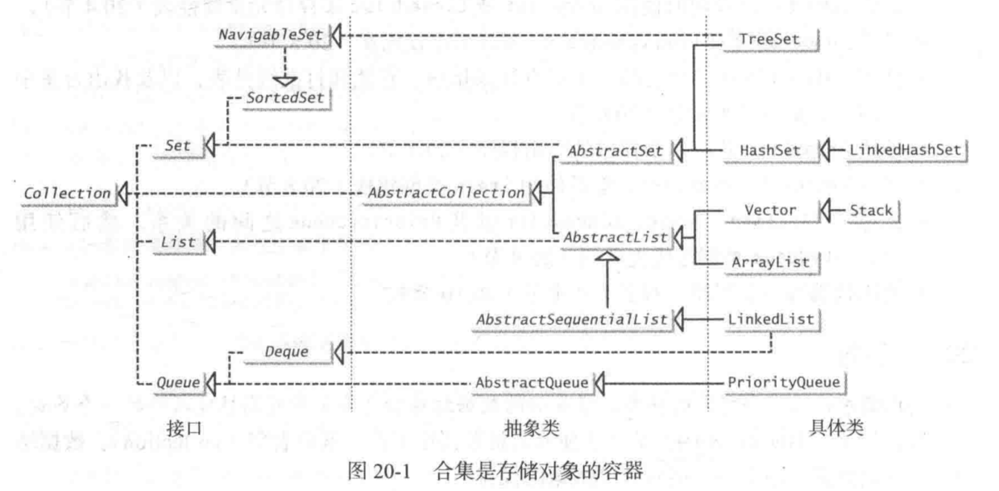
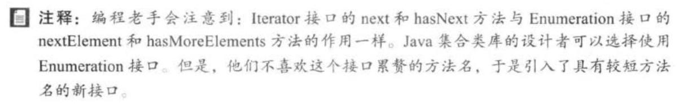
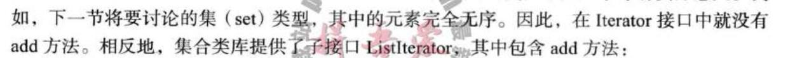
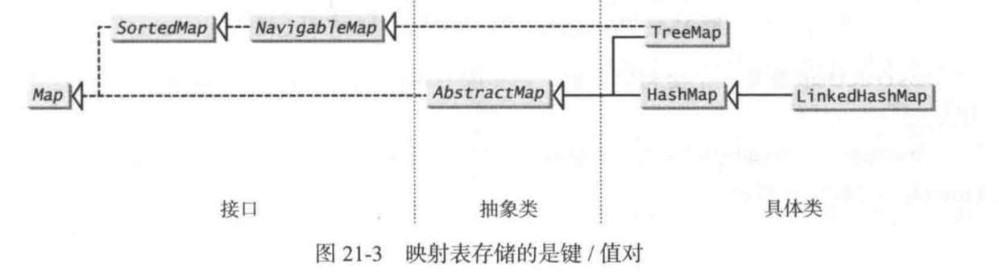
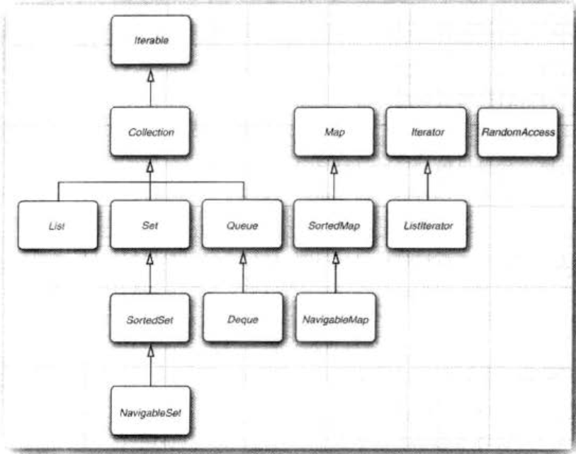
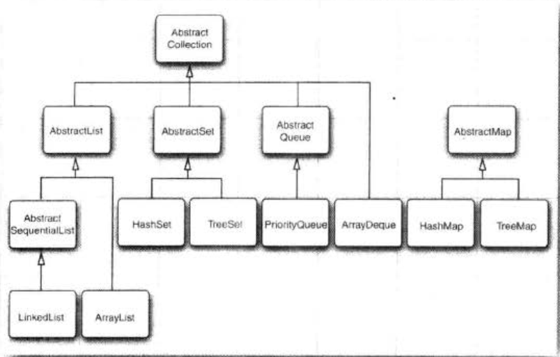
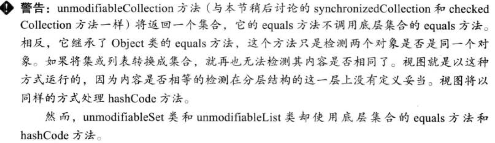

 在面向对象思想里，一种数据结构也被认为是一个容器（container）或者容器对象。

java合集框架支持以下两种类型的容器：  
一种是为了存储一个元素合集，简称为合集\(collection\) 另一种是为了存储键值对，称为映射表（map） collection包括：set, list, queue。他们都继承Collection接口，以期实现一些统一共用的功能



Q1：Collection 接口的部分方法在子类中无法实现，会在子类中抛出异常。比如add方法，在AbstractCollection,AbstractList中均抛出异常UnsupportedOperationException，而在ArrayList中才实现 A1：如果子类不需要实现add方法--比如UnmodifiableCollection--那么就可以不去实现，且可以从父类来统一异常标准，避免子类一个个实现。

Q2：有空看下Spliterator




Q1：无序的add就不能叫做add吗？


HashSet不保证元素顺序，LinkedHashSet按插入顺序排序，TreeSet则会对元素进行排序




不需要排序使用HashMap，按插入顺序或者访问顺序排序使用LinkedHashMap，按键值排序使用TreeMap

EnumSet,IdentityHashMap; System.IdentityHashCode\(Object obj)



RandomAccess接口用来标记是否支持高效的随机访问

 

老版集合，vector,stack,hashTable,properties




Collecitons.checkedList() 
keySet，视图

```java
String[] values = (String[]) s.toArray();//error
String[] values = s.toArray(new String[size]);
```

**遗留**  
hashtable,properties,vector,stack,bitset  
enumeration

