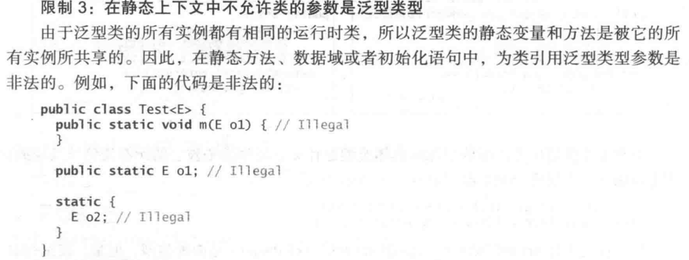
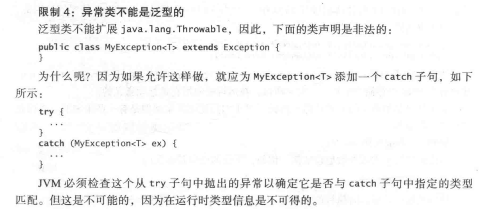
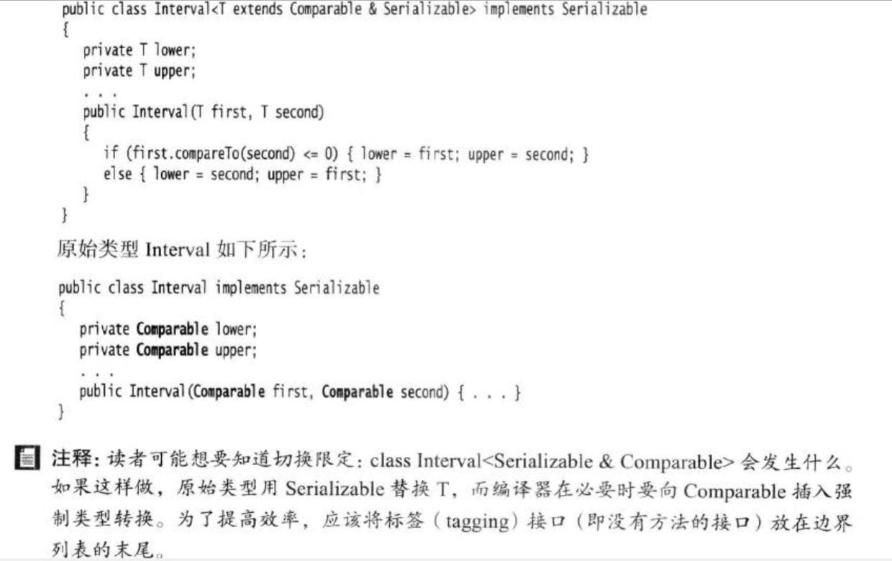

称只读的集合为生产者（Producers），只写的集合为消费者（Consumers）

速记为 PECS : Producer-Extention , Consumer-Super


 ?、? extends T、? super T E\[\] elements = \(E\[\]\)new Object\[capatity\];


泛型用大写字母代替类型，无字母限制，但是一般使用如下字母： E - Element \(在集合中使用，因为集合中存放的是元素\) T - Type（Java 类） K - Key（键） V - Value（值） N - Number（数值类型） ？ - 表示不确定的java类型 S、U、V - 2nd、3rd、4th types

受限泛型： T extends Object\(表示泛型必须是Object或者其子类，Object可以是任何类\) 通配泛型： 1、非受限通配 -- ? -- 基本没限制，等同于 ? extends Object 2、受限通配 -- ? extends T -- 表示T或者T的一个子类型（T需要替换成实际的类） 3、下限通配 -- ? super T -- 表示T或者T的一个父类型（T需要替换成实际的类）

受限泛型是指定义泛型相关类或方法时候的约束，而通配泛型则是在使用泛型类或方法时候的约束

泛型只是一种约束，实际上还是类型消除的，只是编译器进行了自动转化。 类型消除会带来一系列的限制，如： 不能new E\(\)；不能new E\[\] 



泛型创建数组： E\[\] elements = \(E\[\]\) new Object\[capacity\]（会存在类型检测警告）


E,K,V,T-U-S,

```java
//多接口限定，如果有类，那么只能是一个且需要在第一位
T extends Comparable & Serializable
```



**桥方法** 

首先确认类型擦除的概念（处理成限定类型再强转，好奇三四个限定怎么个强转法？新建类？）

```java
class Pair<T>{
    private T first;
    private T second;
    ... constructor ...
    ... getter ... setter
}

class DateInterval extends Pair<Date>{
    public void setSecond(Date second){
        if(second.compareTo(getFirst() >= 0)){
            super.setSecond(second);
        }
    }
}

//擦除类型
class DateInterval extends Pair{
    public void setSecond(Date second){ ... }
    //擦除类型的pair中
    public void setSecond(Object second){ ... }
}

这里子类继承之后的方法不会进行擦除处理，而父类的被擦成了Object
桥方法应运而生，

class DateInterval...{
    //编译器生成
    public void setSecond(Object second){
        setSecond((Date) second)
    }
}

class DateInterval...{
    //更奇怪的是get方法
    Date getSecond()
    Object getSecond()
}
这里在编写java的时候是不允许的，但是虚拟机里是可以共存的

//继承方法也是类似的：
//父类
public Parent getValue(){...}
//子类
public Son getValue(){...}
实际上两个方法是共存的，只是子类的getValue调用桥方法进行转换。
```

@SuppressWarnings\("unchecked"\)

instance的原理

由于数组会有自查限制，如 ArrayList\[\] p ,需要记忆p能够存储的类型，而泛型运行后只能识别ArrayList，有可能造成赋值错误。所以规定不能初始化泛型数组，但是作为变参（T ...）时，变相实现了初始化数组（会有警告，可以@SafeVarargs或者@SuppressWarnings\("unchecked"\)）。

```java
//初始化泛型实例
public Pair<T>{

    T first;

    public Pair(){
        first = new T();//error
        first = T.class.newInstance();//error
    }

    ...
    //如此看来，T这个符号其实更多的编译器实现泛型需求的标记符号
    public static <T> Pair<T> makePair(Class<T> clz){
        try{return new Pair<>(cl.newInstance)}catch{...}
    }
}
```

```java
//强转泛型数组类型
    public static <T extends Comparable> T[] minmax(T... a) {
        T[] mm = (T[]) Array.newInstance(a.getClass().getComponentType(), 2);
        for (int i = 0; i < mm.length; i++) {
            mm[i] = a[i];
            System.out.print(mm[i]);
        }
        return (T[]) mm;
    }
```

object\[\] arrayList.toArray\(\)

 T\[\] arrayList.toArray\(T\[\] var1\)

Q1：这里桥方法，既然把每个方法生成一个桥方法，为什么不干脆把方法给改成一个？

Q2：，试了下声明也是不行的？

Q3：class 是泛型的设计理念

Q4：泛型异常--核心章12.6.7。不能设计泛型类继承异常， 也不能在catch\(T e\)中将T作为方法参数，但是可以在方法体中重新抛出{t.initiCause\(realCause\), throw t}。感觉前面不行是因为动态，但是为什么后面可以?

Q5：章12.6.7，

```java
//去除必检异常的检测
    @SuppressWarnings("unchecked")
    public static <T extends Throwable> void throwAs(Throwable e) throws T {
        throw (T) e;
    }
//这个方法的意义完全没看懂
```

