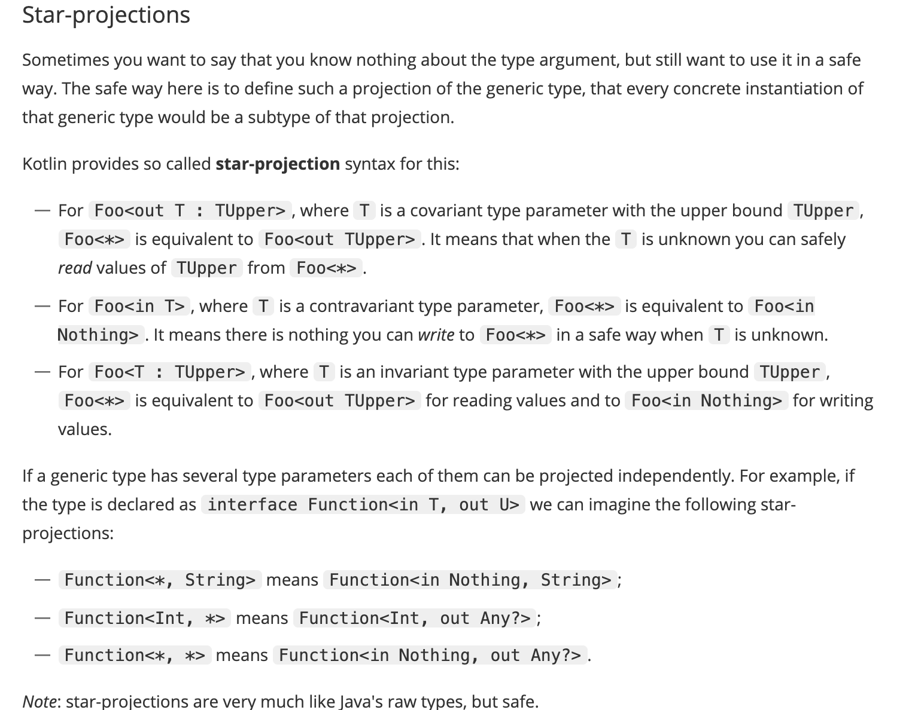

```kotlin
// 类
class Box<T>(t: T){
    var value = t
}

val box: Box<Int> = Box<Int>(1) // 可推断，可简写

// 方法
fun <T> singletonList(item: T): List<T> {
    // ...
}

fun <T> T.basicToString(): String {  // extension function
    // ...
}

val l = singletonList<Int>(1)
```

泛型一样会在运行时进行类型擦除


#### variance

先了解这三个概念，从结论往回看会更好一些：invariant , covariant , contravariant  


Java 中，泛型是不可变( invariant，如List<String> 不是 List<Object> 子类 )的，所以使用通配符来增加适用性，但是很多时候还是很僵硬。

主要因为通配符是在使用端 声明时处理，而不能在定义端 声明时处理。造成很多时候，**明明某个类只有协变或者逆变之一的功能，却还是因为类的声明是不可变的，导致处理上的不方便**。


kotlin 则提供了 **declaration-site** variance 

对于没有消费元素类型（如上述List<Object> 只是从List<String> 获取数据，然后传给外部）的泛型而言，不应该禁止相对的转化。

```kotlin
// kotlin 就加了 out 修饰符, 叫做可变注解(variance annotation)
// 这里out 保证了T 没有被消费，只是
interface Source<out T>{
    fun nextT(): T
}
fun demo(strs: Source<String>) {
    val objects: Source<Any> = strs // This is OK, since T is an out-parameter
    // ...
}

// 相对的增加了 in 修饰符，只能消费，不能生产
interface Comparable<in T> {
    operator fun compareTo(other: T): Int
}

fun demo(x: Comparable<Number>) {
    x.compareTo(1.0) // 1.0 has type Double, which is a subtype of Number
    // Thus, we can assign x to a variable of type Comparable<Double>
    val y: Comparable<Double> = x // OK!
}
```


补充一下使用端的方法，毕竟它能提供 类型安全保护

上述的方式在声明处标明类型的使用情况，但是很多时候虽然声明时既是消费者又是生产者，而使用的时候是独立的。

此时可以在使用处进行`out/in`声明

```kotlin
fun copy(from: Array<out Any>, to: Array<Any>) { ... }
```


#### 泛型约束

向上绑定(upper bound)  （注意java 中的extend 既 用于泛型约束，又用于协变  

```kotlin
// 默认的向上绑定是 Any?
fun <T : Comparable<T>> sort(list: List<T>) {  ... }
```

```kotlin
// 括号里只能写一个向上绑定，如果要多个，需要用 where
// 调用方需要全部实现多个接口
fun <T> copyWhenGreater(list: List<T>, threshold: T): List<String>
    where T : CharSequence,
          T : Comparable<T> {
    return list.filter { it > threshold }.map { it.toString() }
}
```


#### Start - projection

上面两个关键字还不能覆盖所有场景。还有一种场景，是想让所有类型都能传递  

但是为了安全性，有很明确的一些约束  




**泛型擦除**

inline reified (具体在[inline -function]())可以应对此种情况，进行类型检查 

