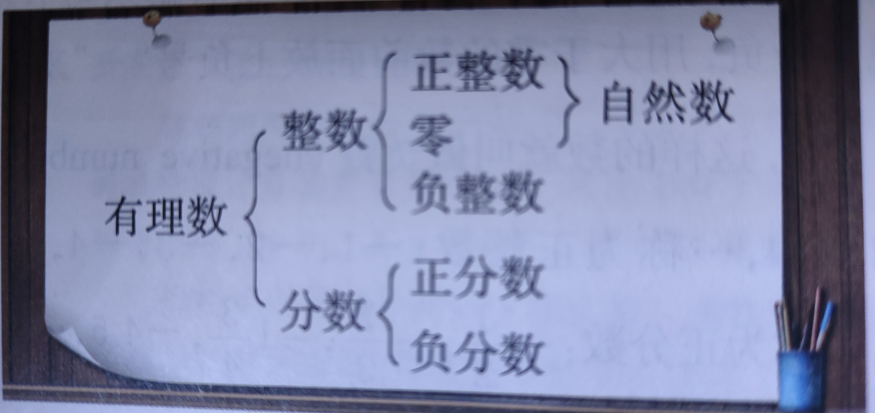
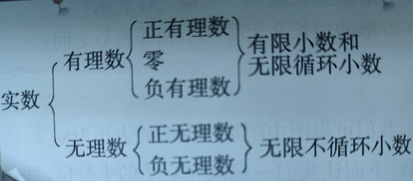

有理数：

> 加法：交换律、结合律；乘法：交换律、结合律、分配律；除法：乘法逆运算
>
> 负负得正、乘零皆零
>
> 倒数、
>
> 乘方：幂、底数、指数 -- 底数的次幂、底数的次方；科学计数法 
>
> 准确数、近似数

数轴：原点、单位长度、正方向

> 相反数、绝对值：|a|

实数：

> $$
> 无理数：次方根\sqrt{4}、\sqrt[3]{8}、开方、算数根
> $$
>
> 正数有正、负两个平方根、0 的平方根是0、负数没有

代数式：
$$
|a|= 
\begin{cases}
a& \text{(a} \geq \text{0)}
\\ -a& \text{(a} < \text{0)}
\end{cases}
$$
> 整式：单项式、系数、次数；多项式、项、常数项、同类项
>
> 单项式是数与字母或字母与字母相乘组成的代数式。所以整式中，代数字母不能是分母。

一元一次方程：

> 未知数、解（根）
>
> 移项、

图形：

> 几何图形：立体、平面
>
> 线段、射线、直线
>
> 两点确定一条直线
>
> 相交、直线的交点
>
> 互相垂直、垂线、垂足；同一平面，线上一点有且仅有一条垂线；点到线的线段中，垂线段最短
>
> 两点之间线段最短
>
> 线段和、线段差、中点

> 角、顶点、角的始边、角的终边；∠AOB
>
> 平角、周角 ；度、分、秒；直角、锐角、钝角
>
> 角的和、角的差、平分线
>
> 余角-互余、补角-互补、对顶角

