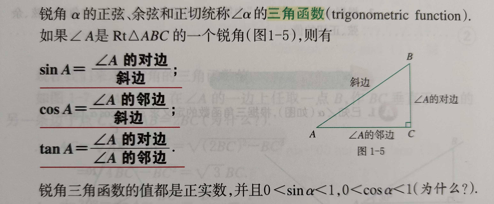

三角函数：

> 锐角
>
> 正弦：sin α ； 余弦：cos α；正切：tan α

解直角三角形

直线与圆：

> 相交、相切、相离 ；判断圆心O 到直线的距离
>
> 圆的切线、切点、切线长
>
> 经过半径的外端并且垂直这条半径的直线是圆的切线
>
> 经过切点的半径垂直于圆的切线
>
> 过圆外一点所作的圆的两条切线长相等

内切圆，内心，圆的外切三角形

三视图与表面展开图：

> 投影、投射线、投影面
>
> 平行投影：平行的投射线形成的投影  
>
> 中心投影：同一点出发的投射线形成的投影
>
> 正投影：投射线垂直于投影面（所以必是平行投影）
>
> 三视图：主视图、俯视图、左视图；主视方向

> 几何体展开平铺所得到的平面图形叫做表面展开图
>
> 圆锥、圆柱：底面、侧面、母线
> $$
> 圆锥：
> 侧面积 S_侧 = πrl ; 全面积 S_全 = πr^2 + πrl ; 圆心角度数： θ = \frac{r}{l} \cdot 360 °
> $$
> 

圆线相切，用tangent 表示，那怎么统一理解三角形的tan A ? 

