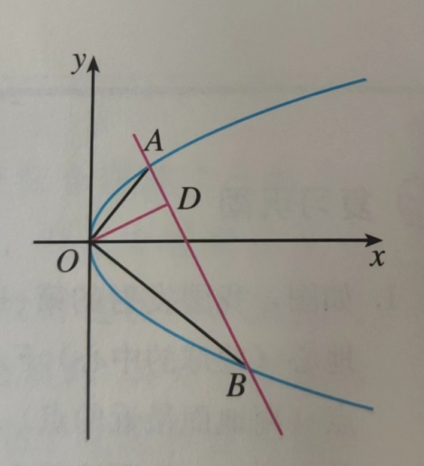

## 曲线图形-课内

### 圆

推论：

圆心为(a,b)，半径为r 的圆可以表示为：$x=a+r\cdot cos\theta;y=b+r\cdot sin\theta$

如果四边形一组对边的平方和等于另一组对边的平方和，那么它的对角线垂直

- 直线$l:(2m+1)x+(m+1)y-7m-4=0$ ，求证其恒过定点，并求出该点。

- $\triangle ABC$ 的三个顶点分别为A(5,1), B(7,-3), C(2,-8)，求$\triangle ABC$ 的外接圆的标准方程

- 已知线段AB 的端点B 的坐标是(4,3)，端点A 在圆$(x+1)^2+y^2=4$ 上运动，求线段AB 的中点M 的轨迹方程

- 如图，在四边形ABCD 中，AB=6，CD=3，且AB//CD，AD=BC，AB 与CD 间的距离为3。

  

  求等腰梯形ABCD 的外接圆的方程，并求这个圆的圆心坐标和半径

- 已知动点M 与两个定点O(0,0), A(3,0) 的距离的比为$\frac{1}{2}$，求动点M 的轨迹方程，并说明轨迹的形状

- 已知直线$l$：3x+y-6=0 和圆心为C 的圆$x^2+y^2-2y-4=0$，判断直线$l$ 与圆C 的位置关系。如果相交，求直线$l$ 被圆C 所截得的弦长。

- 过点P(2,1) 作圆O：$x^2+y^2=1$ 的切线$l$，求切线$l$ 的方程

- 赵州桥的跨度是37.4 m，圆拱高约为7.2 m，求这座圆拱桥的拱圆的方程

- 已知圆$C_1:x^2+y^2+2x+3y+1=0;C_2:x^2+y^2+4x+4y+2=0$，证明圆$C_1、C_2$ 相交，并求其公共弦所在直线的方程

- 求圆心在直线3x-y=0 上，与x 轴相切，且被直线x-y=0 截得的弦长为$2\sqrt{7}$ 的圆的方程

- 求圆$C:x^2+y^2-x+2y=0$ 关于直线$l:x-y+1=0$ 对称的圆的方程

- 已知圆$x^2+y^2=4,直线l:y=x+b$，问b 为何值时，圆上恰有三个点到直线$l$ 的距离都等于1？

- 已知圆$x^2+y^2=4; x^2+y^2+4x-4y+4=0$ 关于直线$l$ 对称，求直线$l$ 的方程

- 求曲线$x^2+y^2=|x|+|y|$ 围成的图形的面积

  

### 椭圆

推论：

过椭圆的右焦点$F_2$ 作直线AB，交椭圆于A，B两点，$F_1$ 是椭圆的左焦点。那么$\triangle AF_1B$ 的周长固定

椭圆的长轴顶点，是距离焦点最远和最近的两个点

- 已知椭圆的两个焦点坐标分别是(-2,0),(2,0)，并且经过点$(\frac{5}{2},-\frac{3}{2})$，求它的标准方程
- 如果椭圆$\frac{x^2}{100}+\frac{y^2}{36}=1$ 上一点P 与焦点$F_1$ 的距离等于6，那么点P 与另一个焦点$F_2$ 的距离是`____`
- 求椭圆$16x^2+25y^2=400$ 的长轴和短轴的长、离心率、焦点和顶点的坐标。
- 问$x^2+9y^2=36$ 与$\frac{x^2}{6}+\frac{y^2}{10}=1$ 哪个更接近圆
- 已知P 是椭圆$16x^2+25y^2=1600$ 上的一点，且在x 轴上方，$F_1,F_2$ 分别是椭圆的左、右焦点，直线$PF_2$ 的斜率为$-4\sqrt{3}$，求$\triangle PF_1F_2$ 的面积 

### 双曲线

推论：

若动点M 与定点F(c,0)的距离和它到定直线$l:x=\frac{a^2}{c}$ 的距离的比是常数$\frac{c}{a}(0<a<c)$，则点M 的轨迹是一个双曲线

> 若是点F'(-c,0)，$l':x=-\frac{a^2}{c}$ ，也是一样

- 已知方程$\frac{x^2}{2+m}-\frac{y^2}{m+1}=1$ 表示双曲线，求m 的取值范围
- 求双曲线$9y^2-16x^2=144$ 的实半轴长和虚半轴长、焦点坐标、离心率、渐近线方程
- 直线$y=\frac{2}{3}x$ 与双曲线$\frac{x^2}{a^2}-\frac{y^2}{8}=1(a>0)$ 相交于A，B两点，且A，B两点的横坐标之积为-9，求离心率e
- 求与椭圆$\frac{x^2}{49}+\frac{y^2}{24}=1$ 有公共焦点，且离心率$e=\frac{5}{4}$ 的双曲线的方程
- M 是一个动点，MA 与直线y=x 垂直，垂足A 位于第一象限，MB 与直线y=-x 垂直，垂足B 位于第四象限，若四边形OAMB（O为原点）的面积为3，求动点M 的轨迹方程
- 已知双曲线$x^2-\frac{y^2}{2}=1$，过点P(1,1) 的直线$l$ 与双曲线相交于点A，B两点，P 能否是线段AB 的中点？为什么？

>  双曲线与直线交点的时候，考虑一下渐近线，然后再计算。

### 抛物线

- 抛物线$y^2=12x$ 上与焦点的距离等于9 的点的坐标是`____`

- 求抛物线标准方程：焦点F 在y 轴负半轴上，经过横坐标为16 的点P，且FP 平行于准线

- 已知圆心在y 轴上移动的圆经过点A(0,5)，且与x轴、y轴分别交于B(x,0),C(0,y) 两个动点，求点M(x,y) 的轨迹方程

- 【思路为主】设抛物线$y^2=2px(p>0)$ 的焦点为F，从点F 发出的光线经过抛物线上的点M（不同于抛物线的顶点）反射，证明反射光线平行于抛物线的对称轴

- 如图已知直线与抛物线$y^2=2px(p>0)$ 交于点A，B两点，且$OA\perp OB,OD\perp AB$ 交AB 于点D，点D 的坐标为(2,1)，

  

  求p 的值

### 综合

推论：

过抛物线的焦点做直线与抛物线相交与AB 线段，并以此为直径画圆，与抛物线的准线相切；椭圆则相离；双曲线则相交

- 如果点M(x,y) 在运动过程中，总满足关系式：$\sqrt{x^2+(y-3)^2}+\sqrt{x^2+(y+3)^2}=10$。那么点M 点轨迹是什么曲线？
- 一动圆与圆$x^2+y^2+6x+5=0$ 外切，同时与圆$x^2+y^2-6x-91=0$ 内切，求动圆圆心的轨迹方程。
- 与圆$x^2+y^2=1$ 及圆$x^2+y^2-8x+12=0$ 都外切的圆的圆心轨迹是什么曲线？
