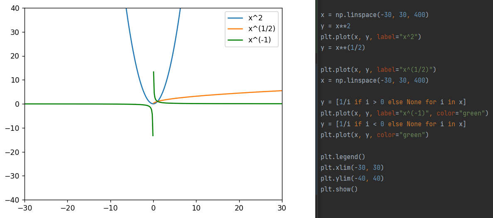

## 函数图像

把一个函数的自变量x 的值与函数y 的对应值分别作为点的横坐标和纵坐标，在直角坐标系中描出它的对应点，所有这些点组成的图形叫做这个函数的**图像**（8年级上）

- 方程$f(x)=0$ 有实数解 $\Leftrightarrow$ 函数$y=f(x)$ 有零点 $\Leftrightarrow$ 函数$y=f(x)$ 的图像与x 轴有公共点（必修1）

- **函数零点存在定理：** 如果函数$y=f(x)$ 在区间[a, b] 上的图像是一条连续不断的曲线，且有$f(a)f(b)<0$，那么，函数$y=f(x)$ 在区间(a, b) 内至少有一个零点，即存在$c\in(a,b)$，使得$f(c)=0$，这个c 也就是方程$f(x)=0$ 的解（必修1）
    - **二分法：**通过不断地把函数的零点所在的区间一分为二，使所得区间的两个端点逐步逼近零点，进而得到零点近似值的方法（将零点所在区间范围缩小到满足一定精确度$\varepsilon$）。（必修1）
    
- 偶函数，即关于y 轴对称；奇函数，即关于原点中心对称。（必修1）

    > 拓展：函数$y=f(x)$ 的图像关于点P (a,b) 成中心对称图形的充要条件是函数$y=f(x+a)-b$ 为奇函数

### 图像特性

#### 一次函数（8年级上）

一次函数$y=kx+b(k,b都是常数,且k\ne 0)$ 可以用直角坐标系中的**一条直线来表示**，这条直线也叫作一次函数$y=kx+b$ 的图像。

> 反之研究实际问题的两个变量之间的关系时，可以利用图像去判断两者是否构成一次函数关系

- 当$k>0$ 时，y 随 x 的增大而增大；当$k<0$ 时，y 随 x 的增大而减小 

#### 反比例函数（8年级下）

反比例函数$y=\frac{k}{x}(k为常数，k\ne 0)$ 的图像有如下特征：

- 其图像是由两个分支组成的**曲线**（是高中知识的双曲线的一种）。

  当$k>0$时，图像在一、三象限，函数值y 随自变量x 的增大而减小；

  当$k<0$时，图像在二、四象限，函数值y 随自变量x 的增大而增大。

- 其图像关于直角坐标系的原点成中心对称

#### 二次函数（9年级上）

二次函数$y=a(x-m)^2+k(a\ne 0)$的图像是一条**抛物线**，对称轴是直线`x=m` ，**顶点**是(m, k)

而二次函数$y=ax^2+bx+c(a\ne 0)$ 可以通过变形得到$y=a(x+\frac{b}{2a})^2+\frac{4ac-b^2}{4a}(a\ne 0)$ 。所以其图像是一条抛物线，对称轴是直线$x=-\frac{b}{2a}$ ，顶点是$(-\frac{b}{2a}, \frac{4ac-b^2}{4a})$. 

- 当$a>0$ 时，抛物线的开口向上，顶点是抛物线的最低点；当$a<0$ 时，抛物线的开口向下，顶点是抛物线的最高点。

- 图像与x 轴的交点数量，增减性，最大最小值

  >  就可以利用此来计算日常应用的最值问题 

#### 幂函数（必修1）

- 都通过点(1,1)
- $\alpha=2$ 时是偶函数，$\frac{1}{2}$ 时只有第一象限，其它是奇函数
- 在$[0,+\infin)$ 上，只有$\alpha=-1$时，是单调递减。其它递增

#### 指数函数（必修1）

- 过定点(0,1)
- a<1 时，减函数；a>1 时，增函数
- 值域都是$(0,+\infin)$

底数互为倒数的两个指数函数的图像关于y 轴对称

#### 对数函数（必修1）

- 过定点(1,0)
- a<1 时，减函数；a>1 时，增函数

底数互为倒数的两个对数函数的图像关于x 轴对称

### 拓展

$x+\frac{1}{x}$ 的图像是对勾型

指数函数$y=a^x(a>0,且a\ne1)$ 与对数函数$y=log_ax(a>0,且a\ne1)$ 的图像关于$y=x$ 对称 