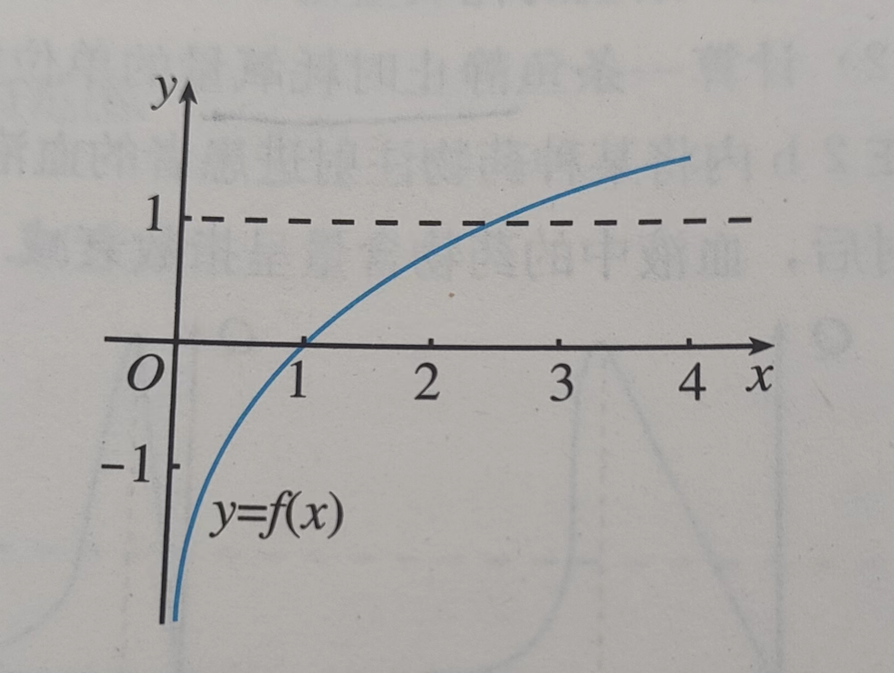

## 函数图像-课内

#### 基本

- 画出函数$y=|x-2|$ 的图像

- 已知函数$f(x)=\frac{x+2}{x-6}$ ，问：点(3,14) 在f(x) 的图像上么？当$x=4$ 时，求f(x) 的值。当$f(x)=2$ 时，求x 的值。

- 已知幂函数$y=f(x)$ 的图像过点$(2,\sqrt{2})$，求这个函数的解析式。如果过点$(2,\frac{\sqrt{2}}{2})$ 呢？

- 下表是拉力F（单位：N）与弹簧伸长长度x（单位：cm）的相关数据：

  | F    | 1    | 2    | 3    | 4    | 5    |
  | ---- | ---- | ---- | ---- | ---- | ---- |
  | x    | 14.2 | 28.8 | 41.3 | 57.5 | 70.2 |

  描点画出弹簧伸长长度随拉力变化的图像，并写出一个能基本反映这一变化现象的函数解析式

- 【基本】有一道题，“若函数$f(x)=24ax^2+4x-1$ 在区间(-1, 1) 内恰有一个零点，求实数a 的取值范围”，某同学给出了如下解答：

  由$f(-1)f(1)=(24a-5)(24a+3)<0$，解得$-\frac{1}{8}<a<\frac{5}{24}$ 。所以实数a 的范围是$(-\frac{1}{8},\frac{5}{24})$  

  上述解答正确吗？若不正确，请说明理由，并给出正确的解答

- 【基本】设函数$f(x)=ax^2+bx+c(a>0,b,c\in R)，且f(1)=-\frac{a}{2}$，求证：函数f(x) 在(0, 2) 内至少有一个零点

- 【图像】已知函数$f(x)=x^3-2x+1$，求证：方程$f(x)=x$ 在(-1, 2) 内至少有两个实数解

- 【图像】已知函数$f(x)=\begin{cases}x^2+2x-3,x\le 0\\-2+ln\space x, x>0\end{cases}$ 求使方程$f(x)=k$ 的实数解个数分别为1，2，3时k 的相应取值范围

> 不在，-3,14；$y=x^{\frac{1}{2}},y=x^{-\frac{1}{2}}$; x=14F; 不正确，首先要有根，再可能是单根，为$-\frac{1}{6}$；f(0),f(2)正负互异；图像交叉；图像交叉

#### 特性

- 在同一直角坐标系中画出函数$y=log_3x$ 和$y=log_{\frac{1}{3}}x$ 的图像，并说明它们的关系

- 【图像】已知$f(x)=a^x,g(x)=(\frac{1}{a})^x(a>0,且 a\ne1)$ ，如果$f(x)<g(x)$，那么x 的取值范围是多少

- 【基本】已知函数$y=a(\frac{1}{2})^{|x|}+b$ 的图像过原点，且无限接近直线y=2 但又不与该直线相交。求出该函数的解析式，并画出图像

- 函数$y=f(x)$ 的图像如图所示

  

  则$y=f(x)$ 可能是：

  A. $y=1-x^{-1},x\in(0,+\infin)$    B. $y=\frac{3}{2}-(\frac{1}{2})^x,x\in(0,+\infin)$  

  C. $y=lnx$                                     D. $y=x-1,x\in(0,+\infin)$
  
- 【应用】某公司为了实现1000万元利润的目标，准备制定一个激励销售人员的奖励方案：在销售利润达到10万元时，按销售利润进行奖励，且奖金y 随销售利润x 的增加而增加，但奖金总数不超过5，同时奖金不超过利润的25%。现有几个模型：$y=0.25x,y=log_7x+1,y=1.002^x$ ，请问哪个模型能符合要求？

