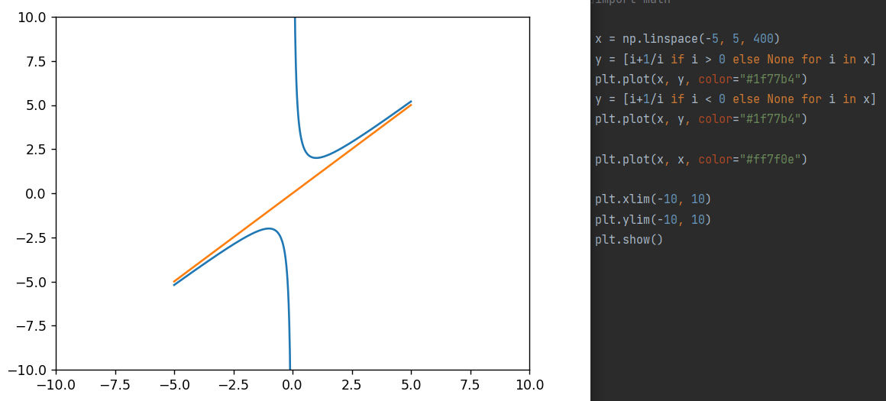
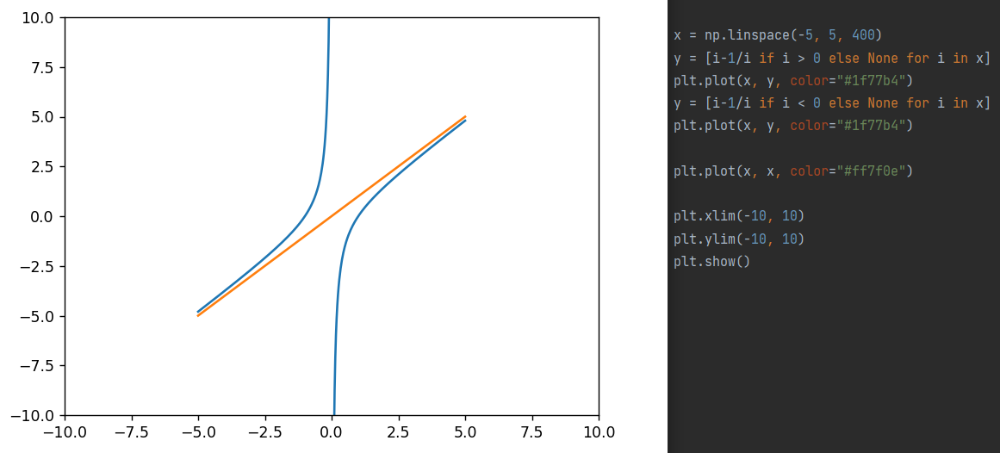

## 对勾函数

$y=ax+\frac{b}{x}$

### 示例

- 特殊：$y=x+\frac{1}{x}$ 的图像如下：

    

    定义域和值域是多少？

    最值、零点、单调性、奇偶性、周期性

    渐近线

- 原始为：$y=a(x+\frac{\frac{b}{4}}{x})$

    如果a>0, b>0，则上述各种结果为

    如果a<0, b<0，则上述各种结果为

### 练习

#### 课内

- 请说明函数$y=x+\frac{k}{x}(k>0)$ 在区间$(0, +\infin)$ 上的单调性，并证明
- 求函数$f(x)=x+\frac{1}{x}$ 的奇偶性

#### 课外

- 求$y=4sin^2x+\frac{9}{sin^2x}$ 的值域
- 求$f(x)=x^2+\frac{1}{x^2+x+3}+x$ 的值域

## 双撇函数

$y=ax-\frac{b}{x}$

### 示例

- 特殊：$y=x-\frac{1}{x}$

    

- 原始的各种值是多少呢？

    零点：$(\sqrt{\frac{b}{a}},0)、(-\sqrt{\frac{b}{a}},0)$

### 练习

#### 课内

- 试讨论函数$y=x-\frac{1}{x}$ 的定义域、值域、单调性、奇偶性，并画出函数图像

#### 课外

- 求函数$f(x)=x-\frac{4}{x}$ 在区间$x\in (3,4]$ 上的值域是：

- 求证$f(x)=x-\frac{1}{x}$ 的函数图像是轴对称图形，并求对称轴的解析式

