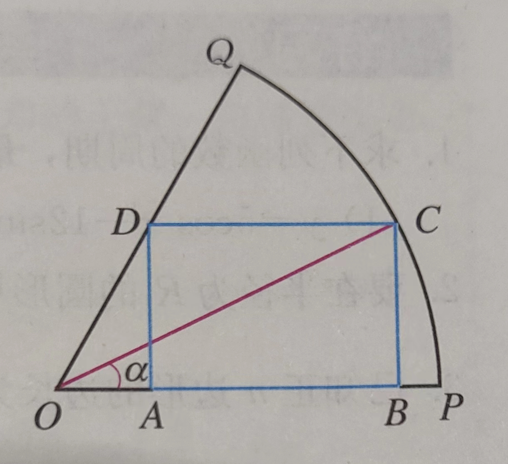
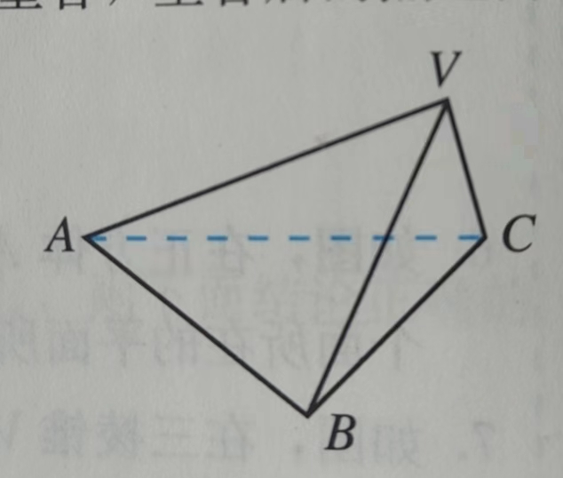

## 三角函数图像-课内

### 基本

- 化简$\sqrt{\frac{1+sin\alpha}{1-sin\alpha}}-\sqrt{\frac{1-sin\alpha}{1+sin\alpha}}$，其中$\alpha$ 为第二象限角

  

### 图像

- 用五点法绘制$y=|sinx|$ 的图像及其关系

- 求函数$y=\frac{2}{3}sin(\frac{1}{2}x-\frac{\pi}{4})$ 的图像与正弦曲线有什么关系？

- 求函数$y=1+cosx,x\in(\frac{\pi}{3},2\pi)$ 的图像与直线$y=t(t 为常数)$ 的交点可能有几个？

- 如图在扇形OPQ 中，半径OP=1，圆心角$\angle POQ=\frac{\pi}{3}$，C 是扇形弧上的动点，矩形ABCD 内接于扇形，记$\angle POC=\alpha$，求当角$\alpha$ 取何值时，矩形ABCD 的面积最大，并求出这个最大面积 

  
  
- 如图，在三棱锥V-ABC 中，VA=VB=AB=AC=BC=2，VC=1

  

  求AB 中点O，所构成的角VOC 的余弦值
