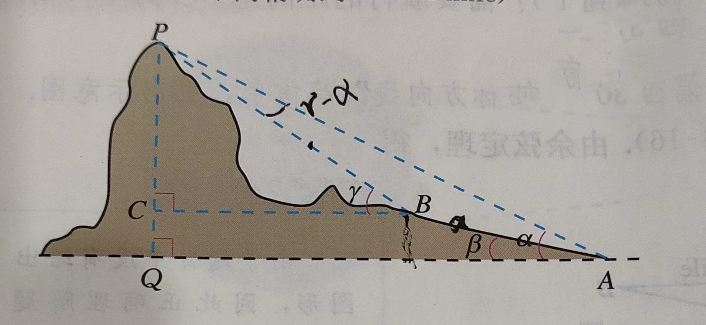
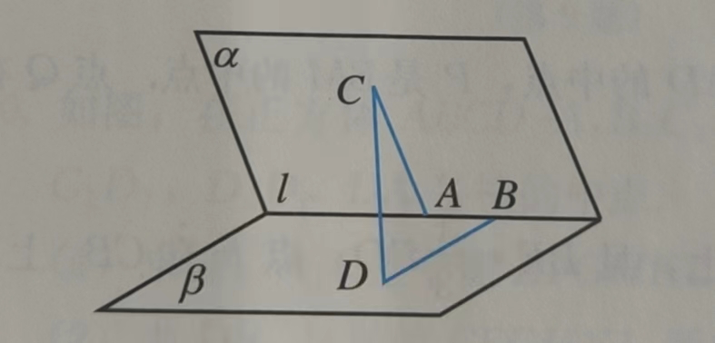

## 三角函数-课内

推论：

$sinx=x-\frac{x^3}{3!}+\frac{x^5}{5!}-\frac{x^7}{7!}+...$

$cosx=1-\frac{x^2}{2!}+\frac{x^4}{4!}-\frac{x^6}{6!}+...$

常见角度组合：$105=45+60;75=30+45$

### 练习

#### 性质公式

- 求$\frac{5\pi}{3}、\frac{\pi}{2}$ 的正弦、余弦和正切值
- 已知$sin\alpha=-\frac{3}{5}$，求$cos\alpha, tan\alpha$ 的值
- 化简$(1+tan^2\alpha)cos^2\alpha$ 
- 计算：

    - $10cos270^\circ+4sin0^\circ+9tan0^\circ+15cos360^\circ$ 
    - $sin^2\frac{\pi}{3}+cos^4\frac{3\pi}{2}-tan^2\frac{\pi}{3}$ 
- 求证：

    - $\frac{1-2sinxcosx}{cos^2x-sin^2x}=\frac{1-tanx}{1+tanx}$
    - $\forall x\in R,sin^2x-cos^2x=sin^4x-cos^4x$

- $sin(53^\circ-\alpha)=\frac{1}{5},且-270^\circ<\alpha<-90^\circ$，求$sin(37^\circ+\alpha)$ 的值
- 已知$sin(\frac{\pi}{3}-x)=\frac{1}{3}，且0<x<\frac{\pi}{2},求sin(\frac{\pi}{6}+x)和cos(\frac{2\pi}{3}+x)$ 的值
- 化简
    - $\frac{cos(180^\circ+\alpha)sin(\alpha+360^\circ)}{tan(-\alpha-180^\circ)cos(-180^\circ+\alpha)}$
    - $\frac{sin(2\pi-\alpha)cos(\pi+\alpha)cos(\frac{\pi}{2}+\alpha)cos(\frac{11\pi}{2}-\alpha)}{cos(\pi-\alpha)sin(3\pi-\alpha)sin(-\pi-\alpha)sin(\frac{9\pi}{2}+\alpha)}$
    - $\sqrt{3}sinx+cosx ; \sqrt{2}cosx-\sqrt{6}sinx$
    - $\frac{tan\frac{5\pi}{4}+tan\frac{5\pi}{12}}{1-tan\frac{5\pi}{12}}$
- 求证
    - $cos(\frac{3\pi}{2}+\alpha)=sin\alpha$
- 求$cos15^\circ，sin75^\circ,tan15^\circ$ 的值
- 已知$sin\alpha=-\frac{2}{3},\alpha\in(\pi,\frac{3\pi}{2}),cos\beta=\frac{3}{4},\beta\in(\frac{3\pi}{2},2\pi)$，求$cos(\beta-\alpha)$ 的值
- 已知$\alpha,\beta$ 都是锐角，$cos\alpha=\frac{1}{7},cos(\alpha+\beta)=-\frac{11}{14}$，求$cos\beta$ 的值
- 已知$sin2\alpha=\frac{5}{13},\frac{\pi}{4}<\alpha<\frac{\pi}{2}$，求$sin4\alpha,cos4\alpha,tan4\alpha$ 的值
- 在$\triangle ABC$中，$cosA=\frac{4}{5},tanB=2$，求$tan(2A+2B)$ 的值
- 在$\triangle ABC$ 中，$sinA=\frac{5}{13},cosB=\frac{3}{5}$，求$cosC$ 的值
- 已知$sin\beta+cos\beta=\frac{1}{5},\beta\in(0,\pi)$，求$tan\beta$ 的值
- 求证$sin\theta+sin\varphi=2sin\frac{\theta+\varphi}{2}cos\frac{\theta-\varphi}{2}$（提示：化归思想）
- 在$\triangle ABC$中，已知$tanA,tanB$ 是x 的方程$x^2+p(x+1)+1=0$ 的两个实根，求$\angle C$  
- 是否存在锐角$\alpha,\beta$，使$\alpha+2\beta=\frac{2\pi}{3},tan\frac{\alpha}{2}tan\beta=2-\sqrt{3}$ 同时成立？若存在，求值；若不存在，请说明理由

#### 函数性质

- 求周期$y=2sin(\frac{1}{2}x-\frac{\pi}{6}),x\in R$ 
- 求函数$y=3sinx+4cosx$ 的周期，最大最小值
- 比较$cos(-\frac{23\pi}{5})$ 与$cos(-\frac{17\pi}{4})$ 的大小

- 设函数$f(x)(x\in R)$ 是以2 为最小正周期的周期函数，且当$x\in[0,2]$ 时，$f(x)=(x-1)^2$，求$f(3),f(\frac{7}{2})$ 
- 求函数$y=sin(\frac{1}{2}x+\frac{\pi}{3}),x\in[-2\pi,2\pi]$ 的单调递增区间
- 求函数$y=cos(x+\frac{\pi}{3}),x\in[0,\frac{\pi}{2}]$ 的值域
- 已知函数$f(x)=sin(x+\frac{\pi}{6})+sin(x-\frac{\pi}{6})+cosx+\alpha$ 的最大值为1，求常数a 的值；求函数f(x) 的单调递减区间

### 余弦正弦

- 在$\triangle ABC$ 中，已知$a=5,b=2,C=\frac{\pi}{3}$，求c

- 在$\triangle ABC$ 中，已知$a=2,c=\frac{2\sqrt{3}}{3},A=120^\circ$，求b 和C

- 在$\triangle ABC$ 中，已知$cosA=\frac{4}{5},B=\frac{\pi}{3},b=\sqrt{3}$，求a, c

- 在三角形ABC 中，设三边分别为a，b，c，边BC 上的中线记为$m_a$，利用余弦定理证明：$m_a=\frac{1}{2}\sqrt{2(b^2+c^2)-a^2}$

- 证明：设三角形的外接圆的半径是R，则a=2RsinA

- 如图，在山脚A 测得山顶P 的仰角为$\alpha$, 沿倾斜角为$\beta$ 的斜坡向上走a 距离到达B 处，到B 处测得山顶P 到仰角为$\gamma$，

    

    求证：山高$h=\frac{asin\alpha sin(\gamma-\beta)}{sin(\gamma-\alpha)}$

- 已知a,b,c 分别是三角形ABC 三个内角A，B，C 的对边，且$acosC+\sqrt{3}asinC-b-c=0$，求A。

    若a=2，则三角形ABC 的面积为$\sqrt{3}$，求b，c
    
- 如图，二面角$\alpha-l-\beta$ 的棱上由两个点A，B，线段BD 与AC 分别在这个二面角点两个面内，并且都垂直于棱 $l$。若AB=4，AC=6，BD=8，CD=$2\sqrt{17}$ 

    

    求平面$\alpha$ 与平面$\beta$ 的夹角

