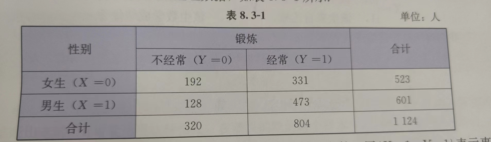
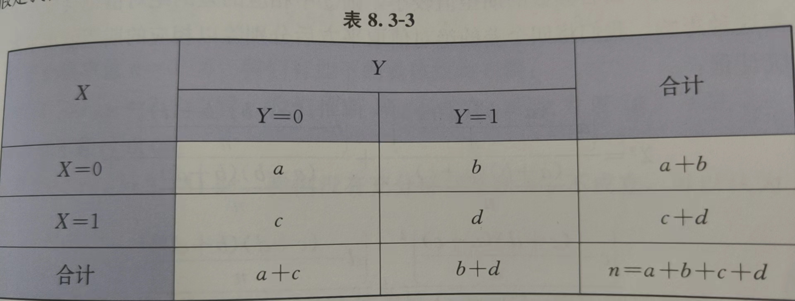
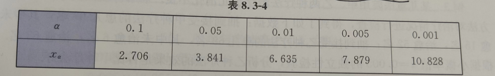

## 列联表（选3）

一类特殊的随机变量被称为**分类变量**，其取值可以用实数表示，作为编号使用，以区分不同的现象或性质，并没有通常的大小和运算意义。

> 主要讨论取值于{0, 1} 的分类变量的关联性问题

举例说明：

为了了解性别因素是否对本校学生体育锻炼的经常性有影响，本校普查数据有：523名女生中有331名经常锻炼；601名男生中有473名经常锻炼。判断逻辑为：比较各自性别中，经常锻炼的人数比例。

此时可以用条件概率描述：$X=\begin{cases}0,该生为女生\\1,该生为男生\end{cases}$ ；$Y=\begin{cases}0,该生不经常锻炼\\1,该生经常锻炼\end{cases}$

那么判断逻辑可以表达为：$P(Y=1|X=0)、P(Y=1|X=1)$ 的大小比较

同时可以整理出如下表格（称为**$2\times2$ 列联表**）：

> 该表给出了成对分类变量数据的交叉分类频数：
>
> 最后一行的前两个数分别是事件{Y=0}、{Y=1} 的频数；最后一列的前两个数分别是事件{X=0}、{X=1} 的频数
>
> 中间四格的数是事件{X=x,Y=y}(x,y=0,1) 的频数，
>
> 右下角的为样本容量

用$\{X=0,Y=1\}$ 表示事件$\{X=0\}$ 和$\{Y=1\}$ 的积事件，则有$P(Y=1|X=0)=\frac{n(X=0,Y=1)}{n(X=0)}$

通用抽象为：

称$H_0:P(Y=1|X=0)=P(Y=1|X=1)$ 为**零假设** 或 **原假设**（即X 分类不影响Y）

可推得$H_0$ 等价于：$\{X=1\}$ 与$\{Y=1\}$ 两者独立

用随机变量$\chi^2=\frac{n(ad-bc)^2}{(a+b)(c+d)(a+c)(b+d)}$取值的大小作为判断$H_0$ 是否成立的依据。在$\chi^2$ 的近似分布中，对于任何小概率值$\alpha$ 都可以找到相应的正实数$x_\alpha$，使得$P(\chi^2\ge x_\alpha)=\alpha$ 成立，则称$x_\alpha$ 为$\alpha$ 的**临界值**。只要概率值$\alpha$ 取的足够小，事件$\chi^2\ge x_\alpha$ 不大可能发生，于是可以用于反向判断：当其发生时，推断$H_0$ 不成立，即认为$X、Y$ 不独立

上述这种方法称为**$\chi^2$ 独立性检验**，读作“卡方独立性检验”，简称独立性检验

常用小概率值、临界值为：

