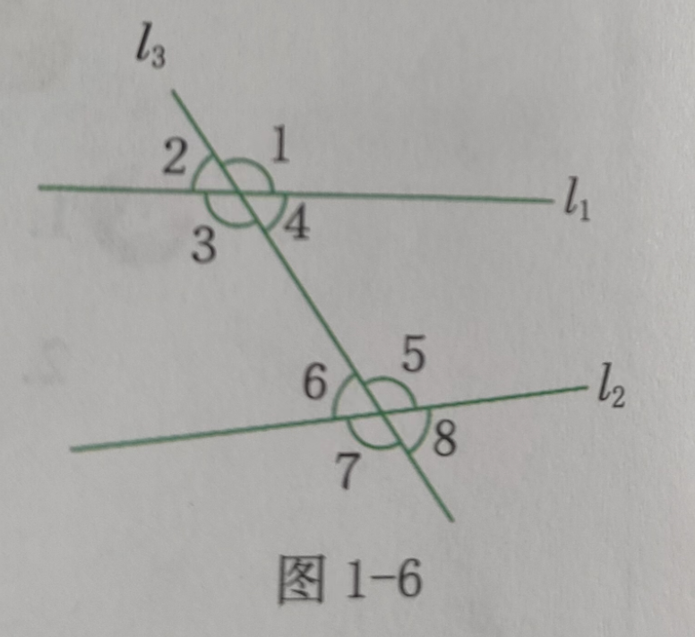

## 平面图形

### 点线

##### 线段

- 定义
    - 拉紧的一段线，可以看作一条线段。线段是直的，可以量出长度。（2年级上）
    - **线段** 有两个端点，可以用线段AB 来表示（AB 为两个端点）（4年级上），也可以用一个小写字母表示。如"线段a"（7年级上）

    - 两点间所有连线中线段最短，这条线段的长度叫作**两点间的距离**（4年级下）

    - 若点C 把线段AB 分成相等的两条线段AC 与BC，那么点C 叫做线段AB 的**中点**（三等分类似）（7年级上）

    - **延长线段AB** 是指将线段沿AB 方向延长。若沿BA 方向延长线段，则要说成“延长线段BA”。线段的延长线通常画成虚线（7年级上）

- 运算

    - 如果两条线段长度相等，我们就说这两条线段相等，记作AB=AC（大小类似，转换为长度比较）（7年级上）

        如果一条线段的长度是另两条线段的长度的和，那么这条线段就叫做另**两条线段的和**。（差类似）
        
    - 两条线段的长度的比叫做这两条**线段的比**（9年级上）

        四条线段a,b,c,d 中，如果a 与b 的比等于c 与d 的比，即$\frac{a}{b}=\frac{c}{d}$，那么这四条线段a,b,c,d 叫做**成比例线段**，简称比例线段

- 性质：
    - 在所有连结两点的线中，线段最短，简单的说：**两点之间线段最短**。（事实，7年级上）
    - 线段垂直平分线上的点到线段两端的距离相等（定理，8年级上）
        - 到线段两端距离相等的点在线段的垂直平分线上（逆定理，8年级上）
    - 垂直于一条线段，并且平分这条线段的直线叫做这条线段的垂直平分线，简称**中垂线**（8年级上）

##### 直线

- **定义**

    - 把线段向两端无限延伸，就得到一条**直线**，直线没有端点，是无限长的。（4年级上）

    - 可以用它上面任意两个点的大写字母表示，如直线AB （7年级上）；直线还可以用小写字母表示，如直线a（4年级上）

    - 经过两点有一条而且只有一条直线。可以简单说成：**两点确定一条直线**（事实，7年级上）

    - 如果两条直线只有一个公共点，就说这两条直线**相交**，该公共点叫做这两条直线的**交点**（7年级上）

    - 在同一个平面内不相交的两条直线叫作**平行线**，也可以说这两条直线**互相平行**，记作$a//b$，读作a 平行于b （4年级上） 

        - 夹在两条平行线间的平行线段相等（8年级下）
        - 夹在两条平行线间的垂直线段相等（8年级下）
        - 如果两条直线平行，那么一条直线上所有的点到另一条直线的距离都相等。两条平行线中，一条直线上任意一点到另一条直线的距离，叫做这**两条平行线之间的距离**（8年级下）
        - 在同一平面内，如果两条直线都和第三条直线平行，那么这两条直线也互相平行（8年级下）

    - 两条直线相交成直角，就说这两条直线**互相垂直**，其中一条直线叫作另一条直线的**垂线**，这两条直线的交点叫作**垂足**（一般用O表示）。记作$a\perp b$，读作a 垂直于b（4年级上）

        > 当两条直线相交所构成的四个角中有一个是直角时.... 记作$AB \perp CD$ 或者$m \perp l$  (7年级上)

    - 从直线外一点到这条直线的垂线段的长度，叫做**点到直线的距离**（7年级上）

- **性质**
  
    - 经过直线外一点，有且只有一条直线与这条直线平行（事实，7年级下）
    - 同一平面内，过一点有一条而且仅有一条直线垂直于已知直线。（7年级上）
    - 连结直线外一点与直线上各点的所有线段中，**垂线段最短**。（7年级上）
    - 端点分别在两条平行线上，且与平行线垂直的所有线段的长度都相等。（4年级上）
    - 两条直线被一组平行线（不少于3 条）所截，所得的对应线段成比例（事实，9年级上）

##### 射线

- **定义**
    - 把线段向一端无限延伸，就得到一条**射线**，射线只有一个端点。可以用射线AB 来表示（A是端点，B是射线上另一点）（4年级上）表示端点的字母要写在前面（7年级上）

### 角

##### 定义

以一个点为**顶点**，向不同的方向画出两条笔直的线（**边**），就画出一个**角**（2年级上）

**角**是由两条有公共端点的射线所组成的图形，这个公共端点叫做这个角的**顶点**。（7年级上）

角也可以看成是由一条射线绕着它的端点旋转而成的图形，起始位置的射线叫做**角的始边**，终止位置的射线叫做**角的终边**（7年级上）

旋转过程中，终边和始边形成一条直线时，所成的角叫做**平角**；终边和始边再次重合时，所成的角叫做**周角**。（7年级上）

把圆平均分成360 份，将其中1份所对的角作为度量角的单位，它的大小就是**1度**，记作$1^\circ$  (4年级上)

把$1^\circ$ 的角分成60份，每一份就是**1分**，记作1‘ ，把1分的角再等分成60份，每一份就是**1秒**，记作1‘’ 。（7年级上）

> 这里的分秒和时间的能重合理解？

角通常用符号$\angle$ , 一个角可以表示为：$\angle1$  （4年级上）

通常有以下几种具体方法：（7年级上）

- 用三个大写字母表示。如$\angle ACB$ 中间字母的C 表示顶点，其他两个字母AB 表示角的两边上的点
- 用一个数字或希腊字母（$\alpha$ - alpha，$\beta$ - beta，$\gamma$ - gamma）表示。如$\angle1 , \angle α$
- 在不引起混淆的情况下，也可以用角的顶点字母来表示这个角。如$\angle O$

1**直角**=$90^\circ$ ; 1**平角**=$180^\circ$；1**周角**=$360^\circ$  （4年级上）

等于90度的角是**直角**，小于直角的角是**锐角**，大于直角而小于平角的角是**钝角**（7年级上）

直角可以表示为：$Rt\angle$（8年级上）

从一个角的顶点引出的一条射线，把这个角分成两个相等的角，这条射线叫做这个**角的平分线**（7年级上）

直线AB 与CD 相交于点O，那么$\angle AOC 和\angle DOB$，$\angle AOD 和\angle COB$ 叫做**对顶角**。对顶角的顶点相同，角的两边互为反向延长线。（7年级上）

如果两个锐角的和是一个直角，我们就说这两个角**互为余角**，简称互余，也可以说其中一个角是另一个角的余角。如果两个角的和是一个平角，我们就说这两个角**互为补角**，简称互补，也可以说其中一个角是另一个角的补角。（7年级上）

> 坡面的倾斜角叫作坡角

**运算**（7年级上）

- 如果两个角的度数相等，我们就说这两个角相等，记作$\angle B = \angle C$（大小类似，转换为角度比较）

    如果一个角的度数是另两个角的度数的和，那么这个角就叫做另**两个角的和**。（差类似）

**性质**：

- 同角或等角的余角相等；同角或等角的补角相等（7年级上）
- 对顶角相等（7年级上）
- 角平分线上的点到角两边的距离相等（定理，8年级上）
    - 角的内部，到角两边距离相等的点，在这个角的平分线上（8年级上）

### 线与角

##### 定义（7年级下）

直线$l1, l2$ 被第三条直线$l3$ 所截，构成了8个角。位置关系的种类有：

- 对顶角。如$\angle1 与\angle3$  
- **同位角**。如$\angle1 与\angle5$ 。它们都在第三条直线$l3$ 的同旁，并且分别位于直线$l1,l2$的同一侧
- **内错角**。如$\angle3与\angle5$。分别位于第三条直线$l3$ 的异侧，并且都在两条直线$l1$ 与$l2$ 之间
- **同旁内角**，如$\angle3与\angle6$。都在第三条直线$l3$的同旁，并且在直线$l1与l2$ 之间

##### 性质（7年级下）

- 两条直线被第三条直线所截，如果同位角相等，那么这两条直线平行。简单的说：同位角相等，两直线平行。（事实）
- 在同一平面内，垂直于同一条直线的两条直线互相平行（判定方法？）
- 两条直线被第三条直线所截，如果内错角相等，那么这两条直线平行。简单的说：内错角相等，两直线平行。（判定方法）
- 两条直线被第三条直线所截，如果同旁内角互补，那么这两条直线平行。简单的说：同旁内角互补，两直线平行。（判定方法）
- 两条平行线被第三条直线所截，同位角相等。简单的说：两直线平行，同位角相等
- 两条平行线被第三条直线所截，内错角相等。简单的说：两直线平行，内错角相等
- 两条平行线被第三条直线所截，同旁内角互补。简单的说：两直线平行，同旁内角互补

### 图形

点、线、面、体 称为**几何图形**。图形所表示的各个部分不在同一个平面内的，称为**立体图形**；各个部分在同一个平面内的，称为**平面图形**（7年级上）

边长（3年级下）

用字母表示面积（S）和周长（C）（5年级上）

**周长**：封闭图形一周的长度，是它的**周长**（3年级上）

在解决几何问题时，有时需要添加辅助线，添辅助线的过程要写入证明中，辅助线通常画成虚线。（8年级上）

能够重合的两个图形称为**全等图形**（8年级上）

对于一种几何图形或几何图形之间的关系，可以通过充要条件给出它的等价定义，通过充分条件给出它的判定定理，通过必要条件给出它的性质定理。（10年级上）

#### 弓形

是圆弧和它所对的弦围成的图形，弓形的高是指弧的中点到弦的距离。（9年级上）

#### 多边形（8年级下）

在同一平面内，由任意两条都不在同一条直线上的若干条线段（线段的条数不小于3）首尾顺次相接形成的图形叫做**多边形**。边数为n 的叫做**n 边形**（n 为正整数，且$n\ge 3$）

多边形相邻两边组成的角叫做多边形的**内角**，多边形一边的延长线与相邻的另一边所组成的角叫做多边形的**外角**，多边形每一个内角的顶点叫做多边形的**顶点**，连结多边形不相邻两个顶点的线段叫做多边形的**对角线**

- n 边形的内角和为$(n-1)\times 108^\circ(n\ge 3)$
- 任何多边形的外角和为$360^\circ$ （每一个顶点只取一个外角）

##### 正多边形（9年级上）

把各边相等，各内角也相等的多边形叫做**正多边形**，根据边数不同分别叫做正三角形、正方形、正五边形等。

#### 相似多边形（9年级上）

对应角相等，对应边成比例的两个多边形，叫做**相似多边形**，相似多边形对应边的比叫做**相似比**，用符号$\sim$表示，读作“相似于”

相似多边形的周长等于相似比；相似多边形的面积之比等于相似比平方

#### 位似

如果两个图形满足以下两个条件：所有经过对应点的直线都相交于同一点；这个交点到两个对应点的距离之比都相等，那么这两个图形就叫做**位似图形**，经过各对应两点的直线的交点叫做**位似中心**，位似中心到两个对应点的距离之比叫做**位似比**

- 当以坐标原点为位似中心时，若原图形上的坐标为（x,y），位似图形与原图形的位似比为k，则位似图形上的对应点的坐标为（kx, ky）或(-kx, -ky)

### 运动

- **对称**，**轴对称图形**。**对称轴**（对折，剪纸）（2年级下）

    如果一个图形沿着一条直线折叠后，直线两侧的部分能够互相重合，那么这个图形叫做轴对称图形，这两条直线叫做对称轴（8年级上）

    - 长方形是有两条对称轴的轴对称图形；正方形是有四条对称轴的轴对称图形；圆也是轴对称图形，任何过圆心的直线都是它的对称轴。（8年级上）

    - 对称轴垂直平分连结两个对称点的线段（8年级上）

    由一个图形变为另一个图形，并使这两个图形沿某一条直线折叠后能够互相重合，这样的图形改变叫做图形的**轴对称**，这条直线叫做对称轴。（8年级上）

    - 成轴对称的两个图形是全等图形（8年级上）

- **平移**，两个图形只要形状、方向、大小一样，就能通过平移互相重合。（2年级下）
    - 一个图形沿某个方向移动，在移动的过程中，原图形上所有的点都沿同一个方向移动相等的距离，这样的图形运动叫做图形的**平移**（7年级下）
    - 平移不改变图形的形状和大小（7年级下）
    - 一个图形和它经过平移所得的图形中，两组对应点的连线平行（或在同一条直线上）且相等（7年级下）

    - 要描述一个平移，必须指出平移的方向和移动的距离（7年级下）

- **旋转**，（风车，陀螺，时针分针）（2年级下）

    一个图形变为另一个图形，在运动的过程中，原图形上的所有点都绕一个固定的点，按同一个方向，转动同一个角度，这样的图形运动叫做图形的**旋转**，这个固定的点叫做旋转中心（9年级上）

    - 图形经过旋转所得的图形和原图形全等。对应点到旋转中心的距离相等，任何一对对应点与旋转中心连线所成的角度等于旋转的角度。（9年级上）

- **相似**

    由一个图形改变为另一个图形，在改变的过程中保持形状不变（大小可以改变），这样的图形改变叫做图形的**相似**（9年级上）

    **放大缩小**（6年级下）是图形相似的应用（9年级上）

- **中心对称图形**（8年级下）

    如果一个图形绕着一个点旋转$180^\circ$ 后，所得到的的图形能够和和原来的图形互相重合，那么这个图形叫做中心对称图形。这个点叫做**对称中心**

    如果一个图形绕着一个点O 旋转$180^\circ$ 后，能够和另外一个图形互相重合，就称这两个图形关于点O 成中心对称。

    - 对称中心平分连结两个**对称点**的线段
    
    

