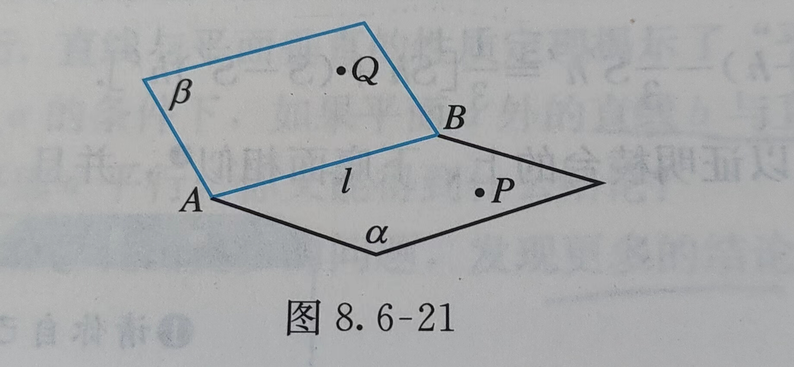

## 空间几何-基础（必修2）

> 默认两个平面指两个不重合的平面
>
> 部分是平面知识，就不额外写了，比如 点在平面内。

一种基本思路：把空间图形问题转化为平面图形问题

#### 基本事实

- 过不在一条直线上的三个点，有且只有一个平面。（简单说成：不共线的三点确定一个平面）

  三点若为A，B，C，可以记成平面ABC。

- 如果一条直线上的两个点在一个平面内，那么这条直线在这个平面内。

- 如果两个不重合的平面有一个公共点，那么它们有且只有一条过该点的公共直线。

- 平行于同一条直线的两条直线平行（传递性）

#### 推论

- 经过一条直线和这条直线外一点，有且只有一个平面
- 经过两条相交直线，有且只有一个平面
- 经过两条平行直线，有且只有一个平面

### 点与面

- 点在平面外

    过一点作垂直于已知平面的直线，则该点与垂足间的线段，叫做这个**点到该平面的垂线段**，垂线段的长度叫做这个**点到该平面的距离**

### 角

已知两条异面直线a，b，经过空间任一点O 分别作直线a'//a, b'//b ，然后把直线a' 与b' 所成的角叫做**异面直线a 与b 所成的角（或夹角）**

如果两条异面直线所成的角是直角，那么就说这两条异面直线相互垂直。

平面的一条斜线和它在平面上的射影所成的角，叫做这条**直线和这个平面所成的角**。

一条直线垂直于平面，所成的角是$90^\circ$ ；一条直线和平面平行，或在平面内，所成的角是$0^\circ$。所以直线与平面所成的角 $\theta$ 的取值范围是$0^\circ\le\theta\le90^\circ$ 

#### 定理

- 如果空间中两个角的两条边分别对应平行，那么这两个角相等或互补

### 面与角

从一条直线出发的两个半平面所组成的图形叫做二面角。这条直线叫做二面角的棱，这两个半平面叫做二面角的面。按图所示标记，可以记作$\alpha-AB-\beta; P-AB-Q; \alpha-l-\beta; P-l-Q$ 中的任一种

> 个人觉得这个语文上有点不太对。其实是说这两个平面的夹角，叫做二面角。然后图形表示的时候如上所示。

在二面角$\alpha-l-\beta$ 上任取一点O，以点O 为垂足，在半平面$\alpha$ 和$\beta$ 内分别作垂直于棱$l$ 的射线OA 和OB，则射线OA 和OB 构成的$\angle AOB$ 叫做二面角的平面角。二面角的大小可以用它的平面角来度量，其取值范围是$0^\circ \le \alpha \le 180^\circ$。平面角是直角的二面角叫做**直二面角**

### 线与面

- 线与线：不同在任何一个平面内的两条直线叫做**异面直线**，它们之间没有公共点

  与一个平面相交的直线和这个平面内不经过交点的直线是异面直线

- 线与面：线在平面外

  - 线与平面相交，记作$l\cap \alpha=A$
    - 如果直线 $l$ 与平面 $\alpha$ 内的任意一条直线都垂直，就说直线 $l$ 与平面 $\alpha$ 互相垂直，记作$l\perp\alpha$。直线 $l$ 叫做平面 $\alpha$ 的**垂线**，平面 $\alpha$ 叫做直线 $l$ 的**垂面**，他们唯一的公共点P 叫做**垂足**
    - 如果直线 $l$ 与平面 $\alpha$ 相交，但不与这个平面垂直，这条直线叫做这个平面的**斜线**，斜线和平面的交点A 叫做**斜足**。过斜线上斜足以外的一点P 向平面 $\alpha$ 引垂线PO，过垂足O 和斜足A 的直线AO 叫做斜线在这个**平面上的射影**
  - 线与平面平行，记作$l//\alpha$
    - 一条直线与一个平面平行时，这条直线上任意一点到这个平面的距离，叫做这条**直线到这个平面的距离**

- 面与面：两个面平行或者相交

  - 如果两个平面平行，那么其中一个平面内的任意一点到另一个平面的距离都相等，把它叫做**两个平行平面间的距离**。

  - 一般的，两个平面相交，如果它们所形成的二面角是直二面角，就说这两个平面互相垂直。平面$\alpha$ 与$\beta$ 垂直，记作$\alpha \bot \beta$  

#### 定理

- 如果平面外一条直线与此平面内的一条直线平行，那么该直线与此平面平行（判定）
- 一条直线与一个平面平行，如果过该直线的平面与此平面相交，那么该直线与交线平行。（性质）
- 如果一个平面内的两条相交直线与另一个平面平行，那么这两个平面平行（判定）
- 两个平面平行，如果另一个平面与这两个平面相交，那么两条交线平行（性质）
- 过一点垂直于已知平面的直线有且只有一条
- 如果一条直线与一个平面内的两条相交直线垂直，那么该直线与此平面垂直（定理）
- 垂直于同一个平面的两条直线平行（定理）

#### 定理

- 如果一个平面过另一个平面的垂线，那么这两个平面垂直。用符号表示：$a\subset\alpha,a\bot\beta\Rightarrow \alpha\bot\beta$
- 两个平面垂直，如果一个平面内有一直线垂直于这两个平面的交线，那么这条直线与另一个平面垂直

