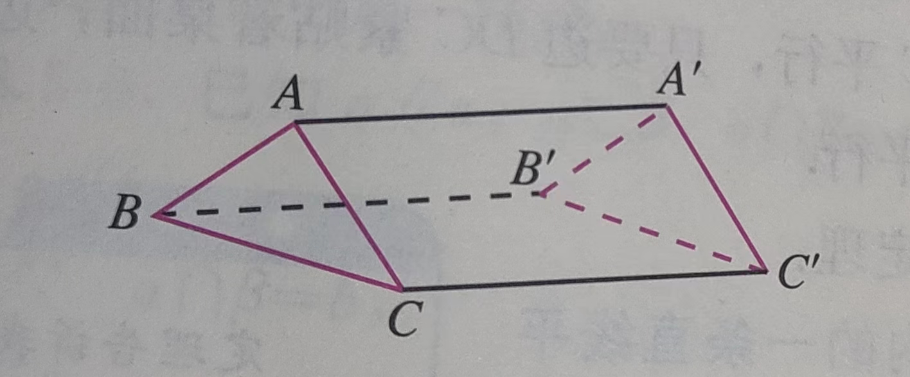

### 点线面之间的位置关系

- 不共面的四点可以确定几个平面？请画出图形说明你的结论

- 设直线a，b 分别是长方体的相邻两个面的对角线所在的直线，则a 与b是什么位置关系

- 已知直线a，b，平面$\alpha,\beta$，且$a\subset \alpha,b\subset\beta,\alpha//\beta$。判断直线a，b 的位置关系，并说明理由

- 四边形是否可以确定一个平面？

- 如图是一个正方体的展开图，

  

  如果将它还原为正方体，那么在AB，CD，EF，GH 这四条线段中，哪些线段所在直线时异面直线？

- 在正方体ABCD-A'B'C'D' 中，E 为$DD_1$ 的中点，判断$BD_1$ 与平面AEC 的位置关系，并说明理由。

- 判断：平面$\alpha$ 与平面$\beta$ 平行的充分条件是“$\alpha$ 内有无穷多条直线都与$\beta$ 平行”

- 如图，在正方体ABCD-A'B'C'D' 中，M，N，E，F 分别是棱$A_1B_1,A_1D_1,B_1C_1,C_1D_1$ 的中点

  

  求证：平面AMN// 平面DBEF
  
- 如图，$\alpha//\beta//\gamma$，直线a 与b 分别交$\alpha,\beta,\gamma$ 于点A，B，C 和点D，E，F

  

  求证$\frac{AB}{BC}=\frac{DE}{EF}$
  
- 如图，在正三棱柱ABC-A'B'C' 中，D 为棱AC 的中点，AB=BB'=2

  

  求证 $BD\perp AC'$ 
  
- 过$\triangle ABC$ 所在平面$\alpha$ 外一点P，做$PO\perp\alpha$，垂足为O，连接PA，PB，PC

  （1）若PA=PB=PC，则点O 是$\triangle ABC$ 的`____` 心

  （2）若PA=PB=PC，$\angle C=90^\circ$，则点O 是AB 边的`____` 心

  （3）若$PA\perp PB,PB\perp PC,PC\perp PA$，垂足都为P，则点O 是$\triangle ABC$ 的`____` 心

### 角

- 如图，在四面体A-BCD 中，E、F、G分别为AB，AC，AD 上的点

  

  若EF//BC，FG//CD，则$\triangle EFG$ 和$\triangle BCD$ 有什么关系？

- 如图，$AA',BB',CC'$ 不共面，且$AA'\underset{=}//BB',BB'\underset{=}//CC'$，

  

  求证：$\triangle ABC \cong \triangle A'B'C'$

- 已知正方体ABCD-A'B'C'D'，求直线BA‘ 与AC 所成的角的大小

- 如图，在正方体$ABCD-A_1B_1C_1D_1$ 中，$O_1$ 为底面$A_1B_1C_1D_1$ 的中心

  

  求证$AO_1\perp BD$