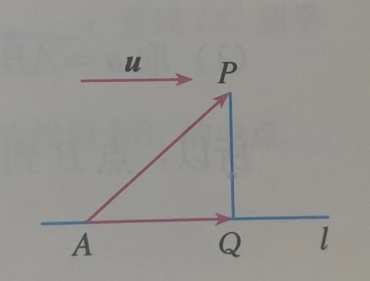
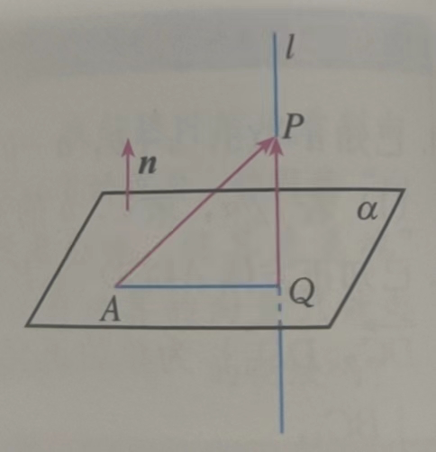

## 空间向量（选1）

#### 基本定理

如果三个向量**a,b,c** 不共面，那么对任意一个空间向量**p**，存在唯一的有序实数组(x,y,z)，使得 **p**=x**a** + y**b** + z**c**

此时{**a,b,c**} 叫做空间的一个基底，**a,b,c** 都叫做基向量。

如果空间的一个基底中的三个基向量两两垂直，且长度都为1，那么这个基底叫做**单位正交基底**，常用{**i,j,k**}来表示。此时任意向量**a**，可以分解为三个向量：x**i**,y**j**,z**k**，使得**a**=x**i** + y**j** + z**k**。此时把空间向量分解为三个两两垂直的向量，叫做空间向量的**正交分解**

#### 向量坐标：

在空间直角坐标系$Oxyz$ 中，**i, j, k** 为坐标向量，对空间任意一点A，对应一个向量$\vec{OA}$，且点A 的位置由向量$\vec{OA}$ 唯一确定，那么存在唯一的有序实数组 (x, y, z)，使 $\vec{OA}=x\bold i + y\bold j + z\bold k$。此时的(x,y,z) 叫做点A 在空间直角坐标系中的坐标，记作A(x,y,z)，其中x 叫做点A 的**横坐标**，y 叫做点A 的**纵坐标**，z 叫做点A 的**竖坐标**。若$\vec{OA}=\bold a$，则可记作 **a**=(x, y, z)

> 此时(x,y,z) 既可以表示向量，也可以表示点，要注意区分

##### 运算

设$\bold a=(a_1,a_2,a_3), \bold b=(b_1,b_2,b_3)$

则$\bold a+\bold b=(a_1+b_1,a_2+b_2,a_3+b_3);\bold a-\bold b=(a_1-b_1,a_2-b_2,a_3-b_3)$

$\lambda \bold a=(\lambda a_1,\lambda a_2, \lambda a_3), \lambda \in R$

$\bold a \cdot \bold b = a_1b_1 + a_2b_2 + a_3b_3$

推论：

当$\bold b\ne \bold 0$ 时，$\bold a//\bold b \Leftrightarrow \bold a=\lambda \bold b\Leftrightarrow a_1=\lambda b_1, a_2 = \lambda b_2, a_3 = \lambda b_3(\lambda \in R)$

$\bold a\bot \bold b \Leftrightarrow \bold a\cdot \bold b=0 \Leftrightarrow a_1b_1+a_2b_2+a_3b_3=0$

$|\bold a|=\sqrt{\bold a\cdot \bold a}=\sqrt{a_1^2 + a_2^2 + a_3^2}$

$cos<\bold a,\bold b>=\frac{\bold a\cdot \bold b}{|\bold a||\bold b|}=\frac{a_1b_1+a_2b_2+a_3b_3}{\sqrt{a_1^2+a_2^2+a_3^2}\sqrt{b_1^2+b_2^2+b_3^2}}$

##### 空间两点间的距离公式

> 这需要放在向量这一节吗？

$\bold P_1\bold P_2=|\vec{\bold P_1\bold P_2}|=\sqrt{(x_2-x_1)^2 + (y_2-y_1)^2 + (z_2-z_1)^2}$

### 空间应用

在空间中，取一定点O 作为基点，那么空间中任意一点P 就可以用向量$\vec{OP}$ 来表示，把$\vec{OP}$ 称为点P 的位置向量。

空间内任意直线由直线上一点及直线的方向向量唯一确定

空间中任意平面由空间一点及两个不共线向量唯一确定

直线$ l\bot\alpha$，取直线$l$  的方向向量**a**, 则向量**a** 称为平面$\alpha$ 的**法向量**。给定一个点A 和一个向量**a**，那么过点A，且以向量**a** 为法向量的平面完全确定，可以表示为集合{P | **a**$\cdot \vec{AP}$=0}

> 求平面的法向量，通常只需要求出平面的一个法向量。直线的方向向量也是如此

若一个平面内的两条相交直线与另一个平面平行，则这两个平面平行。

#### 平行、垂直关系

直线、平面、方向向量、法向量的平行垂直关系，对应空间平面可以直接理解转换

#### 距离、夹角

- 已知直线 $l$ 的单位方向向量为**u**，A 是直线 $l$ 上的定点，P 是直线 $l$ 外一点。

  

  设$\vec{AP}=\bold a$，则向量$\vec{AP}$ 在直线 $l$ 上的投影向量$\vec{AQ}=(\bold a\cdot \bold u)\bold u$，则PQ = $\sqrt{|\vec{AP}|^2-|\vec{AQ}|^2} = \sqrt{{\bold a}^2 - (\bold a \cdot\bold u)^2}$

- 已知平面$\alpha$ 的法向量为**n**，A 是平面$\alpha$ 内的定点，P 是平面$\alpha$ 外一点。过点P 作平面$\alpha$ 的垂线 $l$，交平面$\alpha$ 于点Q。

  

  则PQ=|$\vec{AP}\cdot \frac{\bold n}{|\bold n|}$|=|$\frac{\vec{AP}\cdot \bold n}{|\bold n|}$|=$\frac{|\vec{AP}\cdot \bold n|}{|\bold n|}$

- 异面直线、平面，可以对应转化为方向向量、法向量之间的夹角。

  不过因为夹角的定义，注意线与线、面与面是$cos\theta$，线与面是$sin\theta$ 

  
