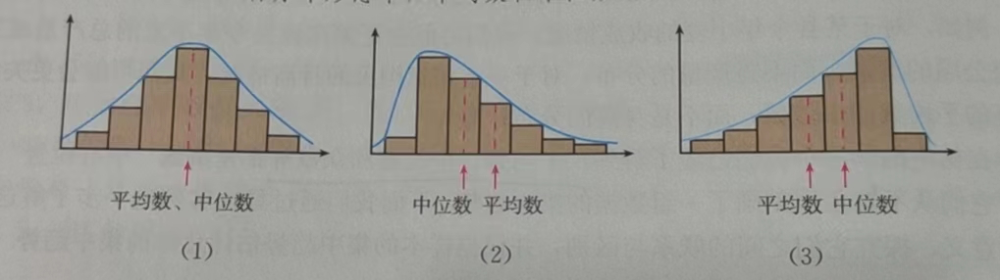

## 统计

### 收集

数据收集可以通过直接观察、测量、调查和实验等手段得到，也可以通过查阅文献资料、使用互联网查询等间接途径得到。当使用直接观察等手段时，往往需要事先设计记录数据的表格。（7年级下）

#### 表格类型：

- 统计表：**双向细目**（7年级下，p144）

#### 记录方式

记录的方法有**划记法**（7年级下）

记录的方案有：

- **全面调查**：根据研究自然现象或社会现象的需要，对所有的考察对象做调查（7年级下）又称为**普查**（必修2）

  **总体**：所要考察的对象的全体（也经常把全体对象的数据整体叫做总体），组成总体的每一个考察对象称为**个体**（7年级下）

- **抽样调查**：根据一定目的，从总体中抽取一部分个体进行调查，并以此为依据对总体的情况做出估计和推断的调查方法（必修2）

  **样本**：从总体中取出的一部分个体（也经常把样本的数据集体叫做样本）（7年级下）

  **样本的容量**：样本中个体的数目（7年级下），简称**样本量**（必修2）

  - 选取样本中的个体需要有代表性，样本容量要合适。有一种方式是抽样，让每一个个体被抽到的机会都相等。叫**简单随机抽样**（7年级下）

    设一个总体含有N（N 为正整数）个个体，从中逐个抽取n（1<=n<N）个个体作为样本。如果抽取是放回的，且每次抽取时总体内的各个个体被抽到的概率都相等，那么叫做**放回简单随机抽样**；如果抽取是不放回的，且每次抽取时总体内未进入样本的各个个体被抽到的概率都相等，叫做**不放回简单随机抽样**。通过简单随机抽样获得的样本叫做**简单随机样本**（必修2）

    > 一般性不放回简单随机抽样的效率更高，所以如果没有特殊说明，简单随机抽样默认指不放回。

    - 抽签，随机
    
  - **分层随机抽样**：按一个或多个变量把总体划分成若干个子总体，每个个体属于且仅属于一个子总体，在每个子总体中独立地进行简单随机抽样，再把所有子总体中抽取的样本合在一起作为总样本。其中每一个子总体称为**层**

    **比例分配**：如果每层样本量都与层的大小成比例。 

### 整理（7年级下）

对收集到的原始数据往往需要进行整理、分析，从中寻找规律，发现有用的信息

整理的方法有：**分类**、**排序**

#### 表格类型：

- 频数统计表：

  首先将数据按从小到大适当地分组，其中每一组的后一个边界值与前一个边界值的差叫做**组距**，通常各组的组距应相等。数据分组后落在各小组内的数据个数为**频数**。每一组数据频数与数据总数的比叫做这一组数据的**频率**。每一组的两个边界值的平均数称为该组的**组中值**

  反应数据**分布情况**

- 频率分布表：（必修2）

  求**极差**：一组数据中最大值与最小值的差；决定组距和组数，分组；列表

**总体百分位数**（必修2，定义众多，举例更好理解）：

- 如第80 **百分位数**（或者叫80%**分位数**）：设100 个样本数据，将其按从小到达排序，得到第80个数和第81个数，取两者的平均数或者近似值等。
- 第25百分位数、中位数、第75百分位数，合称为**四分位数**

### 分析

#### 平均数代数式（必修2）

一般的，总体中有N 个个体，变量值分别为$Y_1,Y_2,...,Y_N$，则称
$$
\overline Y=\frac{Y_1+Y_2+...+Y_N}{N}=\frac{1}{N}\sum_{i=1}^N Y_i
$$
为**总体均值**，又称**总体平均数**

如果总体的N 个变量中，不同的值共有$k(k\le N)$ ge ,不妨记为$Y_1,Y_2,...,Y_k$，其中$Y_i$ 出现的频率$f_i(i=1,2,...,k)$，则总体均值还可以写成**加权平均数**的形式：
$$
\overline Y=\frac{1}{N}\sum_{i=1}^{k}f_iY_i
$$
如果从总体中抽取一个容量为n 的样本，变量值分别为$y_1,y_2,...y_n$，则称
$$
\overline y=\frac{y_1+y_2+...+y_n}{n}=\frac{1}{n}\sum_{i=1}^{n}y_i
$$
为**样本均值**，又称**样本平均数**

#### 数据的集中程度（8年级下）

- 一般的，有n 个数$x_1,x_2,...,x_n$，我们把$\frac{1}{n}(x_1+x_2+...+x_n)$叫做这n 个数的**算术平均数**，简称**平均数**，记作$\overline{x}$（读作"x 拔"）

  形如... 的平均数叫做**加权平均数**，其中...表示各相同数据的个数，称为**权**

  > 加权的概念，有点过于单例，不够通用

- 一组数据中出现次数最多的那个数据叫做这组数据的**众数**。

- 将一组数据按从小到大（或从大到小）的顺序排列，位于最中间的一个数据（当数据个数为奇数时）或最中间两个数据的平均数（当数据个数为偶数时）叫做这组数据的**中位数**

平均数容易受极端值的影响，众数、中位数不能充分利用全部数据信息

##### 平均和中位数（必修2）

#### 数据的稳定程度（8年级下）

通常将个数据偏离平均数的**波动程度**（**离散程度**）作为指标

- 各数据与平均数的差的平方的平均数，叫做这组数据的**方差**

  $S^2=\frac{1}{n}[(x_1-\overline{x})^2+(x_2-\overline{x})^2+...+(x_n-\overline{x})^2]$

  方差越大，说明数据的波动越大，越不稳定

  一组数据的方差的算术平方根称为这组数据的**标准差**

  > 为什么不用平均差：https://www.zhihu.com/question/22266542

  ##### 公式变化（必修2）

  方差也写作：
  $$
  \frac{1}{n}\sum_{i=1}^{n}(x_i-\overline x)^2
  $$
  有时为了计算方便（等同于上式，具体推导可以看“选3”的随机变量方差公式）：
  $$
  \frac{1}{n}\sum_{i=1}^{n}x_i^2-\overline x^2
  $$
  标准差也写作：
  $$
  \sqrt{\frac{1}{n}\sum_{i=1}^{n}(x_i-\overline x)^2}
  $$
  合并入**总体方差（总体加权方差），总体标准差，样本方差，样本标准差** 

### 展示（7年级下）

- 条形统计图：

  一般由两条互相垂直的数轴和若干长方形组成，两条数轴分别表示不同类别的表木，长方形的高表示其中一个目标的数据

  适用于描述离散型的数据（必修2）

- 折线统计图：

  由两条代表不同标目的数轴和折线组成，折线上被线段连接的各点同时反映不同的标目

  在反映数据变化的走向和若干组不同类别数据之间的相互关系方面尤为见长

- 扇形统计图：

  用圆和扇形分别表示关于总体和各个组成部分数据的统计图

  能直观、生动地反映各部分在总体中所占的比例

- 直方图：

  直方图是通过面积来表示大小，适用于描述连续型数据（必修2）
  
  - 频数直方图：
  
    由若干个宽等于组距，面积表示每一组频数的长方形组成的统计图
  
  - 频率分布直方图：（必修2）
  
    纵轴表示$\frac{频率}{组距}$。
  
  可以通过直方图，估计推测样本平均数：表示为样本数据与它的频率的乘积之和；中位数：其左边和右边的直方图面积应该相等；众数：最多的即可。
  
- 散点图：

  用图形表示成对样本数据的变化特征（用横轴表示一个变量，纵轴表示另一个变量，就可以把数据用直角坐标系中的点表示出来）（选3）
  
  

统计图的名称、图例
