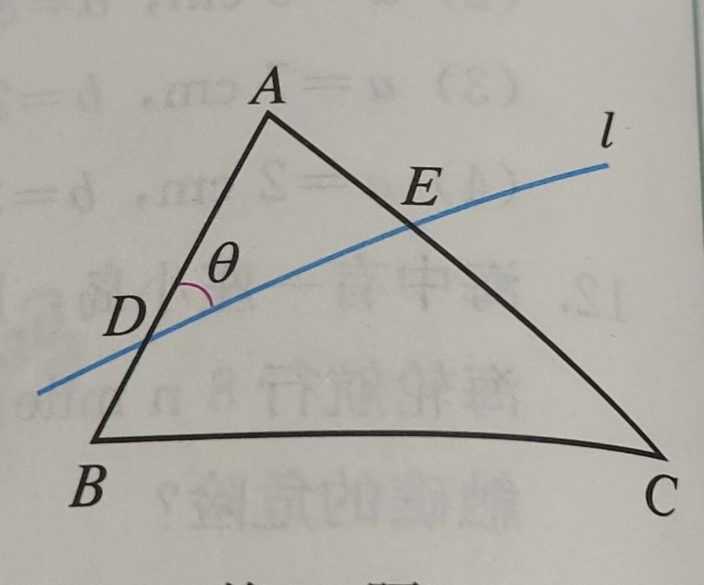
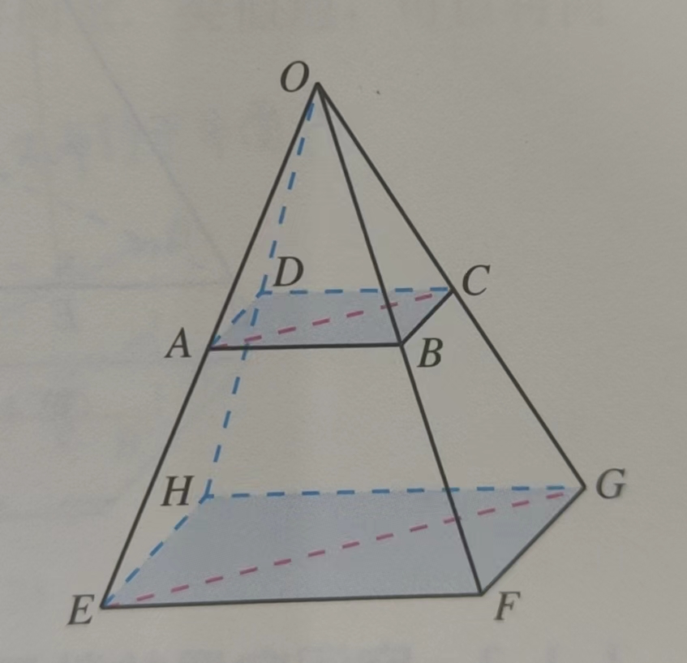
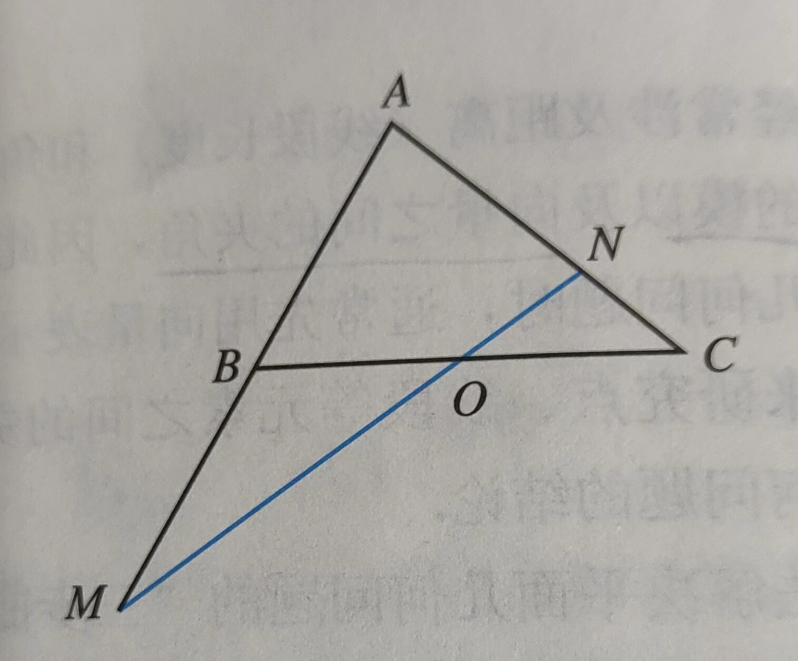
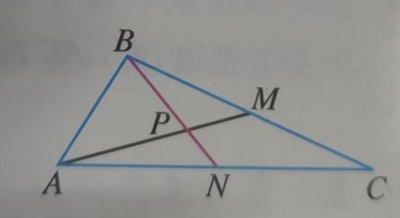
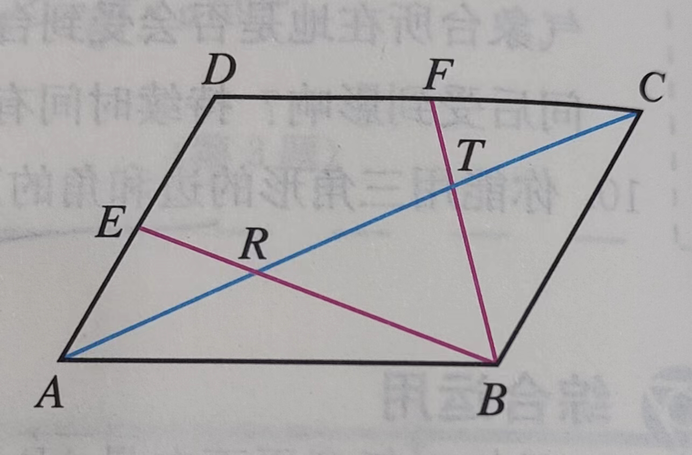

### 推论

- 已知对任意平面内向量$\vec{AB}=(x,y)$，把$\vec{AB}$ 绕其起点（即A）沿逆时针方向旋转$\theta$ 角得到向量$\vec{AP}=(xcos\theta -ysin\theta,xsin\theta+ycos\theta)$ 

- 用边和角的正弦表示三角形的面积：$S=\frac{1}{2}absinC=\frac{1}{2}bcsinA=\frac{1}{2}acsinB$

  > 证明：作BC 的高为$h_a$，容易证明$h_a=bsinC=csinB$
  
- 已知三角形ABC 的三个角A，B，C 的对边分别为a，b，c，设$p=\frac{1}{2}(a+b+c)$，求证：

  - 三角形的面积$S=\sqrt{p(p-a)(p-b)(p-c)}$

    > 通过面积公式和余弦函数得$s=\frac{1}{2}ab\sqrt{1-\frac{a^2+b^2-c^2}{2a^2b^2}}$ ，然后外部ab 放进根号，平方差公式

  - 若r 为三角形的内切圆半径，则$r=\sqrt{\frac{(p-a)(p-b)(p-c)}{p}}$

    > $S=\frac{1}{2}r(a+b+c)$

  - 把BC 边上的高记作$h_a$，则$h_a=\frac{2}{a}\sqrt{p(p-a)(p-b)(p-c)}$

    > $S=\frac{1}{2}h_aa$

- 如图直线$l$ 交三角形ABC 的夹角为$\theta$ ，

  

  则$a\cdot cos(B-\theta)+b\cdot cos(A+\theta)=c\cdot cos\theta$

  > $m=\frac{1}{|\vec{DE}|}\vec{DE},m\cdot(\vec{AB}+\vec{BC}+\vec{CA})=0$ 然后计算分配后的每一项

### 基本

判断题

- 若**a** 与**b** 都是单位向量，则**a**=**b**
- 方向南偏西$60^\circ$ 的向量与北偏东$60^\circ$ 的向量是共线向量
- 直角坐标平面上的x轴，y轴都是向量
- $0\vec{AB}=0$
- 若**a**,**b** 满足|**a**|>|**b**|，且**a** 与**b** 同向，则**a** > **b**

概念

- 两个粒子A，B从同一发射源发射出来，在某一时刻，它们的位移分别为$\pmb s_A=(4,3),\pmb s_B=(2,10)$，写出此时粒子B 相对粒子A 的位移**s**。并计算**s** 在$\pmb s_A$ 上的投影向量

### 运算

- 当向量**a**，b满足什么条件时，|**a**+**b**|=|**a**|-|**b**|（或|**b**|-|**a**|）

- 在▱ABCD 中，$\vec{AB}=$**a** ，$\vec{AD}=$**b**，用**a**，**b**表示向量$\vec{AC},\vec{DB}$

  其对角线相交于点M，用**a**,**b** 表示$\vec{MA},\vec{MB}$

- 填空：$\vec{AB}-\vec{AD}=$`____`

- 已知任意两个非零向量**a**,**b**，试作$\vec{OA}=$**a**+**b**,$\vec{OB}=$**a**+2**b**,$\vec{OC}=$**a**+3**b**，试问A、B、C三点之间的位置关系并证明

- 有一条东西向的小河，一艘小船从河南岸的渡口出发渡河。小船航行速度的大小为15km/h，方向为北偏西$30^\circ$ ，河水的速度为向东7.5km/h，求小船实际航行速度的大小与方向

- 已知|**a**|=5,|**b**|=4,**a**与**b**的夹角$\theta=\frac{2\pi}{3}$，求**a**$\cdot$**b**

- 已知|**a**|=6,|**b**|=4，**a** 与**b** 的夹角为$60^\circ$，求(**a**+2**b**)$\cdot$(**a**-3**b**)

- 已知|**a**|=3,|**b**|=4，且**a** 与**b** 不共线，当k 为何值时，向量**a**+k**b** 与**a**-k**b** 互相垂直

- 已知|**a**|=$\sqrt{2}$, |**b**|=1，且**a**-**b** 与**a**+2**b** 互相垂直，求证**a**$\perp$**b**

- 化简$(\vec{AB}+\vec{MB})+\vec{BO}+\vec{OM}$

- 在任意四边形ABCD 中，E，F 分别为AD，BC 的中点，求证：$\vec{AB}+\vec{DC}=2\vec{EF}$

### 定理

- 已知**a**，**b**是两个不共线的向量，向量**b**-t**a**，$\frac{1}{2}$**a**-$\frac{3}{2}$**b** 共线，求实数t 的值

- 如图，已知平行四边形ABCD，过平面AC 外一点O 作射线OA，OB，OC，OD，在四条射线上分别取点E，F，G，H，使$\frac{OE}{OA}=\frac{OF}{OB}=\frac{OG}{OC}=\frac{OH}{OD}=k$

  

  求证：E，F，G，H 四点共面

### 正交分解

- 已知**a**=(-2,4),**b**=(5,2)，求**a**+**b**,**a**-**b** 的坐标
- 已知A(3,5),B(6,9)，求$\vec{AB},\vec{BA}$ 的坐标
- 若点A(0,1),B(1,0),C(1,2),D(2,1)，则AB 与CD 有什么位置关系？证明你的猜想
- 设P 是线段$P_1P_2$ 上的一点，点$P_1,P_2$ 的坐标分别是$(x_1,y_1),(x_2,y_2)$ ， 当$\vec{P_1P}=\lambda\vec{PP_2}$，求点P 的坐标
- 若点A(1,2),B(2,3),C(-2,5)，则$\triangle ABC$ 是什么形状？
- 设**a**=(5,-7),**b**=(-6,-4),求**a**$\cdot$**b** 及**a**,**b** 的夹角$\theta$
- 已知**a**=(2,3),**b**=(-2,4),**c**=(-1,-2)，求**a**$\cdot$**b**,(**a**+**b**)(**a**-**b**),**a**$\cdot$(**b**+**c**),(**a**+**b**)$^2$
- 已知▱ABCD 的顶点A(-1,-2),B(3,-1),C(5,6)，求顶点D 的坐标
- A(1,2),B(-3,-4),C(2,3.5) 之间有什么位置关系？证明你的猜想
- 已知**a**=(4,2)，求与**a** 垂直的单位向量的坐标
- 已知A(2,3),B(4,-3)，点P 在线段AB 的延长线上，且$|\vec{AP}|=\frac{3}{2}|\vec{PB}|$，求点P 的坐标

### 综合

- 已知$\triangle ABC$ 的外接圆圆心为O，且$2\vec{AO}=\vec{AB}+\vec{AC},|\vec{OA}|=|\vec{AB}|$，则向量$\vec{BA}$ 在向量$\vec{BC}$ 上的投影向量为`____`$\vec{BC}$ 

- O 是平行四边形ABCD 外一点，用$\vec{OA},\vec{OB},\vec{OC} 表示\vec{OD}$

- 已知O 为平行四边形ABCD 所在平面内一点，且向量$\vec{OA},\vec{OB},\vec{OC},\vec{OD}$ 满足等式$\vec{OA}+\vec{OC}=\vec{OB}+\vec{OD}$，做出满足条件的四边形ABCD，该四边形有什么特点？请证明 

- CD 是$\triangle ABC$ 的中线，$CD=\frac{1}{2}AB$，用向量方法证明$\triangle ABC$ 是直角三角形

- 用向量方法证明：对于任意的$a,b,c,d\in R$，恒有不等式：$(ac+bd)^2\le(a^2+b^2)(c^2+d^2)$

- 用向量方法证明：等腰三角形的两个底角相等

- 用向量法证明：直径所对的圆周角是直角

- 如图，在$\triangle ABC$ 中，点O 是BC 的中点，过点O 的直线分别交直线AB，AC 于不同的两点M，N。

  

  设AB=mAM，AC=nAN，求m+n 的值

- 若非零向量$\vec{AB}$ 与$\vec{AC}$ 满足$(\frac{\vec{AB}}{|\vec{AB}|}+\frac{\vec{AC}}{|\vec{AC}|})\cdot\vec{BC}=0$，且$\frac{\vec{AB}}{|\vec{AB}|}\cdot\frac{\vec{AC}}{|\vec{AC}|}=\frac{1}{2}$ ，则三角形ABC 为:

  A. 三边均不相等的三角形  B. 直角三角形  C. 底边和腰不相等的等腰三角形  D. 等边三角形

- 已知O，N，P 在三角形ABC 所在平面内，满足$|\vec{OA}|=|\vec{OB}|=|\vec{OC}|,\vec{NA}+\vec{NB}+\vec{NC}=\pmb{0},\vec{PA}\cdot \vec{PB}=\vec{PB}\cdot \vec{PC}=\vec{PC}\cdot \vec{PA}$ , 则点O，N，P 依次是三角形ABC 的：

  A. 重心，外心，垂心    B. 重心，外心，内心    C. 外心，重心，垂心    D. 外心，重心，内心

- 已知三角形$P_1P_2P_3$，向量$\vec{OP_1},\vec{OP_2},\vec{OP_3}$ 满足条件$\vec{OP_1}+\vec{OP_2}+\vec{OP_3}=\pmb0,|\vec{OP_1}|=|\vec{OP_2}|=|\vec{OP_3}|$，求证：三角形$P_1P_2P_3$ 是等边三角形

- 如图，在三角形ABC 中，已知AB=2，AC=5，$\angle BAC=60^\circ$, BC,AC 边上的两条中线AM，BN 相交于点P，

  

  求$\angle MPN$ 的余弦值
  
- 如图，在平行四边形ABCD 中，点E，F 分别是AD，DC 边的中点，BE，BF 分别与AC 交于R，T 两点，

  

  你能发现AR，RT，TC 之间的关系吗？用向量方法证明你的结论

- 若平面向量**a**,**b**,**c** 两两的夹角相等，且|**a**|=1,|**b**|=1,|**c**|=3，则|**a**+**b**+**c**|=`____`

