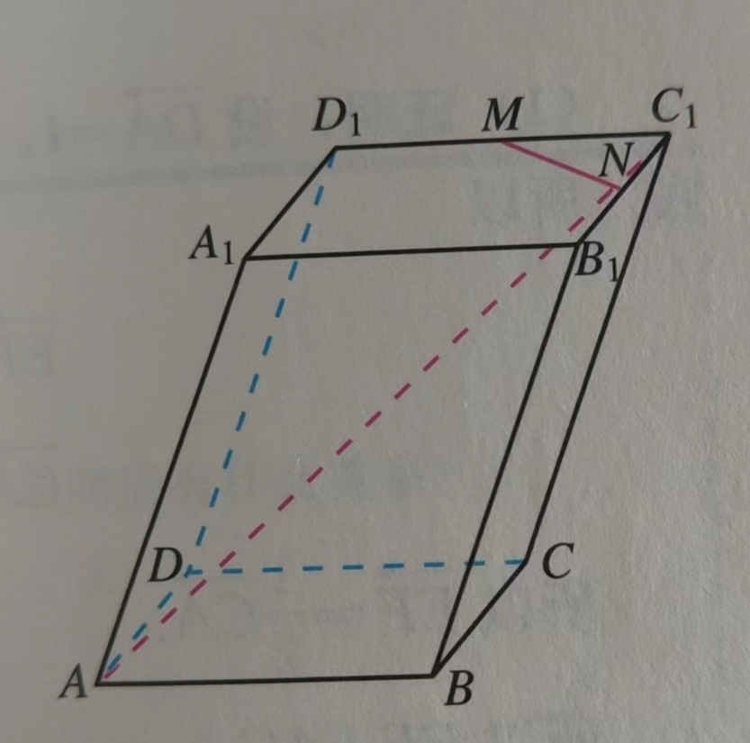
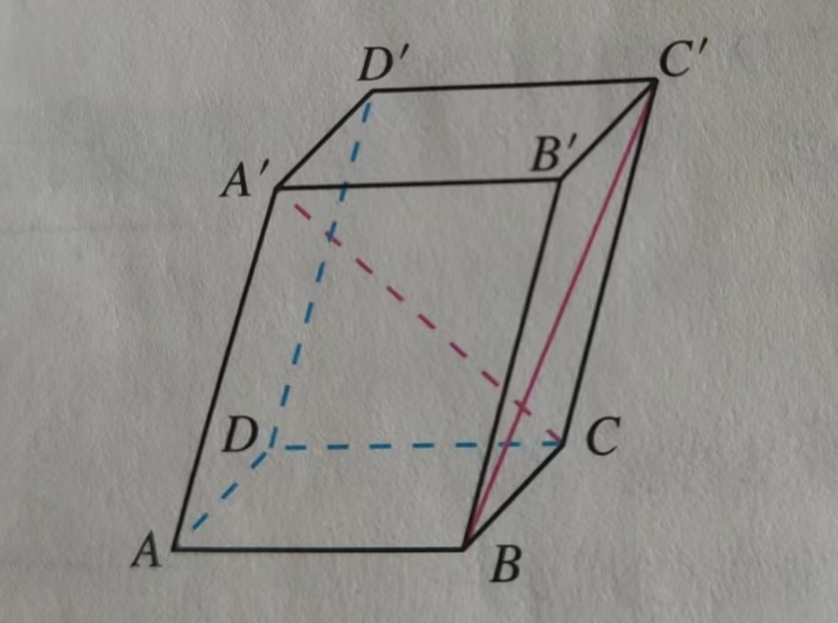
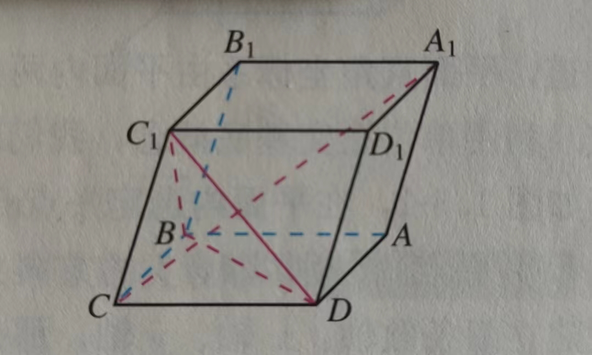

- 如图在平行六面体$ABCD-A_1B_1C_1D_1$ 中，AB=4，AD=4，$AA_1=5,\angle DAB=60^\circ,\angle BAA_1=60^\circ,\angle DAA_1=60^\circ$，M,N 分别为$D_1C_1,C_1B_1$ 的中点，

  

  求证$MN\bot AC_1$  

- 如图在平行六面体ABCD-A‘B’C‘D’ 中，AB=2，AD=2，AA‘=3，$\angle BAD=\angle BAA'=\angle DAA'=60^\circ$

  

  求BC' 与CA' 所成角的余弦值

- 如图在平行六面体$ABCD-A_1B_1C_1D_1$ 的底面ABCD 是菱形，且$\angle C_1CB=\angle C_1CD=\angle BCD=60^\circ，CD=CC_1$，

  

  求证$CA_1\bot平面C_1BD$

   
