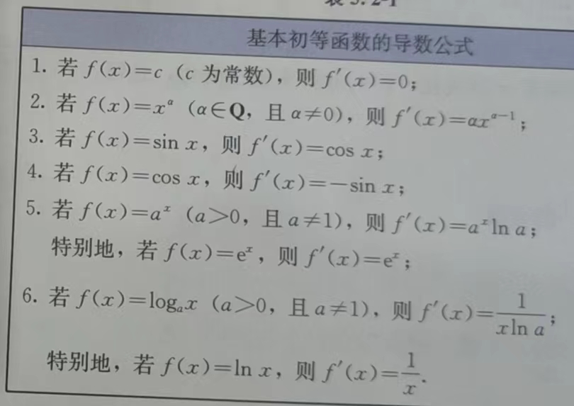

## 导数（选修2）

对于函数$y=f(x)$，设自变量x 从$x_0$ 变化到$x_0+\Delta x$，相应的，函数值y 就从$f(x_0)$ 变化到$f(x_0+\Delta x)$。这时x 的变化量为$\Delta x$，y 的变化量为：$\Delta y=f(x_0+\Delta x)-f(x_0)$ 。把比值$\frac{\Delta x}{\Delta y}$ 叫做函数$y=f(x)$ 从$x_0$ 到$x_0+\Delta x$ 的平均变化率。如果当$\Delta x\rightarrow 0$ 时，平均变化率$\frac{\Delta x}{\Delta y}$ 无限趋近于一个确定的值，即有极限，则称$y=f(x)$ 在$x=x_0$ 处可导，并把这个确定的值叫做$y=f(x)$ 在$x=x_0$ 处的**导数**（也称为**瞬时变化率**），记作$f'(x_0) 或 y'|_{x=x_0}$，即$f'(x_0)=\lim\limits_{\Delta x\rightarrow 0}\frac{\Delta y}{\Delta x}=\lim\limits_{\Delta x\rightarrow 0}\frac{f(x_0+\Delta x)-f(x_0)}{\Delta x}$

当$x=x_0$ 时，$f'(x_0)$ 时一个唯一确定的数，当x 变化时，$y=f'(x)$ 就是x 的函数，称它为$y=f(x)$ 的**导函数**（简称**导数**）。$y=f(x)$ 的导函数有时也记作$y'$，即$f'(x)=y'=\lim\limits_{\Delta x\rightarrow 0}\frac{f(x+\Delta x)-f(x)}{\Delta x}$

### 运算

- $[f(x)\pm g(x)]'=f'(x)\pm g'(x)$
- $[f(x)g(x)]'=f'(x)g(x)+f(x)g'(x)$
- $[\frac{f(x)}{g(x)}]'=\frac{f'(x)g(x)-f(x)g'(x)}{[g(x)]^2}(g(x)\ne0)$
  - $[cf(x)]'=cf'(x)$

对于由函数$y=f(u),u=g(x)$ 复合而成的函数$y=f(g(x))$，$y'_x=y'_u\cdot u'_x$

> 这里的u 会进行代换，比如 sin2x 的导数 cos u * 2 => 2cos 2x

### 单调性

在某个区间(a, b)上，如果$f'(x)>0$，那么函数$y=f(x)$ 在区间(a, b) 上单调递增；在某个区间(a, b) 上，如果$f'(x)<0$，那么函数$y=f(x)$ 在区间(a,b) 上单调递减

### 极值

若函数$y=f(x)$ 在点$x=a$ 的函数值$f(a)$ 比它在点$x=a$ 附近其他点的函数值都小，且$f'(a)=0$，在点$x=a$ 附近的左侧$f'(x)<0$，右侧$f'(x)>0$，那么把a 叫做函数$y=f(x)$ 的极小值点，$f(a)$ 叫做函数$y=f(x)$ 的**极小值** 。类似的，... 为**极大值**。极小值点、极大值点统称为**极值点**，极小值和极大值统称为**极值**。

> 导数值为0 的点一定是函数的极值点吗？

把函数$y=f(x)$ 的所有极值连同端点的函数值进行比较，就可以求出函数的**最大值和最小值**。
