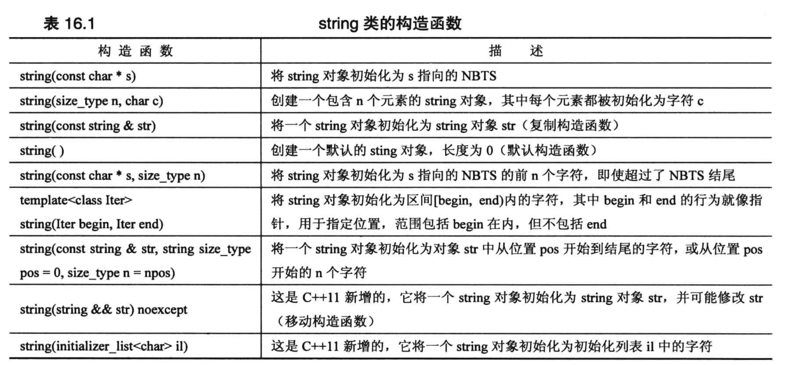

空字符结尾

char fish[8] = "fish";


```c++
//原始字符串， c++11
cout << R"(Who wouldn't?\n\n)" << endl;
cout << R"+*("(Who wouldn't?)", she whispered.)+*" << endl;
```

原始字符串和 不同类型的char还可以组合使用，前缀如：Ru，UR等


```C++
strncopy(destStr, "srcStr", 5);
destStr[5] = '\0'; //需要自己设置空字符
```


```C++
//字符串常量的理解
char * temp = “tempString”;
//这里c++ 会提示ISO 11 不允许将 string literal 转换成 char* 类型, clion 直接编译失败
//是因为c++ 在编译期间会在内存留有一段空间，存储源代码中的用引号括起来的字符串，并且将每个字符串和其地址关联起来
... 下面为猜测，暂未证实
这样子，如果声明一个temp1 变量，值也是 “tempString”
那么temp1 和temp 会指向同一个地址，可能造成修改上的混乱
... 所以需要将temp ，temp1 都指定为const 指针
```


```C++
mate == "string value"; //此时比较的是两者的地址
```

#### string

实际上是 basic_string<charT, traits<>, allocator<>> 的一个typedef，charT表示类字符，traits提供了比较规则，aloocator 是内存分配的类。

string::npos 是字符串最大长度，一般是unsigned int 的最大值。

