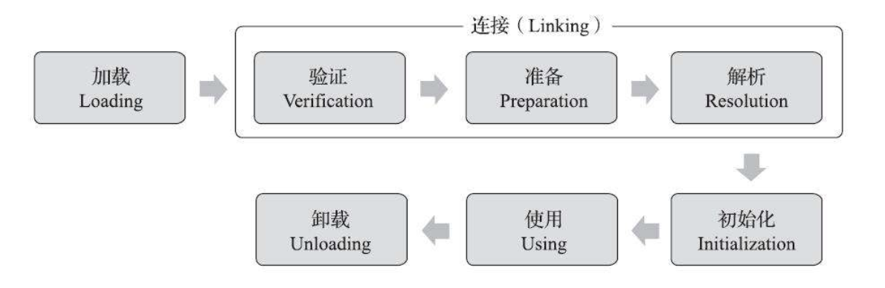

类型被加载到虚拟机内存，再到被卸载的生命周期为：

**Class-loader**

不同class-loader ,加载同一个 class文件 所产生的实例对象是互相独立的

类加载器，从虚拟机角度主要有两种：启动类加载器；其他类加载器。后者必须继承`java.lang.ClassLoader`

三层类加载器，双亲委派模型

- 启动类加载器
- 拓展类加载器
- 应用程序类加载器

双亲委派模型的工作过程是：如果一个类加载器收到了类加载的请求，它首先不会自己去尝试加载这个类，而是把这个请求委派给父类加载器去完成，每一个层次的类加载器都是如此，因此所有的加载请求最终都应该传送到最顶层的启动类加载器中，只有当父加载器反馈自己无法完成这个加载请求（它的搜索范围中没有找到所需的类）时，子加载器才会尝试自己去完成加载

线程上下文类加载器，目前的理解是，父类加载JNDI 相关的服务时，会去请求线程的上下文类加载器，然后查找对应的类，如果初始化时没有，则不加载，下次使用时再走流程重新加载。

