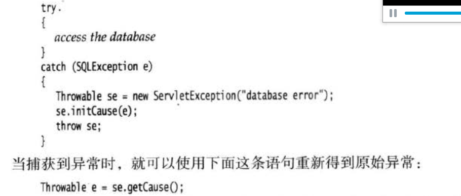

即使到达finally块之前有return语句，依旧会执行finally块


可以在catch语句中重新抛出异常给调用者。

如果方法没有在父类中声明异常， 那么就不能在子类中对其进行继承来声明异常。 Q1：异常堆栈追踪的原理？


 error类和runtimeException类的子类属于未检查异常，其他异常属于已检查异常 RuntimeException和运行时没必要联系，反倒和c++中的logic\_error类似。非runtimeException类似c++中的runtime

对于那些可能被他人使用的java方法，应该根据异常规范在方法的首部声明可能的异常 

覆盖方法：子类方法的异常需要更精确，父类方法无异常，则子类方法也不能有。

栈跟踪的原理。





```java
    //覆盖返回值，返回值是2
    public static int getValue(){
        try{
            return 1;
        }finally {
            return 2;
        }
    }
```

对finally内的close执行操作进行双重catch：

```java
InputStream in = ...;
Exception ex = null;
try{
  try{
    ...
  }catch(Exception e){
    ex = e;
    throw e;
  }
}finally{
  try{
    in.close(); 
  }catch(... e){
    if(ex == null){throw e}
  }
}
```

//AutoCloseable接口资源文件，简单的双重catch方式（尽量别补上catch和finally块了）： 

addSuppressed 方法增加到原来的异常

**堆栈跟踪** throwable.getStackTrace\(\); Thread.getAllStackTraces\(\); Thread.dumpStack\(\);

反射库的异常做法就不正确，调用者经常需要处理早已知道不可能发生的异常。 将异常转换成自己的异常时不要犹豫。

