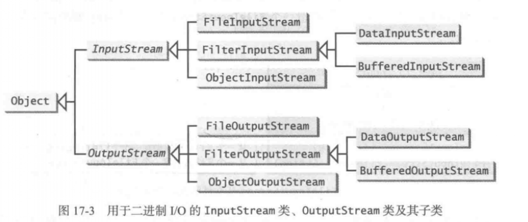
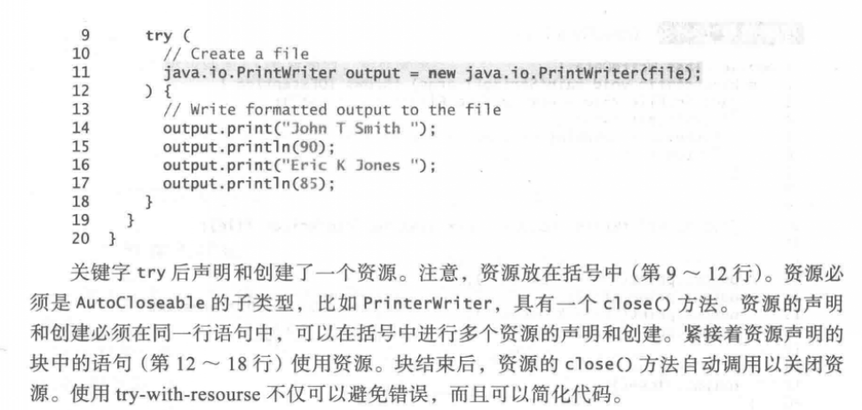

Java 使用 System.out 来表示标准输出设备， 而用 System.in 来表示标准输入设备 

Java 并不直接支持控制台输人， 但是可以使用 Scanner 类创建它的对象， 以读取来自 System.in 的输入

如下所示： Scanner input = new Scanner \(System.ln\); PrintWriter pw = new PrintWriter\(file\);

这里的分类就有些奇怪，照理filter只是对file的一个处理，object更是一个filter的子集

但是事实是，data是一个字符串和基本类型的过滤器，buffer是一个部分读取的过滤器，object反倒包含了data的所有功能。

**27、try-with-resources** 

