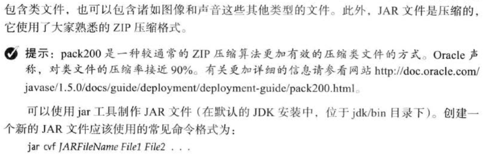
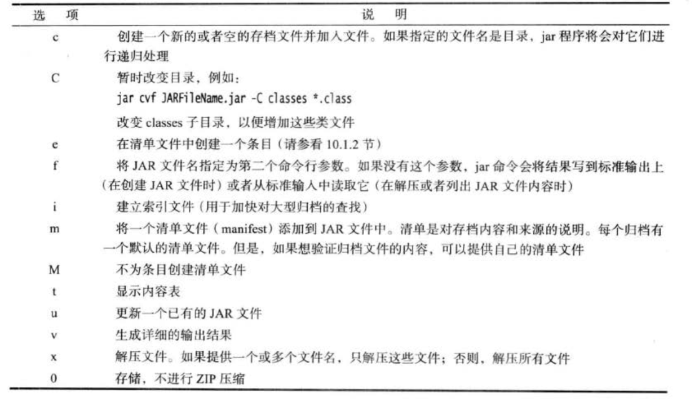

> 核心技术章4.8描述了shell命令将代码生成JAR的方式，同时简要描述了内部查询步骤。

Java归档（Java ARchive）





jar制作工具目录： jdk/bin

> jre自带针对类文件的压缩工具 pack200： 也在jdk/bin中。可以在jar命令中添加一个参数来调用 详情参看：[官网pack200](http://doc.oracle.com/javase/1.5.0/docs/guide/deployment/deployment-guide/pack200.html)

```shell
#常规命令
jar {ctxui}[vfmn0PMe] [jar-file] [manifest-file] [entry-point] [-C dir] files ...
#例如
jar cvf target.jar *.class icon.gif
```

```shell
#示例manifest.mf
Manifest-Version: 1.0
描述这个归档文件的行

Name: Woozle.class
描述这个文件的行

Name: com/mycompany/mypkg/
描述这个包的行
```

清单文件的最后一行必须以换行符结束 更多可查看：[官网jar](http://docs.oracle.com/javase/7/docs/technotes/guides/jar)

指定入口点

```shell
#使用命令
jar cvfe MyProgram.jar com.example.package.TestClass files...
#配置manifest
Main-Class: com.example.package.TestClass
```

双击或者命令启动运行： java -jar MyProgram.jar

第三方工具，jar文件转exe: JSmooth\([http://jsmooth.sourceforge.net](http://jsmooth.sourceforge.net)\) Launch4J\([http://launch4j.sourceforge.net](http://launch4j.sourceforge.net)\) IzPack\([http://izpack.org](http://izpack.org)\) 更多请看：[java2exe](http://www.javalobby.org/articles/java2exe)

转Mac应用比较方便，XCode自带Jar Bundle

密封jar

```shell
#清单文件的主节，全局
Sealed: true
#只针对Mypkg的配置
Name: com/mycompany/mypkg/
Scaled: true
```

