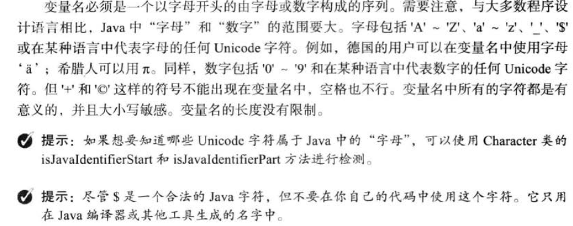

>目前主要来自
>
>《java 程序设计第10版 - 基础/进阶》
>
>《java核心技术第9版 - 卷I》
>
>《java核心技术》有很多总结性的话，《java程序设计》更适合新学。


[命名风格](../general/style.md)  

> java 对字母有一个特殊的对待
>
> 


`import java.util.*` 声明明确导入和声明通配符导入在性能上是没有什么差别的 

```java
static class DeadLoopClass{
  static{
    //如果不加if，编译器会检测到while(ture) 死循环，同时发现在静态初始化部分，然后拒绝编译
    //添加if 则会“绕过”这个检测
    if(true){
      Sytem.out.println("...");
      while(true){
        
      }
    }
  }
}
```


