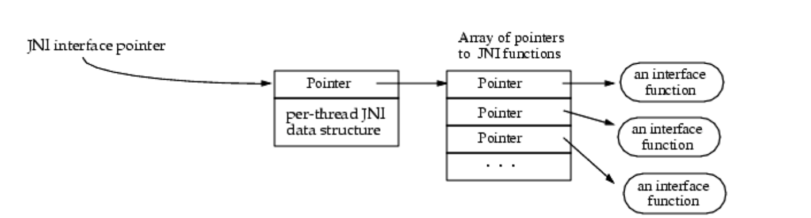
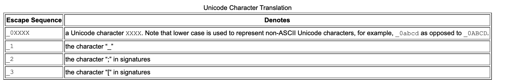

主要是一些设计缺陷，大部分都是关于native 方法的。

navtive 代码是通过JNI 函数访问JVM 功能的，而JNI 函数通过 接口指针（interface pointer）实现。接口指针是一个二级指针，指向一个指针数组。其中指针数组的组件是指向接口函数的指针。可以说每个接口函数以一个预定义的偏移量存储在数组中。

JNI 接口的组织形式和c++ 的虚函数表类似。相对于hard-wired 函数实体，这样JNI 有自己的域名空间，可以和native 代码隔离。而VM 可以很方便的提供JNI 函数表的多种版本，比如即可以提供参数检查、适用于调试的版本；又可以提供最基本的但高效的版本。  

JNI 接口指针只在当前线程有效，即不能在线程间传递接口指针。vm 可能只是实现了当前线程的分配和存储。

native 方法接收 JNI 接口指针作为一个参数，vm 保证同一个线程的多次调用都会传递同一个接口指针。即你可以在不同线程调用native 方法，只是可能会收到一个不一样的JNI 接口指针  

加载库通过System.load("pkg_cls") 进行加载，linux 加载的是`libpkg_cls.so`，win32 则是`pkg_cls.dll`,（mac经测试是`libpkg_cls.jnilib`）。一个动态库通过一个class loader 加载。  

VM 加载native 库可能是通过 静态链接（statically linked），具体要看实现。只有一个被VM 捆绑的输出一个`JNI_OnLoad_L` 方法的库 L 会被静态链接。如果同时还有`JNI_OnLoad` 方法，后者会被忽略。如果一个库是静态链接的，在第一次调用加载时，`JNI_OnLoad_L` 的参数正常调用，但是返回值是`JNI_OnLoad` 定义的。静态库会屏蔽同名动态库。如果动态链接的库被垃圾收集了，vm会调用 `JNI_OnUnLoad_L` 方法，类似的忽略同时定义的`JNI_OnUnLoad`。开发者可以调用`RegisterNatives()` 方法class 关联的vative 方法，在静态链接函数时有用。  

#### native 方法名字

规则：https://docs.oracle.com/javase/8/docs/technotes/guides/jni/spec/design.html#resolving_native_method_names  

vm 查询的时候，先查询无参方法，再查找有参。为了保证unicode 转化为正确的c 函数名，以下转化：

#### 本地方法参数

第一个参数是JNI 接口指针，`JNIEnv` 类型，第二个参数如果是实例方法则是对象的引用，如果是类方法则是对象的类

在c++ 中，JNI 函数以内联成员函数 定义（扩大C 的couterparts）

#### 引用java 对象

基本类型是在 java 和 native 代码之间进行拷贝，其他则是传递引用。 vm 必须跟踪所有被传递的对象，所以这些对象不会被垃圾收集器释放。（因此需要native 在不用这些对象的时候，告知vm 一声，让它及时移除）  

全局和本地引用：本地引用即方法调用生命周期，全局指需要显式释放。  

传递给native 方法和 JNI 函数返回给native的java 对象，都是本地引用。JNI 允许从本地引用 创建 全局引用。 期望Java 对象能接收两者，因为native 方法可能返回两者。  

大部分情况下，native 返回本地引用的回收依赖vm 就行了。但如果有一个大对象被native 持有，但是它在后续较长的处理中已经不需要这个对象，应尽早显式释放。让jvm 回收。类似的大量引用(如引用数组) 使用场景也要注意。

为了保证本地变量被主动释放，除了返回变量，JNI 不允许创建额外的本地变量，且将变量限制在创建线程。  

**实现**

本地引用的实现上，是jvm 创建一个java 到native 方法的转化注册表，会阻止对象回收。在变量创建时自动添加到注册表，native 方法结束时自动移除。  

JNI 自身不管多个实体之间的检测和归并(collapse)。  

而本地引用（的追踪）不应该完全使用保守式的栈扫描，native 存储可能在全局/堆 数据结构里存储本地引用  

#### 访问java 对象

JNI 提供了非常丰富的引用访问接口，所以各种VM 可以通过其中某种方式实现。  

**访问基本类型数组**

这有个性能问题，在处理包含大量基本类型数据的类型，比如arrays 和 strings，在一个方法中处理遍历循环会很没有效率。   

一个解决方案是引入”pinning“ 的概念，让vm 在传递数组的时候，直接给与指针。但是要有两个前提，一个是vm 支持”pin“，一个是vm lay out 数组的时候要连续（一般而言是的，但是比如boolean 数组会以加解包的形式）  

最后的方案作了一个折中处理：

- 对于native 方法只访问大数组的较少数量元素，则可以使用进行array -> memroy buffer 拷贝的系列函数
- 也可以使用”pinning“ 对应的系列函数，但是是否会产生分配和拷贝取决于实现。如上如果vm 支持”pin“ 且lay out 和native 一致，那么可以实现为不需要拷贝；否则会拷贝到一个不可变化（nonmovable）的内存区块（如c heap）
- 然后还有主动通知vm 不再需要数组的函数

JNI 实现必须保证native 方法运行在多线程时能异步访问同一个数组，但是如果异步更新数组会导致未知结果。

**访问变量和方法**

https://docs.oracle.com/javase/8/docs/technotes/guides/jni/spec/design.html#accessing_fields_and_methods  

持有id 不会阻止vm 卸载class, 所以要么持有底层的class，要么记得重新获取id

JNI 对id 的实现没有任何要求  

#### 报告程序错误

JNI 不检查空指针和错误类型，使用java 异常机制，允许抛出Java 异常，native 代码也可以处理java 异常  

发生异常时，JNI 调用会返回一个非常规返回的值，如NULL；也可以通过 `ExceptionOccurred()` 方法获取更详细的描述。  

**异步异常**

其他线程的异常，只有在本线程抛出同步异常或者调用`ExceptionOccurred()` 时可以知悉  

**异常处理**

发生异常时，native 方法可以直接返回，这样会把异常传递给调用的java 代码  

或者调用 `ExceptionClear()` ，然后执行自己的处理逻辑  

当一个异常发生的时候，必须先清除异常才能进行其他JNI 调用，当有一个pending 异常，有一些方法是可以继续安全调用的。（看原文  

