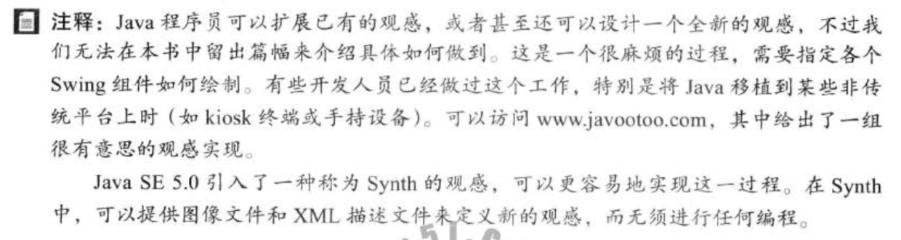

编码，java的通用性，其实是把各种编码转化成jvm内部的unicode，再转化回对应编码的过程。  

LinkedList遍历操作不要使用循环get，应该使用iterator，foreach就是使用的iterator  

自动装箱和拆箱，是编译器进行的   

通常对于比较器来讲，实现serializable比较好  

静态方法也能被继承。 但是， 静态方法不能被覆盖（只是隐藏） 

能够使用迭代较清晰解决的问题不要使用递归，如果使用了，尽量使用尾递归（即继续调用方法时，方法尾部没有后续代码)  
  
因为返回类型不是方法的签名，所以覆盖方法的时候，需要注意(或利用)返回类型  


**观感**


case条件： 有兴趣可以再去看下为什么后面可以增加String  

**可访问性**


**重载**

```java
public double max\(int a, int b\){} public double max\(double a, double b\){} public double max\(float a, float b\){}

public double min\(int a, double b\){} public double min\(double a, int b\){}

max\(2, 4.5\)调用的是双double（会寻找最精确的方法） 如果实在无法分辨，会产生编译错误，如min\(1, 2\)
```

**字符编码**

 utf-8: [http://blog.csdn.net/hezh1994/article/details/78899683](http://blog.csdn.net/hezh1994/article/details/78899683)

所有数值操作符都可以用在 char 型操作数上。 

如果另一个操作数是一个数字或字符， 那么 char 型操作数就会被自动转换成一个数字。 

如果另一个操作数是一个字符串， 字符就 会与该字符串相连 int i = '2' + '3'

```java
 System.out.println\("i is "+ i\); 

int j = 2 + 'a' System.out.println\("j is "+ j\); 

System.out.println\(j + " is the Unicode for character "+ \(char\)j\); 

System.out.println\("Chapter "+ '2'\); 

//显示结果

 i is 101

 j is 99 

99 is the Unicode for character c

 Chapter 2
```

**字符串格式化** 

%5c、%6b、%5d、%10.2f、%10.2e、%12s 默认前面补位空格，即右对齐；可以添加-号，如%-5c进行左对齐 f和e会进行进位处理，所以使用请看情况。。

注意， 可以使用 format 方法将一个十进制数转换为十六进制数， 例如， String.format\("\x", 26\) returns 1A;


**文档**

@author, @version,@since,@deprecated,@see, @param,@return,@throws等 ,...,...等，不用...,... 如果引用了一个本地图片，可以放到doc-files目录下

@see用法示例：

```text
@see classPathName.className#methodName()
@see <a href="www.sample.com">this is a label</a>
//显示在see also
@see "Core java 2 volumn 2"
```

多个@see需要放在一起 如果要单独放置可以使用@link，如：

```text
{@link package.class#featrue label}
```


> 核心技术4.9.7章描述了生成注释的步骤

**this**

 如果一个类有多个构造方法， 最好尽可能使用 this\( 参数列表 ） 实现它们。 通常， 无参數或参数少的构造方法可以用 this\( 参数列表 ） 调用参数多的构造方法。 这样做通常 可以简化代码， 使类易于阅读和维护。

但是android中很多系统组件构造时，某个少参数的构造方法会带有主题属性，而多参数的没有主题属性，在自定义继承的时候，需要调用super才更合适。
