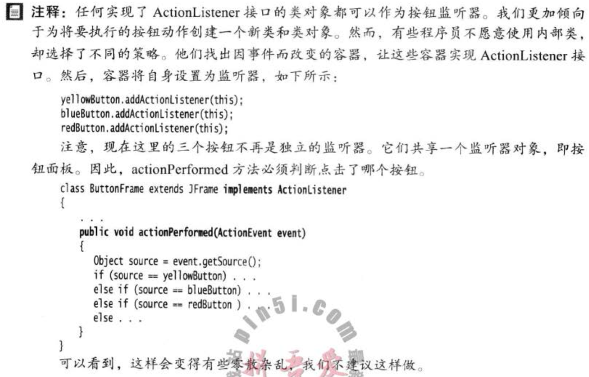
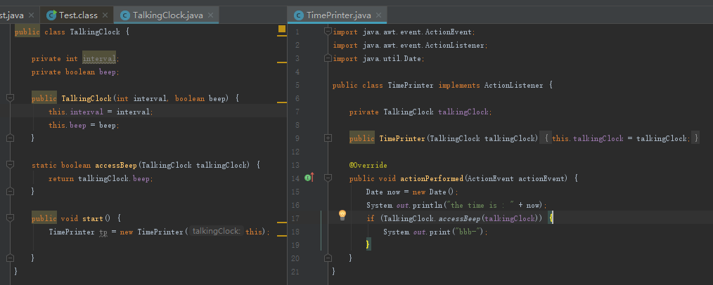
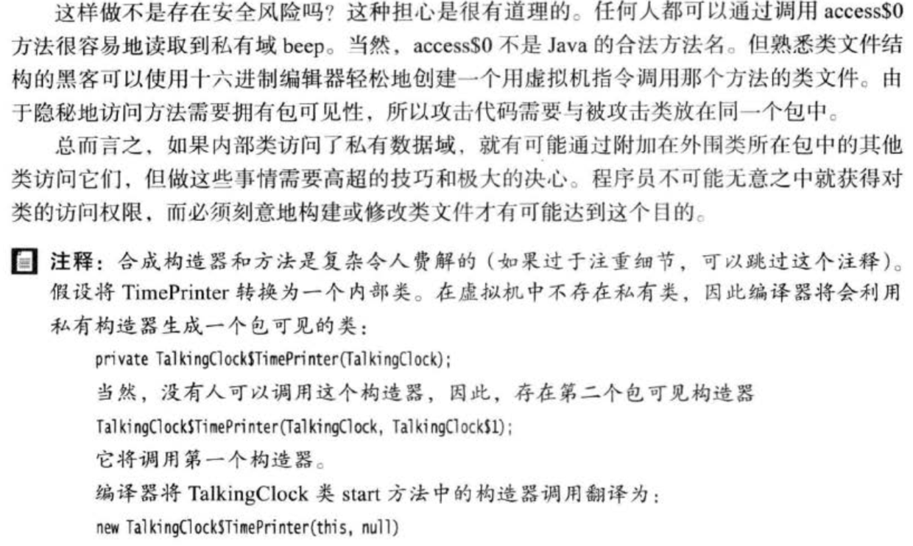
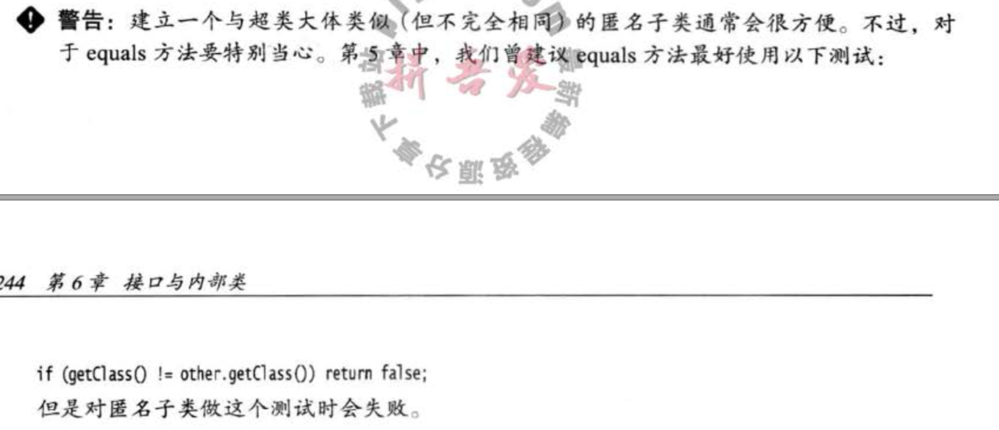

```java
OuterClass.InnerClass innerObj = outerObj.new InnerClass() 

OuterClass.InnerClass innerObj = new OuterObj.InnerClass()
```





访问该类定义所在的作用域中的数据，包括私有 可以对同一个包中的其他类隐藏 匿名内部类。

感觉可以理解成（内部机制另行研究）， 外部类如果构造在一个地址块，外部类的变量和内部类会被构造在该地址块内部，这样，内部类访问外部类的变量就好理解了。

内部类创建的时候，会由编译器合成一个带有外部类引用的构造器，可以分析对应的class文件（反射） 6.4.3，需要思考 

```java
public class TalkingClock{
    private boolean beep;
    class TimePrinter{
        public void doSomeThing(){
            if(beep){...}
        }
    }
}
```

 access$0对应上述伪实现的accessBeep 

可以在方法快中定义类，这样基本做到完全隐藏，只对方法可见。（匿名内部类的真正语法）



\[图片上传失败...\(image-f9147a-1524051357145\)\]