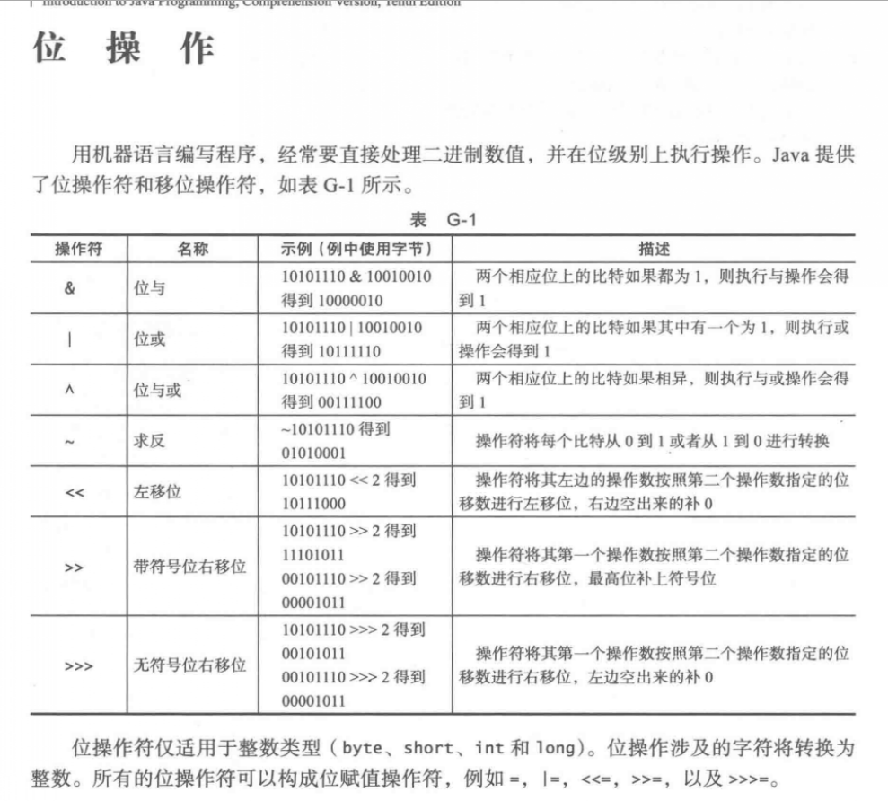

**1、数字的进制表示法** 

16进制：0x 8进制：0 2进制：0b 

**2、数字的正无穷大**

 整数被0除会出现异常 计算浮点数被0除或者负数的平方根结果为NaN 但是举个例子：

```text
//never true
x == Double.NaN
//下面这样才对
Double.isNaN(x)
```

**3、金融数值**  

 **4、不常用的基本类型** float和char   

**Strictfp的说明**

 3.5章节有说明，浮点数的截断实现。

**StrictMath**

**7、位移操作**  

 **9、数值转换**  

**自动装箱** 

了解下原理，比如普通定义的时候怎么装、方法调用的时候怎么装 

自动装箱的对象有可能指向同一个地址:

Integer a, b = 1000; if\(a == b\){ //maybe is true }

 自动装箱时编译器认可的，不是虚拟机处理的。

包装对象都是不可变的，如果希望修改，可以使用org.omg.CORBA.IntHolder

**浮点数**

遵循[IEEE-754标准](https://people.eecs.berkeley.edu/~wkahan/ieee754status/IEEE754.PDF) 

通常情况下， 应该使用 double 型， 因为它比 float 型更精确 一个 float 值有 7 到 8 位小数位， 一个 double 值有 15 到 17 位小数位

第1个bit表示符号sign,0表示正数,1表示负数; 第2-9个bit表示指数e，需要正负指数，所以偏移127 后面的bit表示1.f中的小数位f SEEE EEEE EFFF FFFF FFFF FFFF FFFF FFFF 即结果为：\(-1\)^\(sign\)  _1.f_  2^\(exponent\) 范围为：正负2^\(-127\) ---&gt; \(2-2^\(-23\)\) \* 2^128

这里2-2^\(-23\)的计算方法： 设a = 2^-1 + 2^-2 + 2^-3... + 2^-n 则2 \* a = 2^0 + 2^-1 + 2^-2 + ... + 2^-\(n-1\) 相减为：a = 1 - 2^-n 再加上前缀即可

其他特殊表示: 1.当指数部分全0而且小数部分不全0时表示的是非规格化的浮点数，此时后面的bit表示0.f中的小数位f 范围为：正负2^\(-149\) ---&gt; \(1-2^\(-23\)\) \* 2^\(-126\) 2.当指数部分和小数部分全为0时,表示0值,有+0和-0之分\(符号位决定\),0x00000000表示正0,0x80000000表示负0. 3.指数部分全1,小数部分全0时,表示无穷大,有正无穷和负无穷,0x7f800000表示正无穷,0xff800000表示负无穷. 4.指数部分全1,小数部分不全0时,表示NaN.

S1：由于平时习惯一直没有这个问题，但是还是写一下 不要用浮点数加减来进行判断，如float f = 0.1f, \(f - 0.01\)== 0.09是不一定成立的

strictfp POSITIVE\_INFINITY、 NEGATIVE-INFINITY 和 NaN

**数值类型转化**

 int i = 2; bye b = i; \(错误，需要强转\) final int i = 2; byte b = i; \(正确，同属整型-可以直接截断-且范围不会有问题\) final int i = 128; byte b = i; \(错误，超出范围\)

Q1：final long l = 1; int i = l; 针对上述第二行，这里很奇怪，只有long不行，short,int,byte,char都是可以的&lt;/&gt; A1：暂时不知道，但是肯定和short,byte,char计算时自动扩大成int的机制有关系

Q2：final double d = 2.0; float f = d; （错误，float和double不是一个类型）

这里有个问题，既然有规则可寻，就不能进行转换吗？影响效率？&lt;/&gt; A2：比如float计算时会自动扩大成double，那么就应该可以反向缩小啊？？

关于A1的延伸查询： 大概是java最初设计的时候觉得32位已经很吊了，所以int是一个设计点  
比如switch最开始只支持整形，后来jdk1.6加了enum, 1.7加了String的支持，其内部实现其实是用hashCode对应来进行转换的？（听起来很有道理，想验证的话可以先编译成字节码在反编译） 现在好像正在努力改变这个设计点