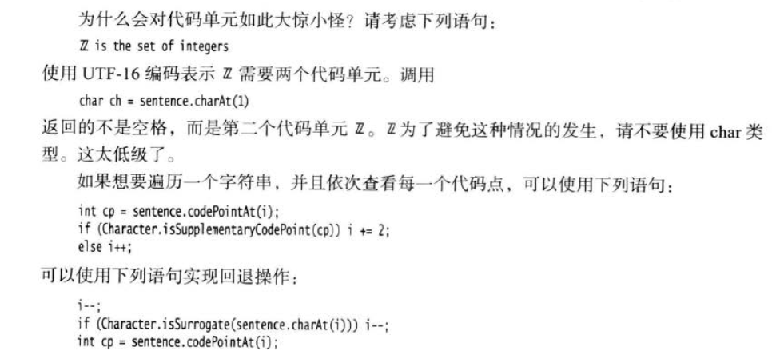

string1.compareTo\(string2\)  

**10、代码点和代码单元**

```text
//代码单元
str.length()
//代码点
str.codePointCount(0,str.length())
```

 参考[https://www.cnblogs.com/vinozly/p/5155304.html](https://www.cnblogs.com/vinozly/p/5155304.html)


```java
String s1 = "Welcome to java"; 
String s2 = new String("Welcome to java"); 
String s3 = "Welcome to java";

s1 == s2 is false
s1 == s3 is true
```

