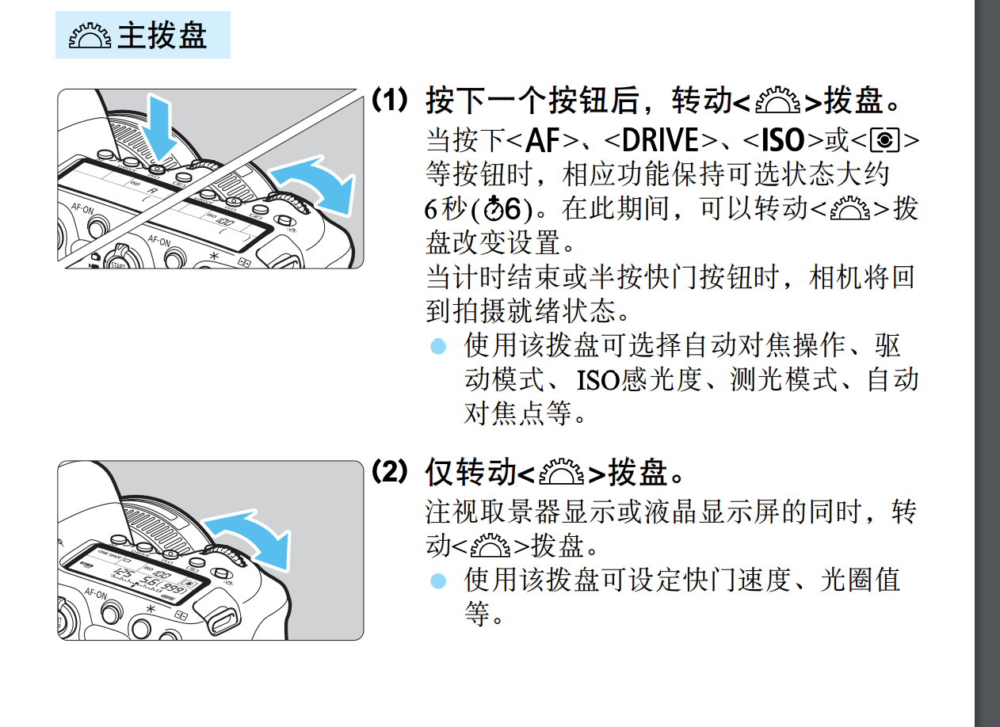

拍摄时反光镜反弹？所以拍摄的构建流程是啥？

自动对焦模式：追踪、平滑区域、实时单点AF  

触摸屏幕点击  

可以用放大辅助对焦

延时短片

曝光量，测光模式是针对曝光量而言

取SD 卡注意事项：

打开插槽盖，关闭电源，然后检查数据处理指示灯（在插槽盖上方附近）是否熄灭，再。。。

GPS 关机前建议关闭

自拍、B 门曝光、快门线，建议安装目镜遮挡片

取景器部分可以调节屈光度，让自动对焦点更清晰  

在创意拍摄区模式下，按`<AF-ON>` 和半按快门效果一样  

拍摄模式的设定，info - q  

氛围设置：

- 鲜艳：被摄体鲜艳
- 柔和：被摄体柔和（人像、宠物、花卉）
- 温馨：被摄体轮廓暖色虚化
- 醇厚：被摄体作为人物或生命被突出，整体亮度较低
- 清冷：被摄体笼罩在阴影下，冷色调
- 更亮：
- 更暗：
- 单色：蓝色、黑白、褐色

场景拍摄：

- 人像：背景虚化，皮肤头发柔和
- 夜景人像：需要外接闪光灯
- 合影：
- 风光：对鲜艳的蓝绿敏感
- 运动：
- 儿童
- 摇摄：速度感，被摄体的背景具有模糊动态效果。需要连拍跟踪被摄体
- 微距：
- 食物：
- 烛光：
- 手持夜景：多拍自动合成
- HDR 逆光控制

模式解析：

- A+ : 场景自动。自动设置对焦、测光等许多功能
- CA：
- SCN：场景
- P: 程序自动曝光。只自动设置快门速度和光圈值；程序偏移  
- Tv：快门优先自动曝光。设置快门，自动光圈
- Av（Aperture ）：光圈优先自动曝光。设置光圈，自动快门
- M：手动曝光。设置快门和光圈
- B：长时间B 门曝光。按下按钮快门保持打开，松开按钮快门关闭。b 门定时器可以代替长按
- C1：
- C2：

测光模式：

- 评价测光：整个场景均匀
- 局部测光：只中央约6.5%
- 点测光：只中央约3.2%
- 中央重点平均测光：侧重中央，覆盖整个场景

自动包围曝光（AEB）：自动光圈快门感光度，连续拍摄三张照片

HDR（High-Dynamic Range）：高反差景物