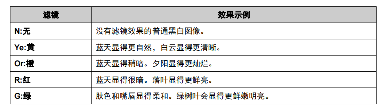

存储卡：SD/SDHC/SDXC，UHS-II, UHS-I    

> 有视频需求的话，由于4GB 文件格式限制，使用SDXC 卡会好一些  

设备温度写的5-40，大疆也是这样诶，这是大部分的线路温度？  

| 项目名                       | 功效                                                         |      |
| ---------------------------- | ------------------------------------------------------------ | ---- |
| Lock 多功能锁按钮            |                                                              |      |
| M-Fn 多功能按钮              | 快速调节ISO、驱动模式、自动对焦、白平衡等；感觉和Q 键有点重复啊 |      |
| 直流电连接器电源线孔         |                                                              |      |
| 景深预览按钮                 |                                                              |      |
| AF-On 自动对焦启动按钮       | 等同于半按快门按钮                                           |      |
| ※ 多功能控制钮（可径直按下） | 主要是查看回放，info显示单张图片信息的时候，下键可以看到几个维度信息。 |      |
| Q 速控按钮                   | 同M-Fn，但是回放的时候也可以用，还会有提示                   |      |
| * 自动曝光锁按钮             | 按一下可以锁定曝光8s                                         |      |
| 自动对焦点选择按钮           | 快速调节自动对焦相关；感觉依旧还是Q 好用                     |      |

下往上：速控转盘1、速控转盘2、主控盘   

暗淡选项可以按set 键来看为什么  

对焦锁定：半按快门锁定对焦之后，同时可以移动以重新构图  

测光定时器，怎么调

曝光补偿是指自动模式下，相机测算的值可能会和实际有较大误差，需要设置这个值来做一个“补偿”。而曝光值，实际和光圈大小、快门速度、ISO关联，相机只是偏移（即补偿）了一下值，如，Tv 模式，则相机以光圈大小、ISO的变更来实现补偿效果；Av 则是快门速度、ISO。  

自动包围曝光补偿，补偿范围内高低再拍几张照片；关机后要重新设置      

景深预览，屈光度  

 ，调了半天没啥区别     

可以设置ISO 自动时的最低快门速度限制  

短片记录时，* 锁定ISO 感光度，直到通过测光按钮解除  

HDR PQ ； CLog  

前者适合暗环境、后者适合亮环境  

白平衡：可以注册纯白画面，设置白平衡校正（偏移）、包围        

色彩空间：sRGB / Adobe RGB  

照片风格：单色上还有两个详细设置  

除尘数据：现在的确有灰，但是没影响到成像  

多重曝光：不支持。。  

HDR：连拍三张（曝光不同）；

> 那和包围曝光什么区别  
>
> 包围曝光主要是为了找准曝光点，而HDR 为了记录更宽广的图像    
>
> 实际确实可以用后期将包围曝光的原始图，合成HDR  

对焦包围：需要AF    

间隔定时器：连拍  

快门模式：机械、电子卷帘、电子 （并没有看懂）

- Fv -- Flexible 

  灵活优先自动曝光

  可设置快门、光圈、ISO，曝光补偿量，相当于P/Tv/Av/M 组合     

  这么一看Fv 切换模式更方便，只是调参数没有单个模式可以用轮盘组合方便  

  无法自动对焦  

- P -- Program

  程序自动曝光，光圈快门自动；  

  相对于A+，对焦方式、测光模式可以自己设定    

  可以设置程序偏移 - 保持曝光（快门速度和光圈组合） -  半按快门，转动主拨盘  

- Tv -- 

  快门优先自动曝光，快门手动，光圈自动

- Av -- Aperture

  光圈优先自动曝光，光圈手动，快门自动

- M -- Manual  

  手动曝光，光圈快门手动  

  ISO 自动可以设定补偿；按* 可以锁定曝光值    

- B  

  长时间（B 门）曝光，一直用M 调快门时长，汗！  
  
  适合夜景、焰火、天体  
  
  Menu 设置B 门定时器；按快门放手快速释放    

自定义拍摄模式  

> 区别：
>
> 首先要理解光圈、ISO、快门 各自的效果和不足

创意拍摄：非A+ 和自定义模式  

视频：29分59s 限制

A+ 时用A+ 模式，其他时用P 模式  

高频帧：7分29s 限制  

时间码  

录音：

- 电平：类似感光ISO？电平高的时候，录入的声音大但杂   
- 输出HDMI 时，录音未设置为关闭，也会有音频输出    

- CLOG

天空白墙容易噪点  

- CLOG3  

Cinema EOS Original - EOS-1D C 中的颜色  

YCbCr 422 色彩采样，BT709/ BT2020/ Cinema Gamut 色彩空间    

HDR 短片：要求FHD, 25帧率  

  

延时短片：

YCbCr 420(8位) 色彩采样，BT709 色彩空间  

HDMI 30分钟 P333  

摩尔纹、伪色  

FHD 25帧率 windows 上，音画可能略微不同步  

对焦：

- 单次自动：需要完全对焦才能按下快门；
- 伺服：无需合焦  

*键可以锁定自动追焦对象，set键解除  

检测对象：人物、动物、车辆  

----

P337 自动对焦之后略看，回放、无线、设置都只看一下目录，没啥特别注意    

这一次主要是为了看视频的使用，找到几个录制格式和录音部分的文档就够了  

其他：音频压缩、usb充电（需要适配器PD-E1，输出3v / 9v， 3a）  

