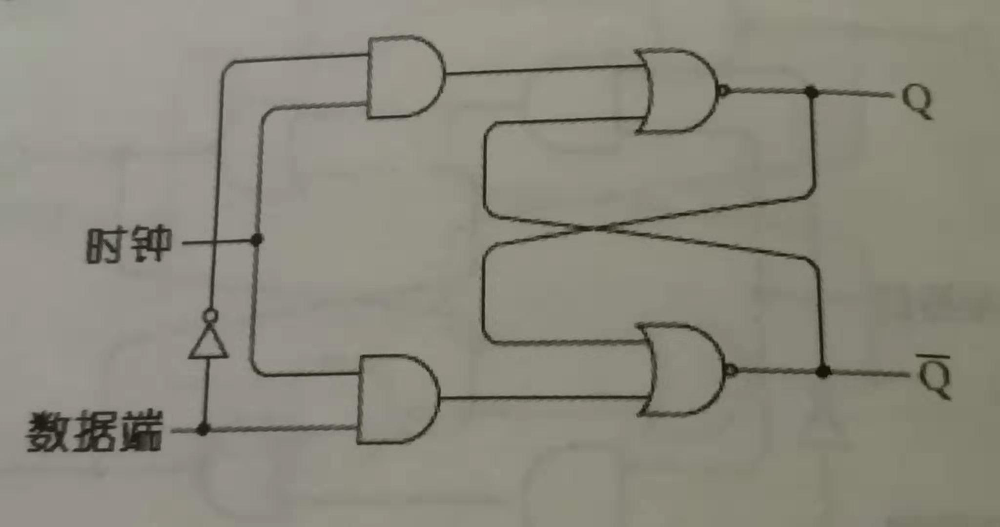
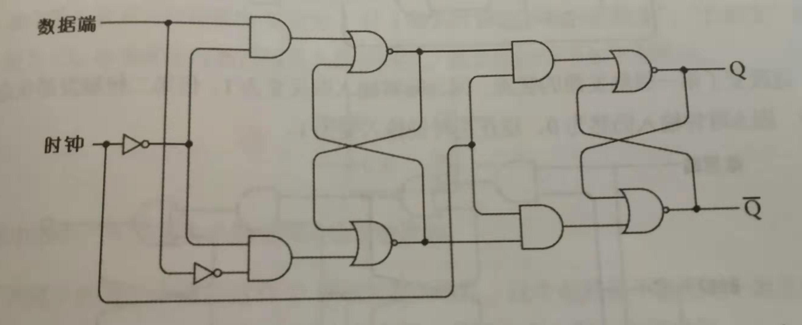
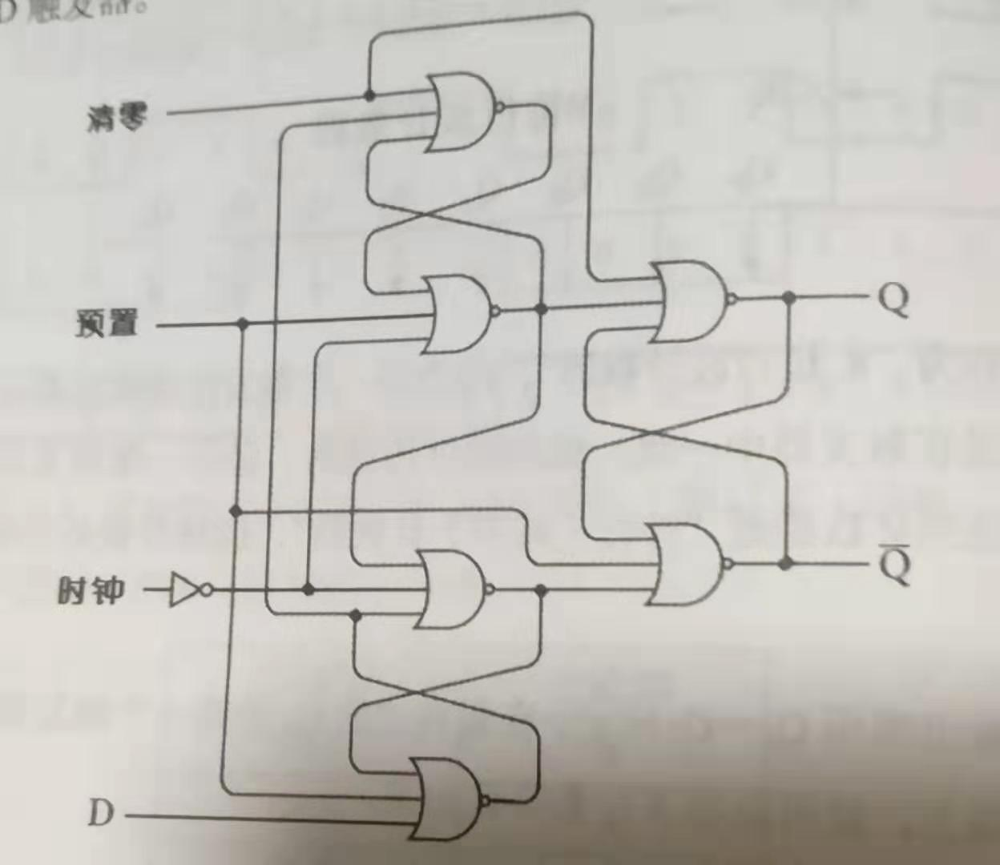

### D型触发器

D型触发器 的存储功能实现，实际是一种锁住外部输入的方式，所以又叫做**锁存器**

要实现存储功能，首先得理解 [R-S 触发器](触发器.md)，

Q 在 R、S全设置成0的时候会清零

其他时候 Q 可以通过 R 变化成 1，通过 S 变化成 0，且不清零时会一直保持这个值

那么整个电路就具有了 清零、变化、保持功能

1. 为了实现输入数据的保存，R、S必然是一个输入的两种状态，而不是两个输入

2. 为了切换功能，必须另有开关 而清零操作就是变化的一种状态，所以只需处理变化、保持功能即可 即只需要一个开关即可

- 关于目标 1，

R、S 的输入可以用一个输入控制，分成两个电路，一个电路用反相器取反。

这里将新的输入端叫做 **数据位**

设计时 取反的电路作为 R 的输入，另一路作为 S 的输入，这样才能保持 数据位 和 Q 值一致

- 关于目标 2，

添加一个开关叫做 **保持位**

保持位的输入，与R 的输入经过与门 输入到 R；与S 的输入经过与门 输入到 S

如此有下图之设计

> 电图中保持位的输入，多为 “时钟“之类的周期装置的输出（如[振荡器](电设备/电路升级3.md)） 。所以电图中叫做 **时钟位**

再来分析下可能性：

- 如此 时钟位 为1时，

若数据位 为0，则R 为1，则Q 为0，即 **保存数据** 为0

若数据位 为1，则S 为1，则Q 为1，即 保存数据 为1

- 如此 时钟位 为0时，

R、S 都为0，即保持之前的数据

此时的电路叫做 电平触发的D型触发器：

即根据 保持位的电平 高（1） 低（0）来变化 

### 边沿触发器

电平触发的D型触发器，

当 时钟位 是1的时候，并不是瞬间的，就有可能出现 数据位 发生变化的情况，即可能数据保存的并不是期望的 数据位。

这在有些时候不能满足需求

此时有一种 边沿触发的D型触发器，它只有在时钟位 从0变化为1的时候，才能引起 保存数据的变化

#### 具体分析

这种触发器其实可以说是两个R-S触发器的叠加（书中），

也可以说是 电平触发的D型触发器的 叠加（个人感觉更符合）

描述时标记为 数据位，时钟位，左侧触发器，右侧触发器

- 首先左侧触发器和右侧触发器的输入都是互补的，逻辑不变，无需多赘言

- 时钟位

  - 为0时

    左侧触发器 保存数据位，右侧触发器 保持不变

  - 切换成1（**正跳变**）

    左侧触发器 保持不变，右侧触发器 保存左侧触发器的保存数据

  - 为1时

    左侧触发器 保持不变，右侧触发器 保存左侧触发器的保存数据，即 保持不变

  - 切换成0（**负跳变**）

    左侧触发器 保存数据位，右侧触发器 保持不变

所以只有在时钟位 正跳变 的时候，时钟位为0时的 数据位 才会被 保存 到右侧触发器

---

#### 带预置和清零功能的 边沿D型触发器

常规情况下，预置位和清零位 为0

预置位 为1时，Q 为1 ； 清零位 为1时，Q 为0

> 注意 预置位 和 清零位 不能同时为1

其余和 边沿D型触发器相同

